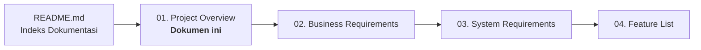
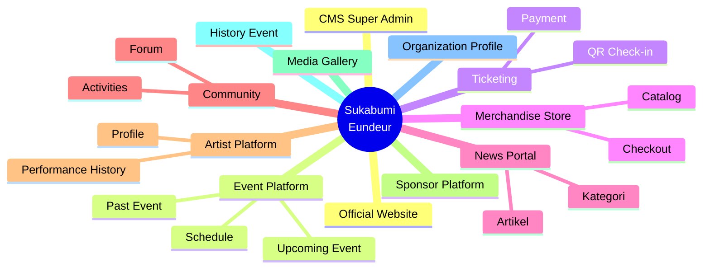
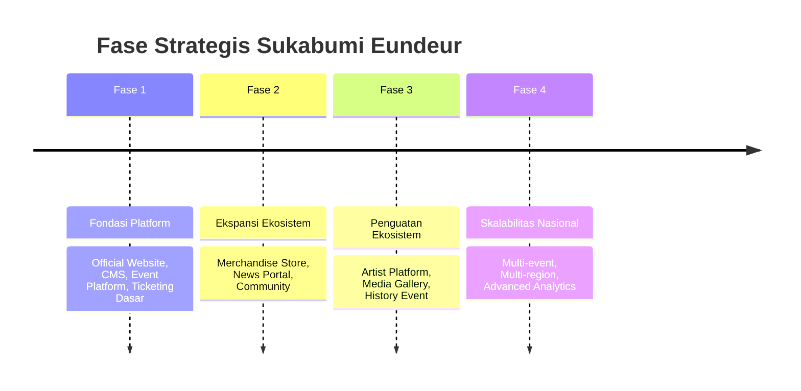

# 01 — Project Overview

> Dokumen ini memberikan gambaran umum menyeluruh mengenai proyek **Sukabumi Eundeur**, mencakup latar belakang, konteks masalah, tujuan proyek, cakupan ekosistem, target pengguna, serta posisi strategis platform ini di industri musik dan kreatif.

---

## 📌 Daftar Isi

- [Penjelasan](#-penjelasan)
- [Tujuan](#-tujuan)
- [Scope](#-scope)
- [Latar Belakang & Konteks Masalah](#-latar-belakang--konteks-masalah)
- [Ekosistem Produk](#-ekosistem-produk)
- [Flow — Posisi Dokumen dalam Siklus Perencanaan](#-flow--posisi-dokumen-dalam-siklus-perencanaan)
- [Diagram Ekosistem](#-diagram-ekosistem)
- [Target Pengguna](#-target-pengguna)
- [Posisi Kompetitif](#-posisi-kompetitif)
- [Fase Strategis Tingkat Tinggi](#-fase-strategis-tingkat-tinggi)
- [Checklist](#-checklist)
- [Catatan](#-catatan)
- [Best Practice](#-best-practice)
- [Enterprise Recommendation](#-enterprise-recommendation)
- [Future Improvement](#-future-improvement)

---

## 🎯 Penjelasan

**Sukabumi Eundeur** adalah sebuah platform digital yang berfungsi sebagai **ekosistem musik dan kreatif** berbasis komunitas lokal Kota/Kabupaten Sukabumi. Berbeda dengan website event konvensional yang hanya menampilkan informasi acara secara statis, Sukabumi Eundeur dirancang sebagai **platform multi-fungsi** yang mengintegrasikan:

- Penyelenggaraan dan promosi event musik
- Sistem ticketing digital end-to-end
- E-commerce merchandise resmi
- Portal berita musik dan budaya lokal
- Ruang komunitas bagi penggemar dan pelaku industri musik
- Profil dan riwayat performa artis/musisi
- Arsip digital sejarah penyelenggaraan event
- Sistem manajemen konten terpusat (CMS) untuk seluruh operasional platform

Nama **"Eundeur"** sendiri merupakan istilah dalam bahasa Sunda yang menggambarkan suasana ramai, semarak, dan penuh kemeriahan — mencerminkan semangat platform ini sebagai representasi digital dari kemeriahan skena musik Sukabumi.

> **Catatan**
> Dokumen ini bersifat gambaran umum (*high-level overview*). Detail kebutuhan bisnis dijabarkan pada [`02-business-requirements.md`](./02-business-requirements.md), dan detail kebutuhan sistem dijabarkan pada [`03-system-requirements.md`](./03-system-requirements.md).

---

## 🎯 Tujuan

Dokumen *Project Overview* ini bertujuan untuk:

1. Memberikan konteks menyeluruh kepada seluruh pemangku kepentingan (developer, designer, product manager, stakeholder) mengenai **apa** yang sedang dibangun.
2. Menjelaskan **latar belakang** dan **urgensi** dibangunnya platform ini.
3. Menentukan **batasan cakupan (scope)** proyek secara umum sebelum masuk ke detail teknis.
4. Menjadi **titik awal onboarding** bagi anggota tim baru sebelum membaca dokumen teknis lainnya.
5. Menyelaraskan pemahaman seluruh tim terhadap visi jangka panjang platform.

---

## 📐 Scope

### Termasuk dalam Scope Proyek

- Pengembangan platform web (desktop & mobile responsive)
- Sistem CMS untuk manajemen seluruh konten platform
- Sistem ticketing digital (pembelian, pembayaran, check-in)
- Sistem e-commerce merchandise
- Portal berita dan artikel
- Sistem komunitas dan forum diskusi
- Profil artis dan riwayat performa
- Galeri media dan arsip histori event
- Integrasi media sosial (Instagram, YouTube, Spotify, TikTok)
- Sistem keamanan, SEO, dan optimisasi performa

### Tidak Termasuk dalam Scope Proyek (Fase Awal)

- Aplikasi mobile native (iOS/Android)
- Sistem pembayaran custom di luar payment gateway pihak ketiga
- Fitur live streaming event
- Sistem loyalty/membership berbayar (dipertimbangkan pada [`25-future-roadmap.md`](./25-future-roadmap.md))
- Ekspansi multi-kota/multi-region (dipertimbangkan sebagai roadmap jangka panjang)

> **Penting**
> Batasan scope ini adalah scope untuk **fase pertama pengembangan**. Fitur di luar scope tidak berarti ditolak selamanya, melainkan didokumentasikan sebagai potensi pengembangan lanjutan pada [`25-future-roadmap.md`](./25-future-roadmap.md).

---

## 🌱 Latar Belakang & Konteks Masalah

### Masalah yang Ingin Diselesaikan

| Masalah | Dampak |
|---|---|
| Informasi event musik lokal tersebar di berbagai platform (Instagram, WhatsApp Group, poster fisik) | Sulit diakses, tidak terpusat, rawan hoax/informasi tidak resmi |
| Tidak ada sistem ticketing resmi yang terpercaya | Rawan penipuan tiket, sulit tracking penjualan |
| Tidak ada arsip resmi sejarah event musik Sukabumi | Nilai historis dan dokumentasi budaya lokal hilang seiring waktu |
| Merchandise event dijual informal tanpa sistem terstruktur | Sulit dikelola, tidak profesional, minim kepercayaan pembeli |
| Komunitas musik lokal tidak memiliki ruang digital resmi | Interaksi komunitas terfragmentasi di berbagai platform sosial |
| Artis/musisi lokal tidak memiliki platform profil resmi | Minim eksposur dan dokumentasi portofolio profesional |

### Solusi yang Ditawarkan

Sukabumi Eundeur hadir sebagai **satu platform terpadu** yang menjawab seluruh permasalahan di atas melalui pendekatan ekosistem digital yang terintegrasi, aman, dan profesional — setara dengan standar platform festival musik internasional.

---

## 🎪 Ekosistem Produk

Sukabumi Eundeur terdiri atas 12 pilar utama sebagai satu kesatuan ekosistem:

| No | Pilar | Fungsi Utama |
|---|---|---|
| 1 | **Official Website** | Wajah utama brand & informasi resmi |
| 2 | **Event Platform** | Manajemen dan promosi event |
| 3 | **Ticketing** | Penjualan dan validasi tiket digital |
| 4 | **Merchandise Store** | E-commerce produk resmi |
| 5 | **News Portal** | Media pemberitaan musik & budaya |
| 6 | **Community** | Forum dan ruang interaksi komunitas |
| 7 | **Artist Platform** | Profil dan portofolio artis |
| 8 | **Sponsor Platform** | Manajemen kemitraan |
| 9 | **Media Gallery** | Dokumentasi visual |
| 10 | **History Event** | Arsip digital penyelenggaraan event |
| 11 | **Organization Profile** | Profil resmi penyelenggara |
| 12 | **CMS (Super Admin)** | Kontrol penuh atas seluruh konten & data |

---

## 🔄 Flow — Posisi Dokumen dalam Siklus Perencanaan

---

## 🖼️ Diagram Ekosistem

---

## 👥 Target Pengguna

| Segmen | Kebutuhan Utama |
|---|---|
| **Penonton/Penggemar Musik** | Informasi event akurat, pembelian tiket mudah & aman, merchandise resmi |
| **Komunitas Musik Lokal** | Ruang berinteraksi, berbagi kegiatan, membangun jaringan |
| **Artis/Musisi Lokal** | Eksposur profil, dokumentasi portofolio, riwayat performa |
| **Sponsor & Media Partner** | Visibilitas brand, laporan keterlibatan, kemitraan resmi |
| **Penyelenggara/Organizer** | Alat manajemen event, ticketing, dan konten secara terpusat |
| **Media & Jurnalis** | Sumber berita resmi dan dokumentasi event yang kredibel |

---

## 🏆 Posisi Kompetitif

Sukabumi Eundeur memposisikan diri sebagai platform festival musik **berskala lokal dengan standar internasional**, dengan diferensiasi sebagai berikut:

| Aspek | Platform Event Konvensional | Sukabumi Eundeur |
|---|---|---|
| Cakupan Fungsi | Hanya informasi event | Ekosistem lengkap (event, ticketing, e-commerce, media, komunitas) |
| Arsip Historis | Tidak ada/minim | Sistem History Event terstruktur |
| Identitas Brand | Generik | Identitas lokal Sukabumi yang kuat |
| Skalabilitas | Terbatas pada satu event | Dirancang untuk berkembang ke skala nasional |
| Teknologi | Bervariasi, sering usang | Stack modern (Next.js 16, React 19, Supabase) |

---

## 🗺️ Fase Strategis Tingkat Tinggi

> **Catatan**
> Detail roadmap teknis dan timeline pengembangan dijabarkan lengkap pada [`22-development-roadmap.md`](./22-development-roadmap.md). Bagian ini hanya menampilkan gambaran strategis tingkat tinggi.

---

## ✅ Checklist

- [x] Latar belakang dan konteks masalah terdefinisi
- [x] Ekosistem produk teridentifikasi (12 pilar)
- [x] Target pengguna teridentifikasi
- [x] Scope proyek (termasuk & tidak termasuk) terdefinisi
- [x] Posisi kompetitif terdokumentasi
- [ ] Validasi scope oleh stakeholder (menunggu review bisnis)
- [ ] Persetujuan resmi fase strategis oleh penyelenggara

---

## 📝 Catatan

- Dokumen ini akan menjadi rujukan utama saat terjadi perbedaan pemahaman mengenai cakupan proyek antar tim.
- Segala penambahan fitur besar di luar scope yang telah didefinisikan wajib melalui proses evaluasi ulang scope (*scope change request*) sebelum masuk ke roadmap pengembangan.
- Istilah "Eundeur" perlu dijaga konsistensinya dalam seluruh komunikasi brand maupun dokumentasi teknis.

---

## 💡 Best Practice

- Gunakan pendekatan **Domain-Driven Design (DDD)** secara konseptual saat memecah ekosistem menjadi modul-modul (event, ticketing, commerce, media, community) agar batas tanggung jawab setiap domain jelas.
- Validasi setiap asumsi bisnis pada dokumen ini dengan stakeholder sebelum lanjut ke tahap desain teknis, mengikuti prinsip **"measure twice, cut once"** yang umum diterapkan tim produk enterprise seperti Stripe dan Shopify.
- Dokumentasikan setiap perubahan scope secara eksplisit (*changelog*) agar histori keputusan produk dapat ditelusuri.

---

## 🏢 Enterprise Recommendation

> Sebagaimana praktik pada perusahaan teknologi kelas dunia, disarankan agar dokumen *Project Overview* ini direview ulang secara berkala (misalnya setiap kuartal atau setiap awal fase pengembangan baru) untuk memastikan visi produk tetap relevan dengan kondisi pasar dan kebutuhan komunitas.

Rekomendasi tambahan:

- Bentuk **Steering Committee** kecil (Product Owner, Lead Engineer, Representative Komunitas) untuk memvalidasi arah strategis platform di setiap fase.
- Terapkan **versioning pada dokumen strategis** (misal: v1.0, v1.1) agar perubahan visi/scope besar dapat dilacak melalui riwayat versi dokumen atau commit history GitHub.

---

## 🚀 Future Improvement

- Potensi ekspansi platform menjadi **agregator festival musik regional Jawa Barat**, tidak hanya Sukabumi.
- Potensi kolaborasi lintas platform dengan festival musik nasional lain sebagai *media partner* atau *cross-promotion*.
- Potensi pengembangan **aplikasi mobile native** setelah validasi kebutuhan pengguna pada platform web tercapai.
- Potensi pengembangan **sistem membership berbayar** dengan benefit eksklusif (early access tiket, merchandise limited edition, dsb).

Detail lebih lanjut mengenai arah pengembangan jangka panjang dibahas pada [`25-future-roadmap.md`](./25-future-roadmap.md).

---

⬅️ [Kembali ke README](./README.md) · ➡️ [Lanjut ke 02. Business Requirements](./02-business-requirements.md)

