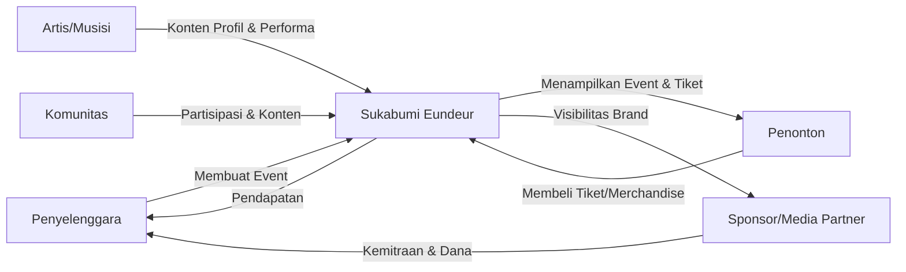
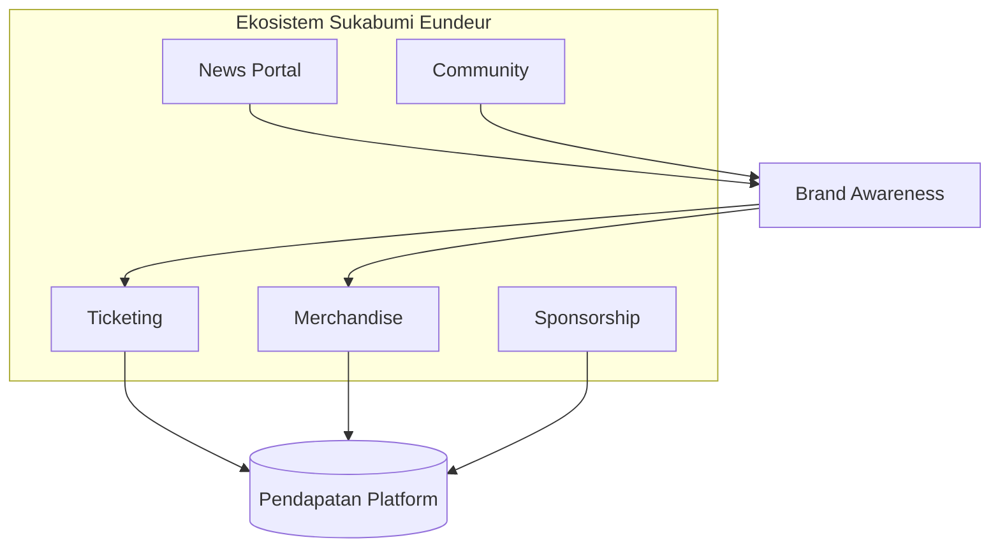

# 02 — Business Requirements

> Dokumen ini menjabarkan kebutuhan bisnis, tujuan strategis, model bisnis, pemangku kepentingan, indikator keberhasilan, serta batasan dan risiko bisnis dari proyek **Sukabumi Eundeur**.

---

## 📌 Daftar Isi

- [Penjelasan](#-penjelasan)
- [Tujuan](#-tujuan)
- [Scope](#-scope)
- [Tujuan Bisnis (Business Objectives)](#-tujuan-bisnis-business-objectives)
- [Model Bisnis](#-model-bisnis)
- [Sumber Pendapatan (Revenue Streams)](#-sumber-pendapatan-revenue-streams)
- [Proposisi Nilai (Value Proposition)](#-proposisi-nilai-value-proposition)
- [Pemangku Kepentingan (Stakeholders)](#-pemangku-kepentingan-stakeholders)
- [Flow — Alur Nilai Bisnis](#-flow--alur-nilai-bisnis)
- [Diagram Model Bisnis](#-diagram-model-bisnis)
- [Indikator Keberhasilan (KPI)](#-indikator-keberhasilan-kpi)
- [Aturan Bisnis (Business Rules)](#-aturan-bisnis-business-rules)
- [Analisis SWOT](#-analisis-swot)
- [Asumsi & Batasan](#-asumsi--batasan)
- [Risiko Bisnis & Mitigasi](#-risiko-bisnis--mitigasi)
- [Checklist](#-checklist)
- [Catatan](#-catatan)
- [Best Practice](#-best-practice)
- [Enterprise Recommendation](#-enterprise-recommendation)
- [Future Improvement](#-future-improvement)

---

## 🎯 Overview

Dokumen *Business Requirements* menjelaskan **kebutuhan dari sudut pandang bisnis** yang mendasari pengembangan platform Sukabumi Eundeur. Dokumen ini menjawab pertanyaan strategis seperti:

- Mengapa platform ini perlu dibangun dari sisi bisnis?
- Siapa saja pihak yang berkepentingan (*stakeholders*) dan apa peran mereka?
- Bagaimana platform ini menghasilkan nilai (dan pendapatan) bagi penyelenggara?
- Apa indikator yang menentukan platform ini berhasil?
- Aturan bisnis apa yang harus dipatuhi oleh sistem?

> **Catatan**
> Dokumen ini berfokus pada kebutuhan **bisnis**, bukan kebutuhan **teknis**. Kebutuhan teknis dijabarkan pada [`03-system-requirements.md`](./03-system-requirements.md).

---

## 🎯 Objective

1. Menetapkan tujuan bisnis yang **terukur (measurable)** dan **selaras (aligned)** dengan visi platform.
2. Mengidentifikasi seluruh pemangku kepentingan dan kepentingan masing-masing.
3. Mendefinisikan model bisnis dan sumber pendapatan platform.
4. Menetapkan indikator keberhasilan (KPI) yang dapat dipantau pasca-peluncuran.
5. Mendokumentasikan aturan bisnis (*business rules*) yang menjadi dasar logika sistem (misalnya kebijakan refund tiket, aturan kupon, dll).
6. Mengidentifikasi risiko bisnis sejak tahap perencanaan.

---

## 📐 Scope

Dokumen ini mencakup:

- Tujuan bisnis jangka pendek, menengah, dan panjang
- Model bisnis dan sumber pendapatan
- Pemetaan pemangku kepentingan
- Indikator keberhasilan (KPI) tingkat bisnis
- Aturan bisnis lintas modul (ticketing, commerce, community)
- Analisis SWOT dan risiko bisnis

Dokumen ini **tidak mencakup**:

- Spesifikasi teknis sistem (lihat `03-system-requirements.md`)
- Detail alur pengguna teknis (lihat `06-user-flow.md`)
- Rencana anggaran/keuangan detail (di luar scope dokumentasi teknis ini)

---

## 🎯 Objective Bisnis (Business Objectives)

| Kategori | Tujuan | Target Indikatif |
|---|---|---|
| **Brand Awareness** | Menjadikan Sukabumi Eundeur sebagai rujukan utama informasi musik & event di Sukabumi | Top-of-mind community musik lokal dalam 1 tahun operasional |
| **Digitalisasi Ticketing** | Mengalihkan penjualan tiket dari manual/informal ke sistem digital resmi | Minimal 80% transaksi tiket event melalui platform |
| **Pertumbuhan Komunitas** | Membangun basis komunitas aktif dalam ekosistem | Pertumbuhan member komunitas berkelanjutan setiap event |
| **Monetisasi Non-Tiket** | Diversifikasi pendapatan melalui merchandise & sponsorship | Kontribusi pendapatan non-tiket meningkat setiap siklus event |
| **Arsip Budaya Digital** | Menjadi arsip resmi sejarah event musik Sukabumi | Seluruh event terdokumentasi lengkap di `History Event` |
| **Skalabilitas Nasional** | Menyiapkan fondasi ekspansi ke platform berskala nasional | Arsitektur mendukung multi-event & multi-region tanpa re-arsitektur besar |

> **Penting**
> Target indikatif di atas bersifat **arah strategis**, bukan target final. Angka pasti (KPI kuantitatif) perlu divalidasi bersama penyelenggara/stakeholder bisnis sebelum ditetapkan sebagai target resmi.

---

## 💼 Model Bisnis

Sukabumi Eundeur mengadopsi model bisnis **multi-sided platform**, di mana platform menjadi penghubung antara:

- **Penyelenggara Event** (organizer)
- **Penonton/Konsumen**
- **Artis/Musisi**
- **Sponsor & Media Partner**
- **Komunitas Musik Lokal**

Model ini memungkinkan platform menghasilkan nilai dari berbagai sisi ekosistem, bukan hanya dari transaksi tiket semata.

---

## 💰 Sumber Pendapatan (Revenue Streams)

| Sumber Pendapatan | Deskripsi |
|---|---|
| **Penjualan Tiket** | Komisi atau margin dari setiap transaksi tiket event |
| **Merchandise Store** | Margin penjualan produk resmi (apparel, aksesoris, kolektibel) |
| **Sponsorship & Partnership** | Paket kemitraan sponsor (placement, branding, promosi) |
| **Media Partnership** | Kolaborasi promosi dengan media partner |
| **Premium Listing Artist** *(potensial)* | Fitur promosi tambahan untuk profil artis (future improvement) |
| **Advertisement Space** *(potensial)* | Slot iklan pada News Portal (future improvement) |

> **Catatan**
> Sumber pendapatan yang ditandai *(potensial)* merupakan opsi monetisasi tambahan yang dapat dipertimbangkan pada fase lanjutan, bukan bagian dari scope wajib fase pertama.

---

## 🎁 Proposisi Nilai (Value Proposition)

| Segmen | Nilai yang Ditawarkan |
|---|---|
| **Penonton** | Kemudahan akses informasi event, keamanan transaksi tiket, kepastian merchandise resmi |
| **Komunitas** | Ruang digital resmi untuk berjejaring dan berkegiatan |
| **Artis/Musisi** | Eksposur profil profesional dan dokumentasi riwayat performa |
| **Sponsor** | Visibilitas brand pada ekosistem yang terukur dan kredibel |
| **Penyelenggara** | Efisiensi operasional melalui sistem terpusat (CMS, ticketing, commerce) |
| **Media** | Sumber informasi resmi dan kredibel untuk pemberitaan |

---

## 🧑‍🤝‍🧑 Pemangku Kepentingan (Stakeholders)

| Stakeholder | Peran | Kepentingan Utama |
|---|---|---|
| **Penyelenggara/Organizer** | Pemilik produk & pengambil keputusan bisnis | Keberhasilan event, efisiensi operasional, pendapatan |
| **Tim Pengembang (Development Team)** | Membangun & memelihara platform | Spesifikasi jelas, arsitektur scalable |
| **Komunitas Musik Lokal** | Pengguna aktif & kontributor konten komunitas | Ruang aktualisasi dan interaksi |
| **Artis/Musisi** | Pengisi konten profil & performa | Eksposur dan dokumentasi karya |
| **Sponsor/Media Partner** | Mitra pendanaan & promosi | ROI kemitraan dan visibilitas brand |
| **Penonton/Konsumen** | Pengguna akhir (end-user) | Kemudahan, keamanan, kepercayaan |
| **Tim Editorial/Konten** | Pengelola News Portal & konten CMS | Alat kerja yang efisien untuk publikasi konten |

### Matriks RACI Tingkat Tinggi

| Aktivitas | Organizer | Dev Team | Editorial | Komunitas |
|---|---|---|---|---|
| Keputusan Strategis Produk | **A/R** | C | I | I |
| Implementasi Teknis | C | **A/R** | I | I |
| Pengelolaan Konten News | C | I | **A/R** | I |
| Aktivitas Komunitas | I | I | C | **A/R** |

*Keterangan: R = Responsible, A = Accountable, C = Consulted, I = Informed*

---

## 🔄 User Flow

### Alur Processes
 Alur Nilai Bisnis

---

## 📊 Diagram Model Bisnis

---

## 📈 Indikator Keberhasilan (KPI)

| Kategori KPI | Metrik | Frekuensi Evaluasi |
|---|---|---|
| **Ticketing** | Jumlah tiket terjual, tingkat konversi checkout, tingkat refund | Per event |
| **Merchandise** | Total penjualan, tingkat konversi cart-to-checkout, produk terlaris | Bulanan |
| **Engagement Komunitas** | Jumlah member aktif, jumlah post/forum activity | Bulanan |
| **Traffic & SEO** | Jumlah pengunjung unik, posisi kata kunci, bounce rate | Bulanan |
| **News Portal** | Jumlah pembaca artikel, artikel trending, waktu baca rata-rata | Mingguan |
| **Sponsorship** | Jumlah sponsor aktif, nilai kontrak kemitraan | Per event |
| **Kepuasan Pengguna** | Rating ulasan produk, feedback event | Per event |

> **Enterprise Recommendation**
> Gunakan pendekatan **North Star Metric** — misalnya *"Jumlah transaksi tiket & merchandise yang berhasil per event"* — sebagai metrik utama yang menjadi acuan seluruh tim, didukung oleh metrik-metrik pendukung (*supporting metrics*) pada tabel di atas.

---

## 📜 Aturan Bisnis (Business Rules)

Berikut aturan bisnis tingkat tinggi yang harus menjadi acuan logika sistem (detail teknis dijabarkan pada dokumen modul terkait):

### Ticketing
- Tiket yang sudah terjual **tidak dapat dibatalkan sepihak** oleh pembeli, kecuali sesuai kebijakan refund yang berlaku.
- Setiap tiket harus memiliki kode unik (QR Code) untuk validasi check-in.
- Refund hanya berlaku sesuai kebijakan yang ditetapkan per event (lihat [`12-ticketing-system.md`](./12-ticketing-system.md)).

### Merchandise
- Stok produk harus tervalidasi real-time untuk mencegah *overselling*.
- Kupon/voucher memiliki masa berlaku dan batas penggunaan yang jelas.

### Komunitas
- Konten yang melanggar pedoman komunitas dapat dimoderasi atau dihapus oleh admin.
- Member harus terverifikasi (minimal email) sebelum dapat memposting konten.

### Konten & CMS
- Seluruh publikasi konten publik (news, event, artist) melalui proses **review sebelum publish** (khususnya untuk kontributor non-admin).
- Riwayat perubahan konten penting harus tercatat (*audit trail*).

> **Catatan**
> Detail lengkap dan teknis dari setiap aturan bisnis di atas akan diperluas pada dokumen modul terkait (`12`, `13`, `14`, `15`).

---

## 🔍 Analisis SWOT

| | Deskripsi |
|---|---|
| **Strengths (Kekuatan)** | Identitas lokal yang kuat, ekosistem terintegrasi, dukungan komunitas musik yang aktif |
| **Weaknesses (Kelemahan)** | Brand baru dengan awareness terbatas, kebutuhan edukasi pengguna terhadap sistem digital |
| **Opportunities (Peluang)** | Pertumbuhan industri musik lokal, minimnya kompetitor dengan model ekosistem serupa di daerah, potensi ekspansi nasional |
| **Threats (Ancaman)** | Kompetisi dari platform ticketing nasional besar, risiko keamanan transaksi digital, ketergantungan pada momentum event |

---

## 📋 Asumsi & Batasan

### Asumsi

- Target pengguna memiliki akses internet dan perangkat yang memadai (smartphone/desktop).
- Penyelenggara memiliki kapasitas operasional untuk mengelola event secara berkala.
- Terdapat dukungan payment gateway pihak ketiga yang legal dan tersedia di Indonesia.

### Batasan (Constraints)

- Anggaran pengembangan tahap awal terbatas pada fondasi platform (fase 1), sesuai [`01-project-overview.md`](./01-project-overview.md).
- Infrastruktur menggunakan VPS (bukan cloud-native scalable infrastructure) pada fase awal.
- Tim pengembang dan tim editorial pada fase awal kemungkinan berjumlah terbatas (*lean team*).

---

## ⚠️ Risiko Bisnis & Mitigasi

| Risiko | Dampak | Mitigasi |
|---|---|---|
| Rendahnya adopsi ticketing digital oleh penonton | Penjualan tiket tidak optimal | Edukasi pengguna, insentif early-bird, kemudahan UX |
| Kegagalan sistem saat lonjakan trafik (event besar) | Reputasi buruk, kehilangan penjualan | Perencanaan performa & caching (lihat `20-performance.md`) |
| Kebocoran data pengguna/transaksi | Kehilangan kepercayaan, risiko hukum | Implementasi keamanan berlapis (lihat `19-security.md`) |
| Ketergantungan pada satu penyelenggara event | Keberlanjutan platform terganggu jika event vakum | Diversifikasi event & kemitraan komunitas |
| Kompetisi platform ticketing nasional | Kehilangan pangsa pasar lokal | Diferensiasi melalui ekosistem lengkap & identitas lokal |

---

## ⚙️ Functional Requirements
- Mengimplementasikan seluruh endpoint API & komponen UI terkait.
- Mengelola state & autentikasi pengguna secara otomatis melalui JWT & Self-Hosted Auth Handler.

## 🚀 Non Functional Requirements
- Latensi respon < 200ms.
- Uptime target 99.9%.
- Aksesibilitas WCAG 2.1 Level AA.

## 🏗️ Architecture
- **Frontend**: Next.js 16 (App Router) + React 19.
- **Backend**: PostgreSQL (Self-Hosted VPS) (PostgreSQL + RLS + Storage).
- **Infrastructure**: VPS Ubuntu + Nginx + PM2.

## 🔗 Dependencies
- `@PostgreSQL (Self-Hosted VPS)/PostgreSQL (Self-Hosted VPS)-js`
- `next` v16
- `react` v19
- `tailwindcss` v4

## ⚠️ Risks
- Kegagalan koneksi database saat lonjakan trafik -> Mitigasi: Connection Pooling & Caching.

## 🧪 Edge Cases
- Sesi pengguna kadaluarsa di tengah transaksi -> Redirect otomatis ke login dengan restore state.

## 📋 Validation Rules
- Format input wajib disanitasi dari potensi XSS & SQL Injection.

## 🛠️ Technical Notes
- Implementasi wajib mengikuti konvensi kode di [`21-folder-structure.md`](./21-folder-structure.md).

## 🚀 Future Improvements
- Integrasi analitik real-time dan rekomendasi berbasis AI.

## ✅ Checklist

- [x] Tujuan bisnis terdefinisi
- [x] Model bisnis & revenue streams terdokumentasi
- [x] Pemangku kepentingan teridentifikasi beserta RACI
- [x] KPI tingkat bisnis terdefinisi
- [x] Aturan bisnis tingkat tinggi terdokumentasi
- [x] Analisis SWOT tersedia
- [x] Risiko bisnis & mitigasi terdokumentasi
- [ ] Validasi target KPI kuantitatif oleh penyelenggara
- [ ] Persetujuan final model monetisasi oleh stakeholder

---

## 📝 Catatan

- Seluruh angka target pada dokumen ini bersifat **indikatif**, perlu disepakati bersama stakeholder bisnis sebelum dijadikan target resmi (OKR/KPI final).
- Aturan bisnis pada dokumen ini menjadi **acuan wajib** saat menyusun logika sistem pada dokumen teknis (database, API, modul fungsional).

---

## 💡 Best Practice

- Gunakan kerangka **OKR (Objectives & Key Results)** untuk menerjemahkan tujuan bisnis pada dokumen ini menjadi target kuantitatif per kuartal.
- Terapkan **Business Model Canvas** secara formal dalam workshop internal untuk memvalidasi model bisnis sebelum dituangkan ke dokumen resmi.
- Libatkan perwakilan komunitas dalam proses validasi kebutuhan bisnis (*co-creation approach*), mengingat platform ini berbasis komunitas.

---

## 🏢 Enterprise Recommendation

> Perusahaan teknologi kelas dunia seperti Stripe dan Shopify selalu memisahkan dokumen *Business Requirements* dari *Product Requirements Document (PRD)* teknis. Pendekatan ini memastikan keputusan bisnis tidak tercampur dengan detail implementasi, sehingga perubahan teknis tidak memerlukan persetujuan ulang tingkat bisnis, dan sebaliknya.

Rekomendasi tambahan:

- Bentuk dokumen turunan **Revenue Model Deck** untuk kebutuhan presentasi ke calon sponsor/investor, terpisah dari dokumentasi teknis ini.
- Lakukan **quarterly business review (QBR)** untuk mengevaluasi KPI terhadap tujuan bisnis yang telah ditetapkan.

---

## 🚀 Future Improvement

- Eksplorasi model **subscription/membership** untuk komunitas dengan benefit eksklusif.
- Eksplorasi model **white-label platform** yang dapat direplikasi untuk festival musik daerah lain (potensi ekspansi nasional).
- Eksplorasi kemitraan dengan **brand nasional** sebagai sponsor tetap (*annual partnership*), bukan hanya per event.
- Eksplorasi **data monetization** yang etis, misalnya insight tren musik lokal untuk kepentingan riset industri (dengan kebijakan privasi yang ketat).

Detail lebih lanjut dibahas pada [`25-future-roadmap.md`](./25-future-roadmap.md).

---

⬅️ [Kembali ke 01. Project Overview](./01-project-overview.md) · ➡️ [Lanjut ke 03. System Requirements](./03-system-requirements.md)

