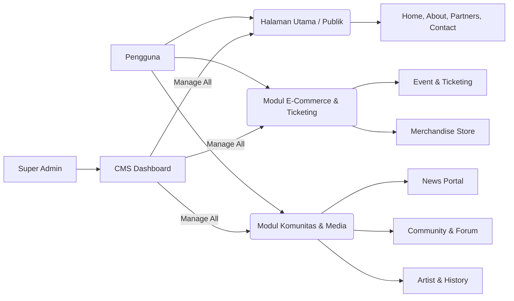
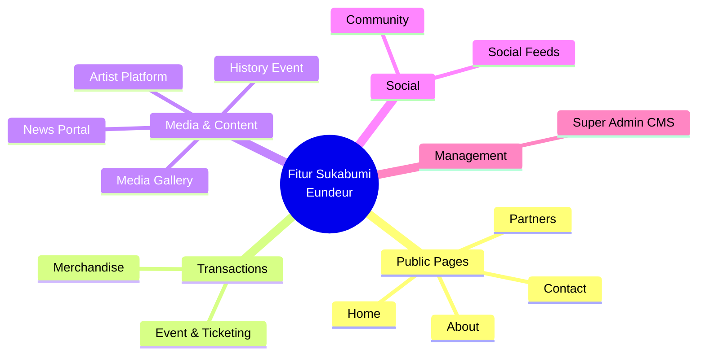

# 04 — Feature List

> Dokumen ini memuat daftar lengkap fitur fungsional yang akan dibangun pada platform **Sukabumi Eundeur**, dikelompokkan berdasarkan modul dan halaman utama untuk mempermudah pemahaman ruang lingkup pengembangan.

---

## 📌 Daftar Isi

- [Penjelasan](#-penjelasan)
- [Tujuan](#-tujuan)
- [Scope](#-scope)
- [Flow — Peta Fitur Utama](#-flow--peta-fitur-utama)
- [Diagram Fungsional](#-diagram-fungsional)
- [Daftar Fitur Halaman Publik](#-daftar-fitur-halaman-publik)
- [Daftar Fitur Modul Khusus](#-daftar-fitur-modul-khusus)
- [Daftar Fitur Super Admin CMS](#-daftar-fitur-super-admin-cms)
- [Checklist](#-checklist)
- [Catatan](#-catatan)
- [Best Practice](#-best-practice)
- [Enterprise Recommendation](#-enterprise-recommendation)
- [Future Improvement](#-future-improvement)

---

## 🎯 Overview

**Feature List** adalah penjabaran detail dari Kebutuhan Fungsional yang telah disinggung pada dokumen `03-system-requirements.md`. Dokumen ini merincikan setiap blok fungsional pada masing-masing halaman website, mulai dari antarmuka publik hingga halaman manajemen CMS.

Platform Sukabumi Eundeur memiliki cakupan fitur yang luas layaknya ekosistem festival (seperti Hellfest, Wacken Open Air, dll), sehingga pengelompokan fitur dibuat terstruktur agar tim *Engineering* dapat melakukan estimasi pengerjaan secara modular.

---

## 🎯 Objective

1. Memberikan gambaran spesifik mengenai setiap fitur yang harus diimplementasikan pada masing-masing modul/halaman.
2. Menjadi acuan (*source of truth*) bagi tim UI/UX dalam merancang antarmuka.
3. Menjadi dasar (*baseline*) bagi tim QA dalam menyusun *test case*.
4. Mencegah terjadinya *scope creep* (penambahan fitur tak terencana) selama fase *development*.

---

## 📐 Scope

Dokumen ini mencakup:
- Seluruh fitur pada antarmuka publik (*Public Facing Website*).
- Fitur spesifik pada modul Ticketing, Merchandise, News, Community, Artist, dan History Event.
- Fitur manajemen pada *Super Admin CMS*.

Dokumen ini **tidak mencakup**:
- Alur detail interaksi *user* dari layar ke layar (lihat `06-user-flow.md`).
- Struktur hierarki *routing* halaman (lihat `08-page-structure.md`).

---

## 🔄 User Flow

### Alur Processes
 Peta Fitur Utama

---

## 🖼️ Diagram Fungsional

---

## 🌐 Daftar Fitur Halaman Publik

### 1. HOME
Halaman utama yang menjadi gerbang ekosistem Sukabumi Eundeur.
- **Hero Section:** Banner dinamis (video/slider) untuk *highlight* event/berita utama.
- **Upcoming Event:** Daftar ringkas event terdekat (dengan status tiket).
- **Latest News:** *Feed* berita dan artikel terbaru.
- **Featured Artist:** *Highlight* musisi lokal/headliner yang akan tampil.
- **Gallery:** Cuplikan galeri media (foto/video) dari event sebelumnya.
- **Sponsor & Partner:** Logo sponsor dan mitra strategis (berjalan/marquee).
- **Merchandise Showcase:** Tampilan produk-produk *merch* unggulan atau rilisan terbaru.
- **CTA (Call to Action):** Tombol aksi utama (Beli Tiket, Gabung Komunitas).

### 2. ABOUT
Informasi resmi mengenai organisasi dan platform.
- **Tentang Sukabumi Eundeur:** Deskripsi naratif dan *brand story*.
- **Visi & Misi:** Arah dan tujuan strategis.
- **History:** *Timeline* sejarah berdirinya platform.
- **Team & Organizer:** Profil ringkas tim inti penyelenggara.

### 3. PARTNERS
Daftar seluruh pihak yang bekerja sama dengan Sukabumi Eundeur.
- **Sponsor:** Mitra perusahaan/brand penyedia dana.
- **Media Partner:** Mitra media publikasi.
- **Community Partner:** Komunitas-komunitas yang berafiliasi.
- **Artist Partner:** Label atau manajemen artis.

### 4. CONTACT & SOCIAL
- **Contact Form:** Formulir pengiriman pesan langsung ke admin.
- **Location & Maps:** Titik lokasi kantor kesekretariatan/organizer (Embed Google Maps).
- **Social Media Links:** Tautan ke kanal sosial resmi.
- **Social Feeds:** *Embed* konten dinamis dari:
  - Instagram Feed
  - YouTube (Video terbaru/Aftermovie)
  - Spotify (Playlist resmi event)
  - TikTok
- **Newsletter Subscription:** Formulir pendaftaran email untuk berlangganan berita.

---

## 🎫 Daftar Fitur Modul Khusus

### 1. EVENT & TICKETING
- **Daftar Event:** Event mendatang (*Upcoming*) dan event berlalu (*Past Event*).
- **Event Detail:** Halaman khusus per event (Deskripsi, Poster, Waktu, Lokasi).
- **Schedule:** *Rundown* atau jadwal tampil (*lineup schedule*).
- **Map:** Denah lokasi acara/venue.
- **FAQ:** Pertanyaan umum terkait event spesifik.
- **Ticket Purchase:** Pemilihan jenis tiket, kuantitas, form data pengunjung, dan *checkout*.

### 2. MERCHANDISE STORE
- **Katalog & Kategori:** Daftar produk berdasarkan kategori (T-Shirt, Aksesoris, dll).
- **Product Detail:** Foto produk (multi-angle), deskripsi, varian (ukuran/warna).
- **Cart & Checkout:** Keranjang belanja dan proses pembayaran.
- **Order Tracking:** Cek status pesanan (*Processing, Shipped, Delivered*).
- **Wishlist:** Menyimpan produk yang diinginkan pengguna.
- **Review:** Sistem ulasan dan rating produk dari pembeli terverifikasi.

### 3. NEWS PORTAL
- **Daftar Artikel:** Aliran berita, terkelompokkan per Kategori.
- **Author Profile:** Profil penulis artikel.
- **Search & Tag:** Pencarian spesifik dan pengelompokan berdasarkan *tag*.
- **Trending:** Artikel terpopuler.

### 4. COMMUNITY
- **Komunitas & Forum:** Papan diskusi per topik.
- **Activities:** Jadwal kopi darat (kopdar) atau kegiatan komunitas.
- **Member Directory:** Daftar anggota komunitas.
- **Community Gallery:** Galeri unggahan pengguna/anggota komunitas.

### 5. ARTIST PLATFORM
- **Artist List:** Direktori musisi/band.
- **Artist Detail:** Profil lengkap (Bio, Genre, Socials).
- **Performance History:** Riwayat penampilan di event Sukabumi Eundeur.
- **Artist Gallery:** Galeri khusus musisi.

### 6. HISTORY EVENT
Modul arsip komprehensif untuk *past events*. Setiap halaman riwayat event memuat:
- **Header:** Nama Event, Tanggal, Lokasi.
- **Visual:** Poster resmi, Video Aftermovie, dan Galeri event.
- **Headline & Line Up:** Daftar artis utama dan pendukung yang tampil.
- **Sponsor & Media Coverage:** Dokumentasi sponsor yang berpartisipasi dan liputan media eksternal.
- **Statistic:** Data pengunjung/penonton (infografis ringan).

---

## ⚙️ Daftar Fitur Super Admin CMS

Halaman *backend* yang diakses khusus oleh pengelola (Penyelenggara/Tim Editorial).
- **Dashboard:** Ringkasan analitik (Penjualan tiket, merch, trafik web).
- **News Management:** CRUD Artikel, Kategori, Tag, Author.
- **Events Management:** Pembuatan event, penjadwalan, pengaturan denah/FAQ.
- **Artists Management:** Direktori artis, profil, dan penautan ke event.
- **Gallery Management:** Manajemen album foto dan video (*embed* YouTube).
- **Merchandise Management:** CRUD Produk, Stok, Kategori, Order, dan Pengiriman.
- **Ticket Management:** Pengaturan jenis tiket, kuota, promo/diskon, laporan penjualan, dan validasi *Check-In*.
- **History Management:** Pengelolaan data untuk arsip *History Event*.
- **Users & Roles:** Manajemen akun pengguna (Admin, Editor, Member), RBAC (*Role-Based Access Control*), dan *Permissions*.
- **SEO & Metadata:** Pengaturan global SEO, robots.txt, schema, dan OpenGraph.
- **Media Library:** Penyimpanan aset gambar/dokumen terpusat (terhubung ke MinIO / Local VPS Storage).
- **Settings:** Konfigurasi web (Logo, kontak, URL sosmed, kebijakan platform).
- **Analytics (Internal):** Laporan mendetail mengenai perilaku pengguna, konversi, dan performa event.

---

## 💼 Business Rules
- Seluruh aturan bisnis modul harus tunduk pada Single Source of Truth (SSOT) Sukabumi Eundeur.
- Transaksi & data mutasi wajib mencatat audit log timestamp.

## ⚙️ Functional Requirements
- Mengimplementasikan seluruh endpoint API & komponen UI terkait.
- Mengelola state & autentikasi pengguna secara otomatis melalui JWT & Self-Hosted Auth Handler.

## 🚀 Non Functional Requirements
- Latensi respon < 200ms.
- Uptime target 99.9%.
- Aksesibilitas WCAG 2.1 Level AA.

## 🏗️ Architecture
- **Frontend**: Next.js 16 (App Router) + React 19.
- **Backend**: PostgreSQL (Self-Hosted VPS) (PostgreSQL + RLS + Storage).
- **Infrastructure**: VPS Ubuntu + Nginx + PM2.

## 🔗 Dependencies
- `@PostgreSQL (Self-Hosted VPS)/PostgreSQL (Self-Hosted VPS)-js`
- `next` v16
- `react` v19
- `tailwindcss` v4

## ⚠️ Risks
- Kegagalan koneksi database saat lonjakan trafik -> Mitigasi: Connection Pooling & Caching.

## 🧪 Edge Cases
- Sesi pengguna kadaluarsa di tengah transaksi -> Redirect otomatis ke login dengan restore state.

## 📋 Validation Rules
- Format input wajib disanitasi dari potensi XSS & SQL Injection.

## 🛠️ Technical Notes
- Implementasi wajib mengikuti konvensi kode di [`21-folder-structure.md`](./21-folder-structure.md).

## 🚀 Future Improvements
- Integrasi analitik real-time dan rekomendasi berbasis AI.

## ✅ Checklist

- [x] Fitur halaman Home, About, Partners, Contact terdefinisi.
- [x] Fitur Event, Ticketing, Merchandise, News terdefinisi.
- [x] Fitur Community, Artist, History Event terdefinisi.
- [x] Fitur Super Admin CMS (Dashboard, CRUD modul, Setting) terdefinisi.
- [ ] Tinjau kecocokan daftar fitur dengan ketersediaan API pihak ketiga (payment gateway, dll).
- [ ] Konfirmasi final (*sign-off*) dari Product Owner atau Stakeholder terkait prioritas fitur.

---

## 📝 Catatan

- **Skala Prioritas:** Jika ada batasan waktu *development*, fitur-fitur seperti `Wishlist`, `Forum Komunitas`, dan `Review` dapat digeser ke Fase 2 (lihat *Roadmap*).
- **CMS sebagai Core:** Mengingat banyaknya entitas yang dinamis, pembangunan Super Admin CMS harus diselesaikan berbarengan atau mendahului *frontend* publik agar data dapat dirender secara nyata.

---

## 💡 Best Practice

- **Modularisasi Komponen UI:** Karena banyak fitur yang saling tumpang tindih (misal: *Carousel* untuk *Upcoming Event* dan *Latest News*), rancang komponen UI di React agar dapat di-*reuse* lintas halaman.
- **Paginasi & Infinite Scroll:** Terapkan paginasi atau *lazy load / infinite scroll* pada halaman dengan banyak data (News, Artist List, History) untuk menjaga performa.

---

## 🏢 Enterprise Recommendation

> **Feature Toggling (Flagging)**
> Untuk platform sebesar ekosistem Sukabumi Eundeur, sangat disarankan menerapkan *Feature Toggles* melalui CMS. Hal ini memungkinkan admin untuk mematikan/menyalakan modul tertentu (misalnya modul `Ticketing` hanya menyala saat musim event) tanpa perlu melakukan *deployment* ulang. Hal ini biasa dilakukan oleh sistem setingkat Vercel atau Stripe.

---

## 🚀 Future Improvement

- **Mobile App Native (iOS/Android):** Mengembangkan aplikasi khusus *user* yang memberikan pengalaman *seamless* (notifikasi *push*, *wallet* tiket digital).
- **Vendor/Tenant CMS:** Memberikan akses CMS terbatas (dashboard terpisah) bagi pihak sponsor atau *tenant merchandise* untuk memonitor trafik atau penjualan mereka sendiri secara transparan.
- **AI Recommendation:** Memberikan rekomendasi berita, artis, atau merchandise berdasarkan riwayat pembelian tiket dan aktivitas pembaca.

---

⬅️ [Kembali ke 03. System Requirements](./03-system-requirements.md) · ➡️ [Lanjut ke 05. User Roles](./05-user-roles.md)

