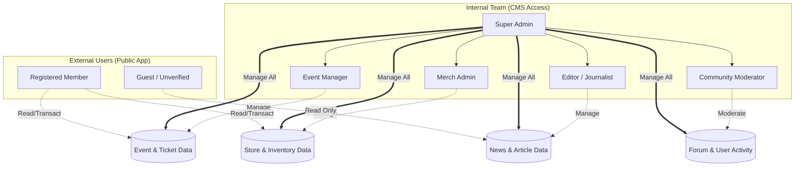

# 05 — User Roles & Permissions

> Dokumen ini menjabarkan daftar peran pengguna (*User Roles*), hak akses (*Permissions*), serta batasan otorisasi di dalam ekosistem platform **Sukabumi Eundeur**.

---

## 📌 Daftar Isi

- [Penjelasan](#-penjelasan)
- [Tujuan](#-tujuan)
- [Scope](#-scope)
- [Flow — Matriks Otorisasi](#-flow--matriks-otorisasi)
- [Diagram Hierarki Akses](#-diagram-hierarki-akses)
- [Daftar Peran Pengguna (User Roles)](#-daftar-peran-pengguna-user-roles)
- [Kebijakan Akses Berbasis Modul](#-kebijakan-akses-berbasis-modul)
- [Checklist](#-checklist)
- [Catatan](#-catatan)
- [Best Practice](#-best-practice)
- [Enterprise Recommendation](#-enterprise-recommendation)
- [Future Improvement](#-future-improvement)

---

## 🎯 Penjelasan

Platform Sukabumi Eundeur memiliki fungsi yang kompleks dan melibatkan banyak pihak mulai dari panitia (*organizer*), staf toko, jurnalis (*editor*), hingga penonton dan artis. Untuk menjaga keamanan dan integritas data, sistem menerapkan arsitektur **Role-Based Access Control (RBAC)**.

Dengan RBAC, setiap akun pengguna akan diberikan satu atau lebih "Peran" (*Role*), yang mana setiap peran memiliki serangkaian "Hak Akses" (*Permissions*) yang menentukan tindakan apa saja yang dapat dilakukan (seperti membuat event, menyetujui artikel, atau membeli tiket).

---

## 🎯 Tujuan

1. Mendefinisikan hierarki dan tingkatan akses seluruh jenis pengguna.
2. Mencegah akses tak sah (misalnya: *Editor* berita tidak boleh bisa mengubah data *Merchandise*).
3. Menjadi acuan teknis bagi *Developer* dalam mengatur *Row Level Security* (RLS) di Supabase dan *middleware* otorisasi di Next.js.
4. Memberikan panduan jelas bagi Administrator dalam memberikan hak akses saat fase operasional.

---

## 📐 Scope

Dokumen ini mencakup:
- Daftar peran (*Roles*) standar yang tersedia di platform.
- Matriks hak akses berdasarkan modul (Ticketing, Merch, News, CMS).
- Konsep dasar autentikasi publik vs internal.

Dokumen ini **tidak mencakup**:
- Implementasi kode teknis middleware otorisasi (berada di implementasi *codebase*).
- Syarat dan Ketentuan Hukum (*Terms & Conditions*) pendaftaran akun (di luar *scope* arsitektur).

---

## 🔄 Flow — Matriks Otorisasi

Berikut adalah matriks sederhana (*CRUD: Create, Read, Update, Delete*) hak akses berdasarkan peran:

| Modul | Super Admin | Event Manager | Merch Admin | Editor | Member | Guest |
|---|:---:|:---:|:---:|:---:|:---:|:---:|
| **CMS Settings** | CRUD | - | - | - | - | - |
| **Users / Roles** | CRUD | - | - | - | - | - |
| **Events & Tickets**| CRUD | CRUD | R | R | R (Buy) | R |
| **Merchandise** | CRUD | R | CRUD | R | R (Buy) | R |
| **News / Content** | CRUD | R | R | CRUD | R | R |
| **Community** | CRUD | R | R | R | CRUD (Own) | R |

*(Catatan: R = Hanya melihat data yang bersifat publik atau relevan).*

---

## 🖼️ Diagram Hierarki Akses

---

## 👥 Daftar Peran Pengguna (User Roles)

### 1. Super Admin
Pemilik platform atau level pimpinan tertinggi.
- **Akses:** Memiliki hak akses penuh (baca, tulis, hapus) ke seluruh modul dan pengaturan sistem.
- **Tugas Khusus:** Mengatur otorisasi *user* lain, mengakses laporan analitik tingkat tinggi, dan mengubah konfigurasi global web.

### 2. Event Manager (Penyelenggara)
Penanggung jawab utama operasional festival/event.
- **Akses:** CRUD pada modul Events, Ticketing, Schedule, dan Artist.
- **Tugas Khusus:** Membuat event baru, mengatur harga/kuota tiket, melihat data penjualan tiket, memvalidasi proses *check-in* (atau mendelegasikan ke akun *Scanner* khusus).

### 3. Merch Admin (Admin Toko)
Penanggung jawab operasional *Merchandise Store*.
- **Akses:** CRUD pada modul Produk, Kategori, Order, dan Pengiriman.
- **Tugas Khusus:** Menambah stok, memperbarui status pengiriman (*tracking*), dan menangani retur/keluhan *merchandise*.

### 4. Editor / Journalist
Penanggung jawab konten publikasi dan pemberitaan.
- **Akses:** CRUD pada modul News, Artikel, Tags, dan Media Library.
- **Tugas Khusus:** Menulis dan mempublikasi liputan event atau berita band lokal.

### 5. Community Moderator
Penanggung jawab aktivitas interaksi sosial.
- **Akses:** Menghapus konten *(take-down)*, *banning user*, dan verifikasi unggahan galeri komunitas.
- **Tugas Khusus:** Menjaga forum komunitas agar bebas dari spam dan konten tidak pantas.

### 6. Registered Member (Pengguna Terverifikasi)
Pengguna yang telah mendaftar dan memverifikasi email/nomor telepon.
- **Akses:** Dapat melakukan pembelian tiket, *checkout merchandise*, membuat post di forum, dan memberikan *review*.
- **Tugas Khusus:** Mengelola profil sendiri (ganti password, ubah foto, cek riwayat pesanan).

### 7. Guest (Pengguna Publik)
Pengunjung website yang belum/tidak *login*.
- **Akses:** *Read-only* (hanya membaca) informasi publik seperti jadwal event, berita, dan katalog produk.
- **Batasan:** Dilarang melakukan *checkout*, dilarang berkomentar di forum.

---

## 🔒 Kebijakan Akses Berbasis Modul

Untuk memastikan keamanan *data isolation*, setiap role dibatasi pada *domain* tugasnya masing-masing:
- **Editor** dapat melihat ringkasan event (untuk bahan berita) namun tidak dapat melihat data pembeli tiket.
- **Merch Admin** dapat memproses pesanan baju, namun tidak memiliki akses ke fungsi *scan* QR code tiket (kecuali diberikan akses ganda).
- **Scanner/Volunteer** (Sub-role sementara saat hari-H) hanya memiliki akses terbatas pada aplikasi untuk memindai tiket tanpa bisa mengubah harga atau data lainnya.

---

## ✅ Checklist

- [x] Hierarki tingkat akses telah terdefinisi (Internal vs Eksternal).
- [x] Pembagian tugas dan peran (SA, Event, Merch, Editor, Mod, Member, Guest) sudah tertulis jelas.
- [x] Matriks *CRUD* tingkat tinggi selesai dibuat.
- [ ] Memastikan model skema *Database* (Supabase) dapat memfasilitasi RBAC ini melalui *Row Level Security* (RLS).
- [ ] Validasi alur persetujuan (*approval flow*) jika *Editor* memerlukan persetujuan sebelum *publish*.

---

## 📝 Catatan

- Satu akun pengguna (*User Account*) dapat memiliki lebih dari satu *Role* jika diizinkan oleh Super Admin (misalnya pengguna A adalah *Event Manager* sekaligus *Merch Admin*).
- Setiap tindakan penting yang dilakukan oleh peran *Internal Team* (seperti penghapusan tiket, perubahan stok) wajib dicatat dalam **Audit Log** sistem untuk keperluan investigasi keamanan.

---

## 💡 Best Practice

- **Principle of Least Privilege (PoLP):** Berikan hak akses minimal yang hanya diperlukan *user* untuk menyelesaikan tugasnya. Jangan berikan akses Super Admin ke semua staf panitia.
- **Default Deny:** Pada implementasi sistem, semua aksi secara bawaan ditolak (*denied*) kecuali *role* pengguna secara eksplisit mengizinkannya.
- **Role Hierarchy:** Buatlah struktur relasi (seperti Supabase *custom claims*) agar sistem mudah mengecek otoritas `isAdmin` atau `isEditor` di sisi *frontend* (UI/UX) maupun *backend* (API).

---

## 🏢 Enterprise Recommendation

> **Single Sign-On (SSO) & Custom Claims**
> Perusahaan teknologi seperti GitLab dan Stripe menggunakan mekanisme *Custom Claims* pada JWT (JSON Web Token) untuk memvalidasi *role* tanpa harus selalu melakukan pemanggilan *database* (query DB) di setiap permintaan API. Pendekatan ini sangat direkomendasikan karena akan memangkas beban server (database) ketika lalu lintas situs memuncak pada saat pembukaan penjualan tiket (*Ticket War*).

---

## 🚀 Future Improvement

- **Vendor / Tenant Roles:** Mengakomodasi penjual pihak ketiga untuk berjualan di platform Sukabumi Eundeur dengan *Dashboard Tenant* khusus yang terisolasi dari toko resmi.
- **Artist Role:** Memberikan akun khusus kepada artis atau manajemen artis agar dapat memodifikasi profil *(bio, riders, gallery)* mereka sendiri secara mandiri setelah diverifikasi Super Admin.
- **Sponsor Role:** Memberikan akses *read-only dashboard* khusus kepada pihak sponsor untuk melihat metrik trafik web atau data statistik event secara *real-time*.

---

⬅️ [Kembali ke 04. Feature List](./04-feature-list.md) · ➡️ [Lanjut ke 06. User Flow](./06-user-flow.md)

