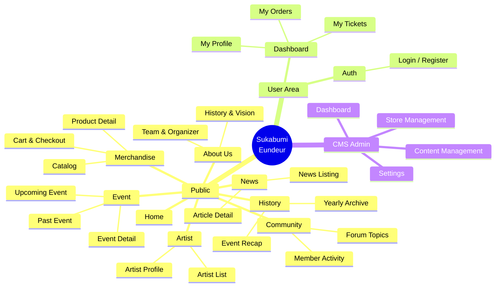

# 07 — Information Architecture

> Dokumen ini menjabarkan Arsitektur Informasi (*Information Architecture* / IA) dari platform **Sukabumi Eundeur**, mencakup peta situs (*sitemap*), taksonomi konten, dan struktur navigasi untuk memastikan informasi mudah ditemukan oleh pengguna.

---

## 📌 Daftar Isi

- [Penjelasan](#-penjelasan)
- [Tujuan](#-tujuan)
- [Scope](#-scope)
- [Flow — Pengelompokan Konten](#-flow--pengelompokan-konten)
- [Diagram Peta Situs (Sitemap)](#-diagram-peta-situs-sitemap)
- [Struktur Navigasi Publik](#-struktur-navigasi-publik)
- [Struktur Navigasi CMS (Internal)](#-struktur-navigasi-cms-internal)
- [Taksonomi & Kategorisasi](#-taksonomi--kategorisasi)
- [Checklist](#-checklist)
- [Catatan](#-catatan)
- [Best Practice](#-best-practice)
- [Enterprise Recommendation](#-enterprise-recommendation)
- [Future Improvement](#-future-improvement)

---

## 🎯 Overview

*Information Architecture* (IA) adalah fondasi pengorganisasian, penamaan, dan pencarian (*searchability*) informasi dalam sebuah website. Platform ekosistem seperti Sukabumi Eundeur memiliki banyak sekali entitas informasi (Berita, Artis, Merchandise, Tiket, Riwayat Event). Tanpa IA yang solid, pengguna akan kebingungan (tersesat) saat mencari informasi spesifik.

Dokumen ini menjadi cetak biru (*blueprint*) bagi UI/UX Designer dalam merancang struktur menu (Header/Footer), serta bagi Developer dalam merancang URL/Routing halaman (yang akan dibahas lebih teknis di `08-page-structure.md`).

---

## 🎯 Objective

1. Mengelompokkan fungsi dan konten ke dalam hierarki yang logis.
2. Memudahkan pengguna menavigasi platform dari satu layanan ke layanan lain (misal: dari membaca berita ke membeli tiket).
3. Mendefinisikan struktur taksonomi (kategori, tag) untuk data yang dinamis.
4. Mendukung strategi SEO (dibahas mendalam di `18-seo-strategy.md`) melalui struktur *sitemap* yang jelas.

---

## 📐 Scope

Dokumen ini mencakup:
- Peta situs (*Sitemap*) hierarkis untuk area Publik dan CMS.
- Struktur Menu Navigasi Utama (Header) dan Navigasi Bawah (Footer).
- Taksonomi konten (News, Merchandise, Event, Artist).

Dokumen ini **tidak mencakup**:
- Struktur *routing* teknis Next.js atau penamaan *slug* URL tingkat kode (lihat `08-page-structure.md`).
- Desain visual menu *dropdown* (berada di ranah desain antarmuka).

---

## 🔄 User Flow

### Alur Processes
 Pengelompokan Konten

Pengelompokan informasi didasarkan pada intensi pengguna (*user intent*):

1. **Informasional (Mencari Tahu):** About, News, Artist, History, Contact.
2. **Transaksional (Melakukan Pembelian):** Event & Tickets, Merchandise Store.
3. **Interaksional (Terhubung dengan Orang Lain):** Community, Forum, Social.
4. **Manajerial (Mengatur Platform):** CMS Dashboard.

---

## 🖼️ Diagram Peta Situs (Sitemap)

---

## 🧭 Struktur Navigasi Publik

### 1. Main Header Navigation (Global)
Navigasi ini lengket (*sticky*) di bagian atas seluruh halaman.
- **Beranda** (Home)
- **Event** (Dropdown: Upcoming, Past Event, History)
- **Store** (Merchandise)
- **News** (Berita & Artikel)
- **Community** (Forum & Komunitas)
- **Artist** (Direktori Artis)
- **[Kanan]** Ikon Pencarian (*Search*), Keranjang (*Cart*), dan Tombol [Login / Akun Saya]

### 2. Footer Navigation
Navigasi di bagian paling bawah halaman untuk *link* sekunder dan kepatuhan hukum.
- **Tentang Kami** (About, Visi Misi, Team)
- **Bantuan & Dukungan** (FAQ, Kontak Kami)
- **Legalitas** (Syarat & Ketentuan, Kebijakan Privasi, Kebijakan Refund)
- **Media Sosial** (Link ke Instagram, Spotify, YouTube, TikTok)
- **Newsletter** (Form berlangganan email)

---

## ⚙️ Struktur Navigasi CMS (Internal)

Navigasi khusus untuk *Super Admin* dan *Staff*, biasanya berada di panel sebelah kiri (*Sidebar*).

- 📊 **Dashboard** (Ringkasan Analitik)
- 🎟️ **Event & Ticket**
  - Kelola Event
  - Data Penjualan Tiket
  - Validasi Check-In
- 🛍️ **Merchandise Store**
  - Kelola Produk
  - Manajemen Order & Pengiriman
- 📰 **News & Content**
  - Semua Artikel
  - Kategori & Tags
- 🎸 **Artist & Line Up**
  - Direktori Artis
- 👥 **Community & Users**
  - Moderator Forum
  - Daftar Pengguna (Member)
- 🖼️ **Media Library**
- ⚙️ **Settings**
  - General Settings (SEO, Info Web)
  - Users & Roles (Manajemen Akun Admin)

---

## 🗂️ Taksonomi & Kategorisasi

Untuk mempermudah pencarian (Search & Filter), konten dinamis dikelompokkan menggunakan taksonomi berikut:

### 1. Kategori Berita (News Categories)
- **Local Gigs** (Acara musik lokal skala kecil)
- **Festival** (Berita khusus event utama Sukabumi Eundeur)
- **Artist Spotlight** (Wawancara atau profil artis)
- **Community** (Berita terkait kegiatan sosial komunitas)

### 2. Kategori Merchandise
- **Apparel** (T-Shirt, Hoodie, Topi)
- **Accessories** (Totebag, Lanyard, Stiker, Gelang)
- **Physical Release** (CD, Kaset, Piringan Hitam band lokal)
- **Bundling** (Paket Tiket + Merchandise)

### 3. Taksonomi Event
- **Status:** Upcoming, On-going, Past
- **Tipe Event:** Festival Utama, Road to Festival, Intimate Gig, Community Gathering

---

## 💼 Business Rules
- Seluruh aturan bisnis modul harus tunduk pada Single Source of Truth (SSOT) Sukabumi Eundeur.
- Transaksi & data mutasi wajib mencatat audit log timestamp.

## ⚙️ Functional Requirements
- Mengimplementasikan seluruh endpoint API & komponen UI terkait.
- Mengelola state & autentikasi pengguna secara otomatis melalui JWT & Self-Hosted Auth Handler.

## 🚀 Non Functional Requirements
- Latensi respon < 200ms.
- Uptime target 99.9%.
- Aksesibilitas WCAG 2.1 Level AA.

## 🔗 Dependencies
- `@PostgreSQL (Self-Hosted VPS)/PostgreSQL (Self-Hosted VPS)-js`
- `next` v16
- `react` v19
- `tailwindcss` v4

## ⚠️ Risks
- Kegagalan koneksi database saat lonjakan trafik -> Mitigasi: Connection Pooling & Caching.

## 🧪 Edge Cases
- Sesi pengguna kadaluarsa di tengah transaksi -> Redirect otomatis ke login dengan restore state.

## 📋 Validation Rules
- Format input wajib disanitasi dari potensi XSS & SQL Injection.

## 🛠️ Technical Notes
- Implementasi wajib mengikuti konvensi kode di [`21-folder-structure.md`](./21-folder-structure.md).

## 🚀 Future Improvements
- Integrasi analitik real-time dan rekomendasi berbasis AI.

## ✅ Checklist

- [x] Sitemap lengkap dari halaman Publik hingga CMS terpetakan.
- [x] Struktur Menu Navigasi (Header & Footer) terdefinisi.
- [x] Taksonomi dasar untuk kategori Berita, Merchandise, dan Event telah dibuat.
- [ ] Tinjau kembali dengan tim Bisnis apakah ada kategori merchandise tambahan yang mungkin dijual.
- [ ] Pastikan tautan-tautan *Legalitas* tersedia dan memiliki naskah resmi sebelum *Go-Live*.

---

## 📝 Catatan

- **Kategori "Bundling" pada Merchandise:** Kategori ini penting karena sering kali strategi *marketing* menjual "Tiket Early Bird + T-Shirt Eksklusif". Secara IA, *bundling* harus bisa ditemukan di halaman Event maupun halaman Merchandise.
- Kedalaman menu (*menu depth*) maksimal direkomendasikan hanya **2 tingkat** (Menu Utama -> Sub-menu tunggal). Menghindari *dropdown* bertumpuk (*multi-level dropdown*) untuk menjaga *usability* di perangkat *mobile*.

---

## 💡 Best Practice

- **Breadcrumbs:** Selalu sediakan *Breadcrumbs* (contoh: *Home > Merchandise > Apparel > T-Shirt Eundeur 2026*) pada halaman detail produk atau artikel berita. Ini membantu pengguna mengetahui posisinya dan merupakan praktik terbaik untuk SEO.
- **Search-First Approach:** Berikan fitur pencarian (*Global Search*) yang mudah diakses di Header, mengingat banyaknya entitas informasi di dalam platform.

---

## 🏢 Enterprise Recommendation

> **Faceted Navigation**
> Pada modul *Merchandise Store* dan *History Event*, terapkan *Faceted Navigation* (filter dinamis berlapis seperti Shopify/Amazon). Pengguna dapat memfilter berdasarkan beberapa kriteria sekaligus (misalnya: Harga di bawah 100rb + Kategori Apparel + Warna Hitam) tanpa harus me-muat ulang seluruh halaman (*Client-side filtering*).

---

## 🚀 Future Improvement

- **Personalized Navigation:** Saat pengguna *login*, ubah struktur Header untuk lebih menonjolkan fitur komunitas atau rekomendasi event berdasarkan riwayat pembelian tiket mereka.
- **AI-Driven Search:** Mengganti pencarian teks biasa dengan *Semantic Search* (berbasis AI), sehingga pengguna bisa mencari dengan kalimat "baju ukuran L warna hitam" dan sistem akan langsung menampilkan produk yang relevan.

---

⬅️ [Kembali ke 06. User Flow](./06-user-flow.md) · ➡️ [Lanjut ke 08. Page Structure](./08-page-structure.md)

