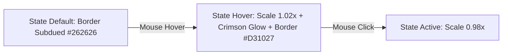
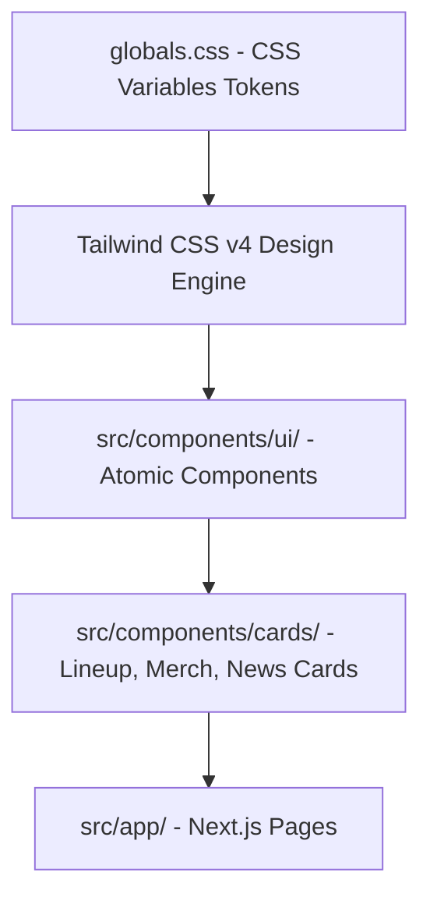

# 08-B — Design System & UI Specification (Heavy Metal Underground Aesthetic)

> **Single Source of Truth (SSOT) — Spesifikasi Design System & Tokens Visual**  
> Dokumen ini menentukan pedoman visual, token warna, tipografi, efek antarmuka, serta spesifikasi komponen UI untuk platform **Sukabumi Eundeur** berdasarkan berkas acuan desain resmi [`Sukabumi_Eundeur_heavy_metal_fes…_202607220029.jpeg`](file:///Users/drefan/Projects/Sukabumi%20Eundeur%20Web/Reference/Sukabumi_Eundeur_heavy_metal_fes%E2%80%A6_202607220029.jpeg).

---

## 📌 Daftar Isi

- [Overview](#-overview)
- [Objective](#-objective)
- [Scope](#-scope)
- [Business Rules](#-business-rules)
- [Functional Requirements](#-functional-requirements)
- [Non Functional Requirements](#-non-functional-requirements)
- [User Flow](#-user-flow)
- [Architecture](#-architecture)
- [Dependencies](#-dependencies)
- [Risks](#-risks)
- [Edge Cases](#-edge-cases)
- [Validation Rules](#-validation-rules)
- [Technical Notes & Design Tokens](#-technical-notes--design-tokens)
  - [1. Color Palette Tokens (Tailwind CSS v4)](#1-color-palette-tokens-tailwind-css-v4)
  - [2. Typography System & Hierarchy](#2-typography-system--hierarchy)
  - [3. Card Component Specifications](#3-card-component-specifications)
  - [4. Button & Interactive Elements](#4-button--interactive-elements)
  - [5. Visual Effects (Glows, Shadows, Transitions)](#5-visual-effects-glows-shadows-transitions)
- [Future Improvements](#-future-improvements)
- [Checklist](#-checklist)

---

## 🎯 Overview

Design System Sukabumi Eundeur memusatkan identitas visual platform pada genre **Heavy Music & Underground Culture Ecosystem**. Desain menggunakan tema *Ultra-Dark Pitch Black* yang memadukan permukaan *Obsidian Surface Cards* dengan warna aksen *Crimson Blood Red*, memberikan kesan gahar, modern, mewah, dan berstandar internasional (setara Hellfest & Wacken).

---

## 🎯 Objective

1. Menyediakan acuan token visual (*Design Tokens*) yang konsisten di seluruh komponen React 19 & Tailwind CSS v4.
2. Memastikan rasio kontras warna (*WCAG AA Compliance*) tetap tinggi meskipun berkonsep *dark mode*.
3. Membakukan gaya kartu (*Card Styles*), tombol, tipografi, dan efek pencahayaan (*Glow Effects*).
4. Menjamin mikro-interaksi antarmuka terasa halus, responsif, dan dinamis.

---

## 📐 Scope

### In-Scope
- Pendefinisian variabel CSS token warna, font, border-radius, dan box-shadow.
- Spesifikasi detail komponen: Hero Section, Countdown Card, Line Up Grid Cards, Merchandise Cards, News Cards, Gallery Grid, Sponsor Grid, & Navbar/Footer.
- Panduan mikro-interaksi (*Hover State, Active State, Focus State, Loading State*).

### Out-of-Scope
- Aset ilustrasi grafis 3D (disediakan oleh tim Motion Graphic).

---

## 💼 Business Rules

1. **Prinsip Utama Brand Identity**: Warna aksen *Crimson Red* (`#E50914` / `#D31027`) **hanya** digunakan untuk elemen tindakan utama (*Primary CTA*), status aktif, dan indikator krusial. Tidak boleh digunakan secara berlebihan pada teks paragraf biasa.
2. **Standard Halaman Gelap**: Seluruh halaman publik dan dashboard **wajib** berlatar belakang gelap (`#030303` / `#050505`). Dilarang menggunakan background putih atau abu-abu terang sebagai kontainer utama.
3. **Imutabilitas Foto Artis**: Foto penampil (*Line Up*) menggunakan estetik foto hitam-putih (*High-Contrast Black & White*) dengan efek hover warna asli atau glow merah.

---

## ⚙️ Functional Requirements

| ID | Komponen UI | Spesifikasi Visual |
|---|---|---|
| **FR-DS-01** | Primary CTA Button | Latar belakang Crimson Red (`#D31027`), teks putih uppercase, rounded-lg, hover glow `0 0 20px rgba(211,16,39,0.5)`. |
| **FR-DS-02** | Line Up Artist Card | Container obsidian (`#141414`), foto B&W 1:1 ratio, border `#262626`, nama artis uppercase bold. |
| **FR-DS-03** | Merchandise Product Card | Container dark surface (`#121212`), gambar produk di atas background gelap, harga dalam format IDR kontras. |
| **FR-DS-04** | Countdown Timer Box | Teks angka monospace bold raksasa (`06 : 30 : 26 : 35`), dengan label kecil di bawahnya. |

---

## 🚀 Non Functional Requirements

- **Performance**: Efek glow & transisi menggunakan properti CSS GPU-accelerated (`transform`, `opacity`, `box-shadow`) agar mencapai 60 FPS di perangkat mobile.
- **Accessibility**: Teks putih di atas latar belakang pitch black memenuhi kontras rasio minimal 14:1.

---

## 🔄 User Flow



---

## 🏗️ Architecture



---

## 🔗 Dependencies

- **Tailwind CSS v4**: Utility-first CSS framework.
- **Google Fonts (Inter & Oswald / Syne)**: Tipografi resmi.
- **lucide-react**: Ikonografi vektor minimalis.

---

## ⚠️ Risks

- **Heavy Shadow Performance**: Penggunaan `box-shadow` dengan blur besar yang berlebihan pada daftar kartu yang panjang dapat menyebabkan *lagging* di ponsel kelas bawah.

---

## 🧪 Edge Cases

1. **Judul Artikel/Artis Sangat Panjang**: Komponen kartu menggunakan `line-clamp-2` atau `truncate` agar tinggi kartu tetap konsisten (*uniform grid height*).

---

## 📋 Validation Rules

- Border radius elemen UI: `rounded-xl` (12px) untuk kartu, `rounded-lg` (8px) untuk tombol.
- Transisi durasi standar: `duration-300 ease-out`.

---

## 🛠️ Technical Notes & Design Tokens

### 1. Color Palette Tokens (Tailwind CSS v4)

#### `src/app/globals.css`
```css
@import "tailwindcss";

@layer base {
  :root {
    /* Color Palette */
    --color-pitch-black: #030303;
    --color-surface-dark: #0A0A0A;
    --color-card-obsidian: #121212;
    --color-card-elevated: #1A1A1A;
    --color-border-subdued: #262626;
    --color-border-hover: #3F3F46;

    /* Primary Accent - Crimson Red */
    --color-crimson-primary: #D31027;
    --color-crimson-hover: #B20600;
    --color-crimson-glow: rgba(211, 16, 39, 0.4);

    /* Text Hierarchy */
    --color-text-primary: #FFFFFF;
    --color-text-secondary: #A1A1AA;
    --color-text-muted: #71717A;
  }
}
```

### 2. Typography System & Hierarchy

- **Display Headings (H1, H2, H3)**:
  - Font: `Oswald`, `Syne`, atau `Cabinet Grotesk` (Sans-Serif Heavy).
  - Style: **ALL CAPS (Uppercase)**, Tracking `tracking-wider` / `tracking-tight`.
  - Font Weight: `font-bold` (700 / 800).
- **Body & Subtitles**:
  - Font: `Inter` atau `Space Grotesk`.
  - Style: Normal sentence case, `leading-relaxed`.
  - Font Weight: `font-normal` (400) / `font-medium` (500).

```html
<!-- Contoh Halaman Hero Title -->
<h1 class="font-display font-extrabold text-5xl md:text-7xl uppercase tracking-wider text-white">
  SUKABUMI EUNDEUR
</h1>
```

### 3. Card Component Specifications

#### A. Line Up Artist Card (`src/components/cards/ArtistCard.tsx`)
- **Background**: `#121212` (`bg-card-obsidian`)
- **Border**: `1px solid #262626`
- **Image**: Ratio 1:1, B&W Filter (`grayscale contrast-125`), Scale on Hover (`hover:scale-105 transition-transform duration-300`).
- **Typography**: Name (Bold White Uppercase), Genre & Time (`text-zinc-400 text-sm`).

#### B. Merchandise Product Card (`src/components/cards/MerchCard.tsx`)
- **Background**: `#0F0F0F`
- **Image Container**: Aspect ratio 4:3 / 1:1 dengan latar belakang studio gelap.
- **Price Tag**: Teks bold kontras tinggi di pojok bawah.

#### C. Festival Countdown Box (`src/components/cards/CountdownCard.tsx`)
- **Layout**: Horisontal split (Poster Acara di kiri, Timer Monospace di kanan).
- **Timer Font**: Numeric Monospace (`06 : 30 : 26 : 35`), Label (`DAYS`, `HOURS`, `MINS`, `SECS`).
- **Button**: Crimson Red "BUY TICKET" CTA.

### 4. Button & Interactive Elements

```html
<!-- Primary Button (Crimson Red) -->
<button class="bg-[#D31027] hover:bg-[#B20600] text-white font-bold uppercase tracking-wider px-6 py-3 rounded-lg transition-all duration-300 shadow-[0_0_20px_rgba(211,16,39,0.3)] hover:shadow-[0_0_30px_rgba(211,16,39,0.6)] cursor-pointer">
  BUY TICKET
</button>

<!-- Secondary Ghost Button -->
<button class="bg-transparent border border-zinc-700 hover:border-white text-white font-semibold uppercase tracking-wider px-6 py-3 rounded-lg transition-all duration-300">
  HOVER S00 CTA
</button>
```

### 5. Visual Effects (Glows, Shadows, Transitions)

- **Red Crimson Glow**: `shadow-[0_0_25px_rgba(211,16,39,0.4)]`
- **Card Hover Elevation**: `hover:-translate-y-1 hover:border-[#D31027] transition-all duration-300`
- **Glassmorphism Translucent Navbar**: `backdrop-blur-md bg-black/80 border-b border-zinc-800/50`

---

## 🚀 Future Improvements

- **Interactive 3D Stage Preview**: Mengintegrasikan Three.js untuk menampilkan efek visual stage 3D interaktif yang menyala dalam kegelapan.

---

## ✅ Checklist

- [x] Variabel CSS Token Warna (Pitch Black, Crimson Red, Obsidian Surface) terdefinisi.
- [x] Himpunan tipografi heavy display & body text ditentukan.
- [x] Spesifikasi komponen kartu (Lineup, Merch, Countdown, News) terinci.
- [x] Efek visual glow & mikro-interaksi terpetakan.
- [x] Memenuhi 15 komponen standar dokumentasi arsitektur.

---

<div align="center">

⬅️ [Kembali ke 08. Page Structure](./08-page-structure.md) · ➡️ [Lanjut ke 09. Database Planning](./09-database-planning.md)

</div>
