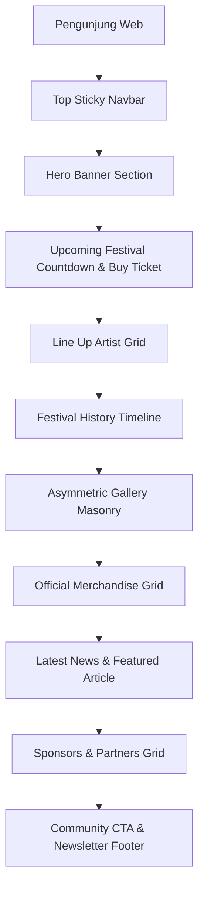
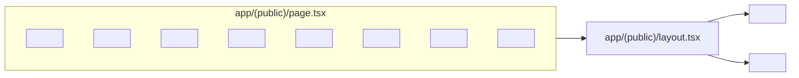

# 08 — Page Structure & Layout Blueprints (Heavy Metal UI Architecture)

> **Single Source of Truth (SSOT) — Tata Letak Halaman & Blueprint Antarmuka**  
> Dokumen ini menjabarkan pemetaan rute URL Next.js App Router, hierarki *layout*, serta anatomi antarmuka visual halaman utama platform **Sukabumi Eundeur** berdasarkan berkas acuan desain [`Sukabumi_Eundeur_heavy_metal_fes…_202607220029.jpeg`](file:///Users/drefan/Projects/Sukabumi%20Eundeur%20Web/Reference/Sukabumi_Eundeur_heavy_metal_fes%E2%80%A6_202607220029.jpeg).

---

## 📌 Daftar Isi

- [Overview](#-overview)
- [Objective](#-objective)
- [Scope](#-scope)
- [Business Rules](#-business-rules)
- [Functional Requirements](#-functional-requirements)
- [Non Functional Requirements](#-non-functional-requirements)
- [User Flow](#-user-flow)
- [Architecture](#-architecture)
- [Dependencies](#-dependencies)
- [Risks](#-risks)
- [Edge Cases](#-edge-cases)
- [Validation Rules](#-validation-rules)
- [Technical Notes & Page Blueprints](#-technical-notes--page-blueprints)
  - [1. Routing Map (Next.js App Router)](#1-routing-map-nextjs-app-router)
  - [2. Nested Layout Architecture](#2-nested-layout-architecture)
  - [3. Home Page Layout Blueprint (Design Reference Aligned)](#3-home-page-layout-blueprint-design-reference-aligned)
  - [4. Component Server vs Client Boundaries](#4-component-server-vs-client-boundaries)
- [Future Improvements](#-future-improvements)
- [Checklist](#-checklist)

---

## 🎯 Overview

Platform Sukabumi Eundeur dibangun di atas Next.js 16 App Router dengan pemisahan wilayah rute (*Route Groups*) antara halaman publik (`(public)`), autentikasi (`(auth)`), dan dashboard manajemen (`(admin)`). Seluruh halaman publik mematuhi estetik *Ultra-Dark Pitch Black* dengan tata letak visual modern.

---

## 🎯 Objective

1. Menyediakan cetak biru (*blueprint*) antarmuka presisi untuk setiap seksi halaman publik.
2. Mengoptimalkan pembagian *Server Components* (RSC) dan *Client Components* demi performa FCP < 1.2s.
3. Menjamin konsistensi tata letak *sticky navbar*, *hero section*, *lineup grid*, *merchandise grid*, *gallery masonry*, dan *footer*.
4. Membakukan hierarki navigasi dinamis berbasis `[slug]`.

---

## 📐 Scope

### In-Scope
- Peta rute URL publik, auth, dan admin CMS.
- Cetak biru tata letak 10 seksi halaman utama (Home Page Layout Blueprint).
- Arsitektur *Nested Layouts* (Root, Public, Auth, Admin).

### Out-of-Scope
- Skema database (dijelaskan pada `09-database-planning.md`).

---

## 💼 Business Rules

1. **Sticky Translucent Navbar**: Navigasi atas publik **wajib** bersifat melayang (*sticky top-0*) dengan latar belakang `backdrop-blur-md bg-black/80`.
2. **Hero Banner Primary CTA**: Seksi Hero **wajib** menampilkan Headline "SUKABUMI EUNDEUR" dengan tombol aksen Crimson Red ("BUY TICKET" / "HOVER S00 CTA").
3. **Responsive Grid Layout**: Daftar Line Up, Merchandise, dan Berita **wajib** responsif (1 kolom di Mobile, 2 kolom di Tablet, 3-4 kolom di Desktop).

---

## ⚙️ Functional Requirements

| ID | Seksi Halaman | Komponen UI | Deskripsi Fungsional |
|---|---|---|---|
| **FR-PS-01** | Top Navbar | `<Navbar />` | Menampilkan Logo, Hamburger, Share, Search, & Cart Icon. |
| **FR-PS-02** | Hero Banner | `<HeroSection />` | Background foto konser dengan pyrotechnics, Title, Subtitle, & CTA. |
| **FR-PS-03** | Upcoming Festival | `<CountdownWidget />` | Poster acara, Timer `06:30:26:35`, & Tombol Crimson Red. |
| **FR-PS-04** | Line Up Grid | `<LineupGrid />` | Grid kartu portrait artis hitam-putih dengan nama & genre. |
| **FR-PS-05** | History & Timeline | `<FestivalHistory />` | Garis waktu tahunan, statistik pengunjung, & link aftermovie. |
| **FR-PS-06** | Gallery Masonry | `<MediaGallery />` | Grid foto asimetris (fire, smoke, crowd, stage lighting). |
| **FR-PS-07** | Official Merchandise | `<MerchGrid />` | Grid 3x2 produk merch (Hoodie, T-Shirt, Beanie, Vinyl). |
| **FR-PS-08** | Latest News | `<NewsSection />` | Card berita utama featured + side list berita sekunder. |
| **FR-PS-09** | Sponsors Bar | `<SponsorsMarquee />` | Logos sponsor monokrom (Hellfest, Wacken, Vercel). |
| **FR-PS-10** | Community & Footer | `<Footer />` | Card CTA komunitas + form newsletter + footer links. |

---

## 🚀 Non Functional Requirements

- **LCP (Largest Contentful Paint)**: Foto Hero Banner dioptimasi menggunakan Next.js `Image` dengan properti `priority` (LCP < 1.5s).
- **CLS (Cumulative Layout Shift)**: Aspek rasio gambar pada kartu merchandise & lineup dikunci (`aspect-square` / `aspect-video`) untuk 0 CLS score.

---

## 🔄 User Flow



---

## 🏗️ Architecture



---

## 🔗 Dependencies

- **Next.js Image (`next/image`)**: Optimasi gambar otomatis.
- **Framer Motion**: Animasi scroll & micro-interactions.

---

## ⚠️ Risks

- **Heavy Asset Loading**: Halaman utama memuat banyak foto berkualitas tinggi; jika tidak di-compress, kecepatan muat di seluler akan melambat.

---

## 🧪 Edge Cases

1. **Belum Ada Event Mendatang (No Active Event)**: Seksi `<CountdownWidget />` menampilkan status *"SEASON ENDED — STAY TUNED FOR NEXT EDITION"*.

---

## 📋 Validation Rules

- Gambar Hero wajib menggunakan format `.webp` / `.avif`.
- Grid Merchandise tepat 6 item (3x2) pada tampilan desktop.

---

## 🛠️ Technical Notes & Page Blueprints

### 1. Routing Map (Next.js App Router)

```text
app/
├── (public)/
│   ├── page.tsx                    -> Home Page (10 Seksi Utama)
│   ├── about/page.tsx              -> Profil Penyelenggara
│   ├── events/
│   │   ├── page.tsx                -> Daftar Event
│   │   └── [slug]/
│   │       ├── page.tsx            -> Detail Event & Lineup
│   │       └── checkout/page.tsx   -> Process Ticket Checkout
│   ├── merch/
│   │   ├── page.tsx                -> Katalog Merchandise
│   │   └── product/[slug]/page.tsx -> Detail Produk & Add to Cart
│   ├── news/
│   │   ├── page.tsx                -> News Portal Index
│   │   └── read/[slug]/page.tsx    -> Baca Artikel
│   ├── artist/
│   │   └── [slug]/page.tsx         -> Profil Artis & Setlist
│   └── history/page.tsx            -> Arsip Festival & Aftermovie
├── (auth)/
│   ├── login/page.tsx
│   └── register/page.tsx
└── (admin)/
    └── dashboard/page.tsx          -> CMS Admin Dashboard
```

### 2. Nested Layout Architecture

```tsx
// app/(public)/layout.tsx
import Navbar from '@/components/ui/Navbar';
import Footer from '@/components/ui/Footer';

export default function PublicLayout({ children }: { children: React.ReactNode }) {
  return (
    <div class="bg-[#030303] text-white min-h-screen flex flex-col font-sans">
      <Navbar />
      <main class="flex-grow">{children}</main>
      <Footer />
    </div>
  );
}
```

### 3. Home Page Layout Blueprint (Design Reference Aligned)

```tsx
// app/(public)/page.tsx Blueprint
export default async function HomePage() {
  return (
    <div class="space-y-16 pb-12">
      {/* 1. Hero Section */}
      <section class="relative h-[85vh] flex items-center justify-center bg-hero-pattern bg-cover bg-center">
        <div class="absolute inset-0 bg-gradient-to-t from-[#030303] via-black/40 to-black/70" />
        <div class="relative z-10 text-center space-y-4 px-4">
          <h1 class="font-display font-extrabold text-5xl md:text-8xl tracking-wider text-white">
            SUKABUMI EUNDEUR
          </h1>
          <p class="text-zinc-300 text-lg md:text-xl font-medium tracking-wide">
            Indonesia's Ultimate Heavy Metal Festival
          </p>
          <div class="pt-4">
            <a href="/events/sukabumi-eundeur-2026/checkout" class="btn-primary-crimson">
              BUY TICKET
            </a>
          </div>
        </div>
      </section>

      {/* 2. Upcoming Festival & Countdown */}
      <section class="max-w-7xl mx-auto px-4">
        <div class="bg-[#121212] border border-zinc-800 rounded-2xl p-6 md:p-8 grid md:grid-cols-12 gap-8 items-center">
          <div class="md:col-span-4">
            
          </div>
          <div class="md:col-span-8 space-y-6">
            <h2 class="font-display text-2xl font-bold uppercase text-zinc-400">UPCOMING FESTIVAL</h2>
            <div class="flex gap-4 font-mono text-3xl md:text-5xl font-bold text-white">
              <div>06 <span class="text-xs font-sans text-zinc-500 block">DAYS</span></div> :
              <div>30 <span class="text-xs font-sans text-zinc-500 block">HOURS</span></div> :
              <div>26 <span class="text-xs font-sans text-zinc-500 block">MINS</span></div> :
              <div>35 <span class="text-xs font-sans text-zinc-500 block">SECS</span></div>
            </div>
            <p class="text-zinc-300">Indonesia's Ultimate Heavy Metal Festival.</p>
            <a href="/events/checkout" class="inline-block bg-[#D31027] text-white font-bold px-8 py-3 rounded-lg uppercase">
              BUY TICKET
            </a>
          </div>
        </div>
      </section>

      {/* 3. Line Up Grid */}
      <section class="max-w-7xl mx-auto px-4">
        <h2 class="font-display text-3xl font-bold uppercase tracking-wider mb-8 text-white">LINE UP</h2>
        <div class="grid grid-cols-2 md:grid-cols-4 gap-6">
          {/* Artist Cards */}
        </div>
      </section>

      {/* 4. History & Gallery & Merch */}
      {/* ... Seksi Merchandise 3x2 Grid, News Featured Article, & Sponsors */}
    </div>
  );
}
```

### 4. Component Server vs Client Boundaries

- **Server Components (RSC)**: `page.tsx`, `<UpcomingEventWidget />`, `<MerchShowcase />`, `<NewsGrid />` (Direct DB Fetching & SSG).
- **Client Components (`'use client'`)**: `<Navbar />` (Menu toggle state), `<CountdownTimer />` (Interval ticker state), `<CartDrawer />` (Shopping cart state).

---

## 🚀 Future Improvements

- **Interactive Lineup Filter**: Fitur filter penampil berdasarkan genre (Death Metal, Metalcore, Thrash) tanpa *full page reload*.

---

## ✅ Checklist

- [x] Peta Rute URL Next.js App Router terdefinisi.
- [x] Cetak biru 10 seksi halaman utama presisi dengan acuan desain.
- [x] Pemisahan Server vs Client Components terstruktur.
- [x] Memenuhi 15 komponen standar dokumentasi arsitektur.

---

<div align="center">

⬅️ [Kembali ke 08-B. Design System](./08-b-design-system.md) · ➡️ [Lanjut ke 09. Database Planning](./09-database-planning.md)

</div>
