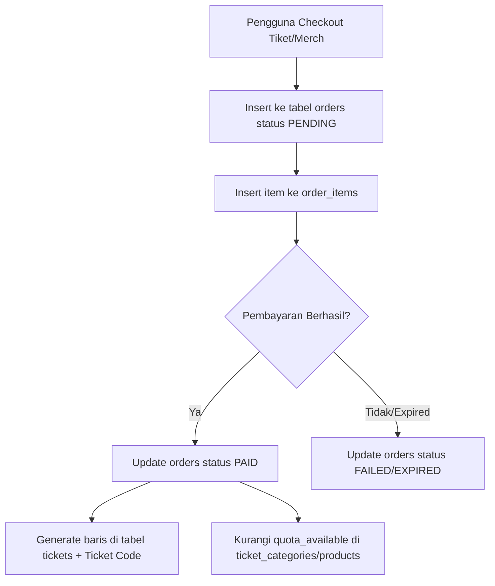
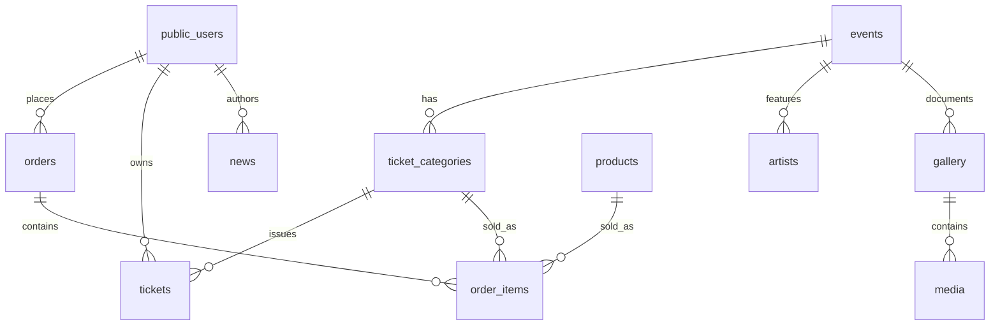

# 09 — Database Planning (Entity Design & DDL Schema)

> **Single Source of Truth (SSOT) — Arsitektur Basis Data PostgreSQL & PostgreSQL (Self-Hosted VPS)**  
> Dokumen ini menentukan perencanaan entitas basis data, skema DDL SQL konkrit, indeks performa, relasi Foreign Key, serta aturan *Row Level Security* (RLS) untuk platform **Sukabumi Eundeur**.

---

## 📌 Daftar Isi

- [Overview](#-overview)
- [Objective](#-objective)
- [Scope](#-scope)
- [Business Rules](#-business-rules)
- [Functional Requirements](#-functional-requirements)
- [Non Functional Requirements](#-non-functional-requirements)
- [User Flow](#-user-flow)
- [Architecture](#-architecture)
- [Dependencies](#-dependencies)
- [Risks](#-risks)
- [Edge Cases](#-edge-cases)
- [Validation Rules](#-validation-rules)
- [Technical Notes & SQL DDL Schema](#-technical-notes--sql-ddl-schema)
  - [1. Extensions & Custom Enum Types](#1-extensions--custom-enum-types)
  - [2. Identity & Profile Tables](#2-identity--profile-tables)
  - [3. Event & Ticketing Tables](#3-event--ticketing-tables)
  - [4. Commerce & Order Tables](#4-commerce--order-tables)
  - [5. Content & Media Tables](#5-content--media-tables)
  - [6. Performance Indexes](#6-performance-indexes)
  - [7. PostgreSQL (Self-Hosted VPS) Row Level Security (RLS) Policies](#7-PostgreSQL (Self-Hosted VPS)-row-level-security-rls-policies)
- [Future Improvements](#-future-improvements)
- [Checklist](#-checklist)

---

## 🎯 Overview

Basis data Sukabumi Eundeur dibangun menggunakan **PostgreSQL 16+** yang dikelola melalui BaaS **PostgreSQL (Self-Hosted VPS)**. Arsitektur basis data ini menangani transaksi finansial (penjualan tiket & e-commerce merchandise), manajemen konten (berita, galeri, riwayat acara), platform komunitas, dan hak akses pengguna berbasis peranan (RBAC).

---

## 🎯 Objective

1. Menyediakan skema database ter-normalisasi hingga bentuk **3NF (Third Normal Form)** untuk menjaga integritas data.
2. Menjamin keamanan data transaksional & privasi pengguna menggunakan **PostgreSQL (Self-Hosted VPS) Row Level Security (RLS)**.
3. Menyediakan performa *querying* tinggi di bawah 50ms untuk *read operations* melalui indeks PostgreSQL yang dioptimasi.
4. Mencegah manipulasi riwayat harga transaksi lalu melalui teknik *denormalization pricing snapshot*.

---

## 📐 Scope

### In-Scope
- Definisi DDL SQL presisi (`CREATE TABLE`, Data Types, Foreign Keys, Check Constraints).
- Pemetaan ekstensi profil pengguna dari `auth.users` PostgreSQL (Self-Hosted VPS) ke `public.users`.
- Kebijakan PostgreSQL (Self-Hosted VPS) Row Level Security (RLS) untuk perlindungan data tingkat baris.
- Indeks basis data B-Tree & GIN untuk pengurutan dan pencarian teks.

### Out-of-Scope
- Konfigurasi cluster PostgreSQL bawaan VPS (dikelola melalui PostgreSQL (Self-Hosted VPS) CLI / Managed Instance).
- Skema internal bawaan PostgreSQL (Self-Hosted VPS) (`auth`, `storage`, `realtime`).

---

## 💼 Business Rules

1. **Harga Historis Terunci**: Nominal harga tiket atau merchandise yang dibeli pada `order_items` **tidak boleh** berubah ketika harga master di `ticket_categories` atau `products` diubah.
2. **Keunikan Tiket**: Setiap tiket fisik/digital yang diterbitkan harus memiliki `ticket_code` acak unik (panjang 12 karakter alfanumerik) yang terhubung ke QR Code.
3. **Pembatasan Pembelian Tiket**: Satu nomor identitas (KTP/NIK) atau ID Pengguna maksimal hanya boleh membeli 4 tiket per jenis kategori dalam satu event.
4. **Prinsip Imutabilitas Transaksi**: Baris pada tabel `orders` yang berstatus `PAID` atau `REFUNDED` tidak boleh dihapus secara hard-delete.

---

## ⚙️ Functional Requirements

| ID | Deskripsi Kebutuhan Fungsional | Tabel Terkait |
|---|---|---|
| **FR-DB-01** | Sistem dapat menyimpan profil pengguna terikat pada akun autentikasi PostgreSQL (Self-Hosted VPS). | `public.users` |
| **FR-DB-02** | Sistem dapat mencatat stok tiket dan mengurangi sisa kuota secara atomik. | `ticket_categories` |
| **FR-DB-03** | Sistem dapat menyimpan pesanan yang mencakup gabungan tiket dan merchandise. | `orders`, `order_items` |
| **FR-DB-04** | Sistem dapat mencatat riwayat check-in tiket beserta waktu dan petugas scanner. | `tickets` |
| **FR-DB-05** | Sistem dapat mempublikasikan artikel berita dengan status draft, published, atau archived. | `news` |

---

## 🚀 Non Functional Requirements

- **Consistency**: ACID Compliance dijamin oleh transaksi PostgreSQL.
- **Latency**: Query pencarian event & berita < 30ms (dengan B-Tree/GIN indexes).
- **Security**: 100% tabel di skema `public` wajib mengaktifkan Row Level Security (`ALTER TABLE ... ENABLE ROW LEVEL SECURITY`).
- **Data Integrity**: Menggunakan UUID v4 sebagai Primary Key untuk mencegah *enumeration attack*.

---

## 🔄 User Flow



---

## 🏗️ Architecture



---

## 🔗 Dependencies

- **JWT & Self-Hosted Auth Handler Subsystem**: Bergantung pada `auth.users` untuk triggers sinkronisasi profil.
- **PostgreSQL Extensions**: Membutuhkan ekstensi `uuid-ossp` dan `pg_trgm`.

---

## ⚠️ Risks

- **Deadlock Kuota Tiket**: Potensi deadlock saat *war ticket* jika update kuota dilakukan tanpa transaksi terisolasi (`SELECT ... FOR UPDATE`).
- **Orphan Data Storage**: File gambar di MinIO / Local VPS Storage berisiko menjadi orphan jika URL di tabel `media` atau `products` dihapus tanpa trigger penghapusan file.

---

## 🧪 Edge Cases

1. **User Menghapus Akun Saat Memiliki Tiket Aktif**: Tiket dialihkan kepemilikannya ke `owner_id = NULL` atau di-flag `is_cancelled = true` untuk mencegah kebocoran transaksi.
2. **Kategori Tiket Dihapus Saat Transaksi Pending**: Database mencegah hard-delete pada kategori tiket yang sudah direferensikan oleh `order_items` menggunakan FK constraint `ON DELETE RESTRICT`.

---

## 📋 Validation Rules

- `email`: Harus berformat valid email.
- `phone_number`: Hanya angka, minimal 10 digit, maksimal 15 digit.
- `price`: Harus bernilai `>= 0`.
- `ticket_code`: Harus unik & uppercase alfanumerik.

---

## 🛠️ Technical Notes & SQL DDL Schema

### 1. Extensions & Custom Enum Types

```sql
-- Ekstensi PostgreSQL
CREATE EXTENSION IF NOT EXISTS "uuid-ossp";
CREATE EXTENSION IF NOT EXISTS "pg_trgm";

-- Enum Types
CREATE TYPE user_role AS ENUM ('super_admin', 'organizer', 'musician', 'user', 'partner');
CREATE TYPE order_type_enum AS ENUM ('ticket', 'merchandise', 'hybrid');
CREATE TYPE payment_status_enum AS ENUM ('pending', 'paid', 'failed', 'refunded', 'expired');
CREATE TYPE event_status_enum AS ENUM ('draft', 'published', 'ongoing', 'completed', 'cancelled');
CREATE TYPE item_type_enum AS ENUM ('ticket', 'merchandise');
CREATE TYPE news_status_enum AS ENUM ('draft', 'published', 'archived');
```

### 2. Identity & Profile Tables

```sql
-- Tabel Profiles (Public Users)
CREATE TABLE public.users (
    id UUID PRIMARY KEY REFERENCES auth.users(id) ON DELETE CASCADE,
    full_name VARCHAR(150) NOT NULL,
    phone_number VARCHAR(20),
    avatar_url TEXT,
    role user_role NOT NULL DEFAULT 'user',
    bio TEXT,
    created_at TIMESTAMPTZ NOT NULL DEFAULT NOW(),
    updated_at TIMESTAMPTZ NOT NULL DEFAULT NOW()
);

-- Trigger auto-create profile dari auth.users
CREATE OR REPLACE FUNCTION public.handle_new_user()
RETURNS TRIGGER AS $$
BEGIN
    INSERT INTO public.users (id, full_name, avatar_url, role)
    VALUES (
        NEW.id,
        COALESCE(NEW.raw_user_meta_data->>'full_name', 'Pengguna Baru'),
        NEW.raw_user_meta_data->>'avatar_url',
        'user'
    );
    RETURN NEW;
END;
$$ LANGUAGE plpgsql SECURITY DEFINER;

CREATE OR REPLACE TRIGGER on_auth_user_created
    AFTER INSERT ON auth.users
    FOR EACH ROW EXECUTE FUNCTION public.handle_new_user();
```

### 3. Event & Ticketing Tables

```sql
-- Tabel Events
CREATE TABLE public.events (
    id UUID PRIMARY KEY DEFAULT uuid_generate_v4(),
    name VARCHAR(200) NOT NULL,
    slug VARCHAR(220) UNIQUE NOT NULL,
    description TEXT,
    location VARCHAR(255) NOT NULL,
    map_url TEXT,
    start_date TIMESTAMPTZ NOT NULL,
    end_date TIMESTAMPTZ NOT NULL,
    status event_status_enum NOT NULL DEFAULT 'draft',
    banner_url TEXT,
    created_by UUID REFERENCES public.users(id) ON DELETE SET NULL,
    created_at TIMESTAMPTZ NOT NULL DEFAULT NOW(),
    updated_at TIMESTAMPTZ NOT NULL DEFAULT NOW()
);

-- Tabel Ticket Categories
CREATE TABLE public.ticket_categories (
    id UUID PRIMARY KEY DEFAULT uuid_generate_v4(),
    event_id UUID NOT NULL REFERENCES public.events(id) ON DELETE CASCADE,
    name VARCHAR(100) NOT NULL,
    price DECIMAL(12,2) NOT NULL CHECK (price >= 0),
    quota_total INT NOT NULL CHECK (quota_total >= 0),
    quota_available INT NOT NULL CHECK (quota_available >= 0),
    start_sales TIMESTAMPTZ NOT NULL,
    end_sales TIMESTAMPTZ NOT NULL,
    created_at TIMESTAMPTZ NOT NULL DEFAULT NOW(),
    CONSTRAINT chk_quota CHECK (quota_available <= quota_total)
);

-- Tabel Tickets
CREATE TABLE public.tickets (
    id UUID PRIMARY KEY DEFAULT uuid_generate_v4(),
    ticket_code VARCHAR(30) UNIQUE NOT NULL,
    category_id UUID NOT NULL REFERENCES public.ticket_categories(id) ON DELETE RESTRICT,
    owner_id UUID REFERENCES public.users(id) ON DELETE SET NULL,
    order_id UUID NOT NULL,
    visitor_name VARCHAR(150) NOT NULL,
    visitor_id_number VARCHAR(50) NOT NULL,
    is_checked_in BOOLEAN NOT NULL DEFAULT FALSE,
    check_in_time TIMESTAMPTZ,
    created_at TIMESTAMPTZ NOT NULL DEFAULT NOW()
);
```

### 4. Commerce & Order Tables

```sql
-- Tabel Products (Merchandise)
CREATE TABLE public.products (
    id UUID PRIMARY KEY DEFAULT uuid_generate_v4(),
    name VARCHAR(200) NOT NULL,
    slug VARCHAR(220) UNIQUE NOT NULL,
    description TEXT,
    price DECIMAL(12,2) NOT NULL CHECK (price >= 0),
    stock_quantity INT NOT NULL DEFAULT 0 CHECK (stock_quantity >= 0),
    category VARCHAR(50) NOT NULL,
    image_urls TEXT[],
    is_active BOOLEAN NOT NULL DEFAULT TRUE,
    created_at TIMESTAMPTZ NOT NULL DEFAULT NOW(),
    updated_at TIMESTAMPTZ NOT NULL DEFAULT NOW()
);

-- Tabel Orders
CREATE TABLE public.orders (
    id UUID PRIMARY KEY DEFAULT uuid_generate_v4(),
    order_number VARCHAR(50) UNIQUE NOT NULL,
    user_id UUID REFERENCES public.users(id) ON DELETE SET NULL,
    order_type order_type_enum NOT NULL,
    total_amount DECIMAL(12,2) NOT NULL CHECK (total_amount >= 0),
    payment_status payment_status_enum NOT NULL DEFAULT 'pending',
    payment_method VARCHAR(50),
    snap_token TEXT,
    expires_at TIMESTAMPTZ NOT NULL,
    created_at TIMESTAMPTZ NOT NULL DEFAULT NOW(),
    updated_at TIMESTAMPTZ NOT NULL DEFAULT NOW()
);

-- Foreign key link untuk tickets -> orders
ALTER TABLE public.tickets 
ADD CONSTRAINT fk_tickets_order 
FOREIGN KEY (order_id) REFERENCES public.orders(id) ON DELETE RESTRICT;

-- Tabel Order Items
CREATE TABLE public.order_items (
    id UUID PRIMARY KEY DEFAULT uuid_generate_v4(),
    order_id UUID NOT NULL REFERENCES public.orders(id) ON DELETE CASCADE,
    item_type item_type_enum NOT NULL,
    ticket_category_id UUID REFERENCES public.ticket_categories(id) ON DELETE RESTRICT,
    product_id UUID REFERENCES public.products(id) ON DELETE RESTRICT,
    quantity INT NOT NULL CHECK (quantity > 0),
    price_at_purchase DECIMAL(12,2) NOT NULL CHECK (price_at_purchase >= 0),
    created_at TIMESTAMPTZ NOT NULL DEFAULT NOW()
);
```

### 5. Content & Media Tables

```sql
-- Tabel News
CREATE TABLE public.news (
    id UUID PRIMARY KEY DEFAULT uuid_generate_v4(),
    title VARCHAR(255) NOT NULL,
    slug VARCHAR(270) UNIQUE NOT NULL,
    content TEXT NOT NULL,
    excerpt TEXT,
    cover_image_url TEXT,
    author_id UUID REFERENCES public.users(id) ON DELETE SET NULL,
    category VARCHAR(50) NOT NULL,
    tags TEXT[],
    status news_status_enum NOT NULL DEFAULT 'draft',
    published_at TIMESTAMPTZ,
    created_at TIMESTAMPTZ NOT NULL DEFAULT NOW(),
    updated_at TIMESTAMPTZ NOT NULL DEFAULT NOW()
);

-- Tabel Artists
CREATE TABLE public.artists (
    id UUID PRIMARY KEY DEFAULT uuid_generate_v4(),
    name VARCHAR(150) NOT NULL,
    slug VARCHAR(170) UNIQUE NOT NULL,
    genre VARCHAR(50) NOT NULL,
    bio TEXT,
    avatar_url TEXT,
    social_links JSONB DEFAULT '{}'::jsonb,
    is_active BOOLEAN NOT NULL DEFAULT TRUE,
    created_at TIMESTAMPTZ NOT NULL DEFAULT NOW()
);
```

### 6. Performance Indexes

```sql
-- Indeks Pencarian & Querying
CREATE INDEX idx_events_slug ON public.events(slug);
CREATE INDEX idx_events_status_date ON public.events(status, start_date);
CREATE INDEX idx_tickets_code ON public.tickets(ticket_code);
CREATE INDEX idx_tickets_owner ON public.tickets(owner_id);
CREATE INDEX idx_orders_user_status ON public.orders(user_id, payment_status);
CREATE INDEX idx_news_slug ON public.news(slug);
CREATE INDEX idx_news_status_published ON public.news(status, published_at DESC);
CREATE INDEX idx_news_title_trgm ON public.news USING gin (title gin_trgm_ops);
```

### 7. PostgreSQL (Self-Hosted VPS) Row Level Security (RLS) Policies

```sql
-- 1. Enable RLS on all tables
ALTER TABLE public.users ENABLE ROW LEVEL SECURITY;
ALTER TABLE public.events ENABLE ROW LEVEL SECURITY;
ALTER TABLE public.tickets ENABLE ROW LEVEL SECURITY;
ALTER TABLE public.orders ENABLE ROW LEVEL SECURITY;
ALTER TABLE public.news ENABLE ROW LEVEL SECURITY;

-- 2. Public Read Policies (Events & News)
CREATE POLICY "Public Events Read" ON public.events
    FOR SELECT USING (status = 'published');

CREATE POLICY "Public News Read" ON public.news
    FOR SELECT USING (status = 'published');

-- 3. Users Own Data Policies (Orders & Tickets)
CREATE POLICY "Users view own orders" ON public.orders
    FOR SELECT USING (auth.uid() = user_id);

CREATE POLICY "Users view own tickets" ON public.tickets
    FOR SELECT USING (auth.uid() = owner_id);

-- 4. Super Admin Full Access Policy Function
CREATE OR REPLACE FUNCTION public.is_admin()
RETURNS BOOLEAN AS $$
BEGIN
    RETURN EXISTS (
        SELECT 1 FROM public.users
        WHERE id = auth.uid() AND role = 'super_admin'
    );
END;
$$ LANGUAGE plpgsql SECURITY DEFINER;

CREATE POLICY "Admin full access events" ON public.events
    FOR ALL USING (public.is_admin());
```

---

## 🚀 Future Improvements

- **Database Partitioning**: Melakukan *Range Partitioning* pada tabel `orders` berdasarkan kolom `created_at` (per tahun) saat transaksi melampaui 1 juta baris.
- **Full Text Search**: Mengimplementasikan PostgreSQL `tsvector` & `tsquery` untuk pencarian berita dan artis multi-kolom yang presisi.

---

## ✅ Checklist

- [x] Skema DDL SQL lengkap dengan Data Types, PK, FK, & Constraints.
- [x] Trigger otomatis penciptaan profil dari JWT & Self-Hosted Auth Handler.
- [x] Indeks performa B-Tree & GIN.
- [x] Aturan PostgreSQL (Self-Hosted VPS) Row Level Security (RLS) policies terpasang.
- [x] Memenuhi 15 komponen standar dokumentasi arsitektur.

---

<div align="center">

⬅️ [Kembali ke 08. Page Structure](./08-page-structure.md) · ➡️ [Lanjut ke 10. API Planning](./10-api-planning.md)

</div>
