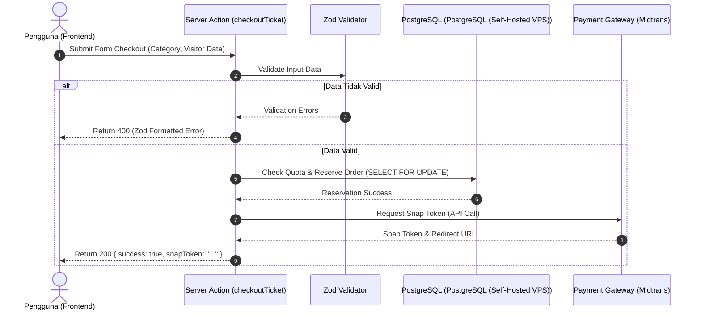

# 10 — API Planning (Data Contract & Payload Specs)

> **Single Source of Truth (SSOT) — Arsitektur API, Server Actions, & Kontrak Payload Data**  
> Dokumen ini memetakan arsitektur *Application Programming Interface* (API), *Server Actions* Next.js, skema validasi Zod, JSON Request/Response Payloads, serta integrasi Webhook Payment Gateway pada platform **Sukabumi Eundeur**.

---

## 📌 Daftar Isi

- [Overview](#-overview)
- [Objective](#-objective)
- [Scope](#-scope)
- [Business Rules](#-business-rules)
- [Functional Requirements](#-functional-requirements)
- [Non Functional Requirements](#-non-functional-requirements)
- [User Flow](#-user-flow)
- [Architecture](#-architecture)
- [Dependencies](#-dependencies)
- [Risks](#-risks)
- [Edge Cases](#-edge-cases)
- [Validation Rules (Zod Schemas)](#-validation-rules-zod-schemas)
- [Technical Notes & Payload Contracts](#-technical-notes--payload-contracts)
  - [1. Standard Response Interface](#1-standard-response-interface)
  - [2. Ticket Checkout Payload Contract](#2-ticket-checkout-payload-contract)
  - [3. Merchandise Checkout Payload Contract](#3-merchandise-checkout-payload-contract)
  - [4. Ticket QR Scan Validation Contract](#4-ticket-qr-scan-validation-contract)
  - [5. Payment Gateway Webhook Payload & Verification](#5-payment-gateway-webhook-payload--verification)
  - [6. Rate Limiting Policy](#6-rate-limiting-policy)
- [Future Improvements](#-future-improvements)
- [Checklist](#-checklist)

---

## 🎯 Overview

Platform Sukabumi Eundeur memanfaatkan Next.js 16 App Router dengan kombinasi **Server Components** (baca data), **Server Actions** (mutasi data), dan **Route Handlers** (eksternal webhooks). Dokumen ini menjadi kontrak yang mengikat antarmuka pengguna (Frontend) dan logika server/database (Backend).

---

## 🎯 Objective

1. Menyediakan kontrak data (*Data Contract*) presisi berupa JSON Schema dan Zod Validation Types.
2. Membakukan format balasan (*API Response Standard*) serta kode HTTP status di seluruh sistem.
3. Menjamin *Idempotency* pada integrasi pembayaran eksternal (*Webhook Midtrans*).
4. Mencegah eksploitasi serangan *bot ticket scalping* melalui lapisan *Rate Limiting*.

---

## 📐 Scope

### In-Scope
- Spesifikasi Zod Schema untuk transaksi tiket, e-commerce, dan autentikasi.
- Kontrak payload JSON Request & Response lengkap untuk endpoint utama.
- Spesifikasi autentikasi & verifikasi tanda tangan (*HMAC Signature Verification*) pada Webhook.
- Penanganan HTTP Status Code & Error Structure.

### Out-of-Scope
- Dokumentasi API internal pihak ketiga (Midtrans SDK internal methods, PostgreSQL (Self-Hosted VPS) Cloud Infrastructure APIs).

---

## 💼 Business Rules

1. **Idempotensi Webhook**: Notifikasi pembayaran dari Payment Gateway yang dikirim berulang kali **tidak boleh** memicu penerbitan tiket ganda.
2. **Validasi Waktu Sesi Checkout**: Sesi pesanan (*Pending Order*) akan otomatis kedaluwarsa dalam 15 menit jika pembayaran tidak diselesaikan.
3. **Pembatasan Rate Limit**: Endpoint checkout publik dibatasi maksimum 5 percobaan per menit per IP address.
4. **Verifikasi HMAC Webhook**: Setiap webhook pembayaran masuk **wajib** divalidasi tanda tangannya (*SHA512 Signature*) menggunakan Server Secret Key.

---

## ⚙️ Functional Requirements

| ID | Endpoint / Action | Metode | Deskripsi Fungsional |
|---|---|---|---|
| **FR-API-01** | `checkoutTicket(payload)` | Server Action | Memvalidasi stok tiket, mengunci reservasi, & menerbitkan Snap Token pembayaran. |
| **FR-API-02** | `checkoutMerchandise(payload)` | Server Action | Memvalidasi stok merchandise, membuat invoice order, & mengembalikan payment URL. |
| **FR-API-03** | `validateTicketQR(qrCode)` | Server Action | Digunakan scanner petugas CMS untuk memverifikasi tiket & memperbarui `is_checked_in`. |
| **FR-API-04** | `POST /api/webhooks/payment` | Route Handler | Menerima status callback transaksi Midtrans/Payment Gateway secara asinkron. |

---

## 🚀 Non Functional Requirements

- **Response Time**: Server Actions mutasi data < 200ms (termasuk validasi Zod).
- **Validation**: 100% input dari antarmuka pengguna wajib melewati validasi Zod sebelum menyentuh basis data.
- **Security**: Menggunakan header HTTP Security, sanitasi input dari serangan XSS/SQL Injection, serta validasi HMAC SHA512.

---

## 🔄 User Flow



---

## 🏗️ Architecture

```mermaid
flowchart LR
    subgraph Frontend
        Client[Client Components / Form]
    end

    subgraph API_Layer["Server Next.js App Router"]
        Zod[Zod Schema Layer]
        SA[Server Actions]
        RH[Route Handlers /api/webhooks]
        RL[Rate Limiter Upstash]
    end

    subgraph Storage_BaaS
        PostgreSQL (Self-Hosted VPS)[(PostgreSQL (Self-Hosted VPS) PostgreSQL)]
    end

    subgraph External
        Midtrans[Payment Gateway]
    end

    Client --> RL --> SA --> Zod --> PostgreSQL (Self-Hosted VPS)
    Midtrans -->|POST Webhook| RH --> PostgreSQL (Self-Hosted VPS)
```

---

## 🔗 Dependencies

- **Zod**: Library validasi TypeScript-first.
- **Midtrans Node.js Client**: Integrasi gateway pembayaran.
- **@upstash/ratelimit**: Layanan rate-limiting berbasis Redis Edge.

---

## ⚠️ Risks

- **Manipulasi Payment Status**: Risiko *attacker* mengirim HTTP POST langsung ke `/api/webhooks/payment` untuk melunasi order secara gratis jika signature validation diabaikan.
- **Form Tampering**: Risiko injeksi data pengunjung (misal: penulisan email palsu) yang gagal ditangkap jika aturan regex Zod kurang ketat.

---

## 🧪 Edge Cases

1. **Midtrans Webhook Tiba Sebelum Response Checkout Selesai**: Handler webhook menggunakan strategi *Upsert Transaction* berbasis `order_number` agar tidak bergantung pada urutan tiba.
2. **Koneksi Terputus Saat Server Action**: Pembelian yang menggantung akan otomatis dibersihkan oleh cron job pembatalan order expired setelah 15 menit.

---

## 📋 Validation Rules (Zod Schemas)

```typescript
import { z } from 'zod';

// 1. Skema Validasi Checkout Tiket
export const TicketCheckoutSchema = z.object({
  categoryId: z.string().uuid({ message: "ID Kategori tiket tidak valid" }),
  quantity: z.number().int().min(1, "Minimal 1 tiket").max(4, "Maksimal 4 tiket per transaksi"),
  visitorName: z.string().min(3, "Nama pengunjung minimal 3 karakter").max(150),
  visitorEmail: z.string().email("Format email tidak valid"),
  visitorPhone: z.string().regex(/^(\+62|62|0)8[1-9][0-9]{7,11}$/, "Nomor WhatsApp/HP tidak valid"),
  visitorIdNumber: z.string().min(8, "Nomor NIK/Identitas minimal 8 karakter").max(50)
});

// 2. Skema Validasi Scan QR Code (CMS Staff)
export const ScanTicketQRSchema = z.object({
  ticketCode: z.string().length(12, "Kode tiket harus tepat 12 karakter").regex(/^[A-Z0-9]+$/, "Kode tiket hanya alfanumerik kapital"),
  eventId: z.string().uuid("ID Event tidak valid")
});

export type TTicketCheckout = z.infer<typeof TicketCheckoutSchema>;
export type TScanTicketQR = z.infer<typeof ScanTicketQRSchema>;
```

---

## 🛠️ Technical Notes & Payload Contracts

### 1. Standard Response Interface

```typescript
export interface ApiResponse<T = any> {
  success: boolean;
  statusCode: number;
  message: string;
  data?: T;
  errors?: Record<string, string[]>;
  timestamp: string;
}
```

### 2. Ticket Checkout Payload Contract

#### Request (Server Action `checkoutTicket`)
```json
{
  "categoryId": "c2b3e4f1-8899-4d11-b999-123456789abc",
  "quantity": 2,
  "visitorName": "Asep Heavy Metal",
  "visitorEmail": "asep@eundeur.com",
  "visitorPhone": "081234567890",
  "visitorIdNumber": "3202012903990001"
}
```

#### Response (Success - 200 OK)
```json
{
  "success": true,
  "statusCode": 200,
  "message": "Pesanan berhasil dibuat, silakan selesaikan pembayaran",
  "data": {
    "orderNumber": "SE-TKT-20260722-X9A2",
    "totalAmount": 300000.00,
    "paymentSnapToken": "snap-token-midtrans-12345",
    "paymentRedirectUrl": "https://app.sandbox.midtrans.com/snap/v2/vtweb/snap-token-12345",
    "expiresAt": "2026-07-22T00:45:00.000Z"
  },
  "timestamp": "2026-07-22T00:30:00.000Z"
}
```

### 3. Merchandise Checkout Payload Contract

#### Request (Server Action `checkoutMerchandise`)
```json
{
  "items": [
    { "productId": "p111e4f1-8899-4d11-b999-123456789aaa", "quantity": 1 },
    { "productId": "p222e4f1-8899-4d11-b999-123456789bbb", "quantity": 2 }
  ],
  "shippingAddress": {
    "receiverName": "Asep Heavy Metal",
    "phone": "081234567890",
    "street": "Jl. Cikole No. 45",
    "city": "Sukabumi",
    "postalCode": "43111"
  }
}
```

### 4. Ticket QR Scan Validation Contract

#### Request (Server Action `validateTicketQR`)
```json
{
  "ticketCode": "EUND2026A1B2",
  "eventId": "e999e4f1-8899-4d11-b999-123456789999"
}
```

#### Response (Success - 200 OK)
```json
{
  "success": true,
  "statusCode": 200,
  "message": "Check-in Berhasil",
  "data": {
    "ticketCode": "EUND2026A1B2",
    "visitorName": "Asep Heavy Metal",
    "categoryName": "VIP Rocker",
    "checkInTime": "2026-07-22T19:15:30.000Z"
  },
  "timestamp": "2026-07-22T19:15:30.000Z"
}
```

### 5. Payment Gateway Webhook Payload & Verification

#### Route Handler: `POST /api/webhooks/payment`

##### Skrip Verifikasi HMAC Signature (TypeScript)
```typescript
import crypto from 'crypto';
import { NextResponse } from 'next/server';

export async function POST(req: Request) {
  const body = await req.json();
  const { order_id, status_code, gross_amount, signature_key, transaction_status } = body;

  const serverKey = process.env.MIDTRANS_SERVER_KEY!;
  const payloadToHash = order_id + status_code + gross_amount + serverKey;
  const calculatedSignature = crypto.createHash('sha512').update(payloadToHash).digest('hex');

  if (calculatedSignature !== signature_key) {
    return NextResponse.json({ success: false, message: 'Invalid Signature' }, { status: 403 });
  }

  // Idempotent processing logic
  if (transaction_status === 'settlement' || transaction_status === 'capture') {
    // Process order -> Mark PAID & Issue Tickets
  }

  return NextResponse.json({ success: true, message: 'Webhook processed' });
}
```

### 6. Rate Limiting Policy

| Target Endpoint / Action | Limit | Window | Action When Exceeded |
|---|---|---|---|
| `checkoutTicket()` | 5 requests | 1 menit | HTTP 429 Too Many Requests |
| `validateTicketQR()` | 60 requests | 1 menit | HTTP 429 Too Many Requests |
| `POST /api/webhooks/payment` | Unlimited | N/A | HMAC Verified Only |

---

## 🚀 Future Improvements

- **OpenAPI 3.1 Spec Generator**: Menghasilkan berkas `swagger.json` secara otomatis dari skema Zod menggunakan `zod-to-openapi`.
- **GraphQL Integration**: Menyediakan endpoint GraphQL khusus untuk konsumsi aplikasi mobile Sukabumi Eundeur di masa mendatang.

---

## ✅ Checklist

- [x] Definisikan Zod Schema untuk transaksi utama.
- [x] Tentukan JSON Payload Request & Response presisi.
- [x] Sertakan skrip verifikasi HMAC Signature Webhook.
- [x] Tentukan batasan Rate Limiting.
- [x] Memenuhi 15 komponen standar dokumentasi teknis.

---

<div align="center">

⬅️ [Kembali ke 09. Database Planning](./09-database-planning.md) · ➡️ [Lanjut ke 11. CMS Planning](./11-cms-planning.md)

</div>
