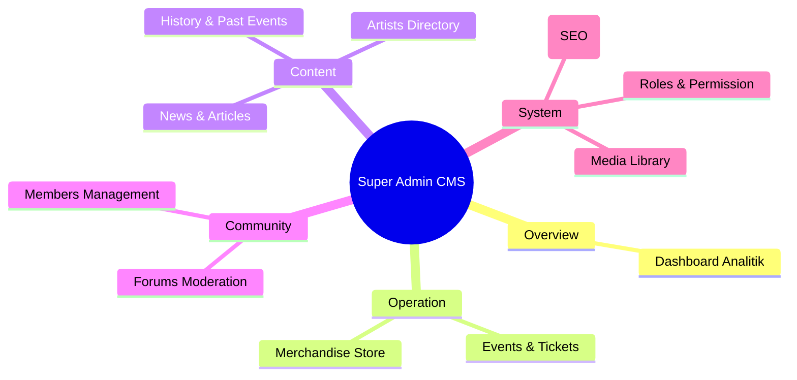

# 11 — CMS Planning (Content Management System)

> Dokumen ini merencanakan arsitektur fungsional dan tata letak operasional untuk **Super Admin CMS** (*Content Management System*), yang berfungsi sebagai "dapur utama" pengelolaan seluruh ekosistem **Sukabumi Eundeur**.

---

## 📌 Daftar Isi

- [Penjelasan](#-penjelasan)
- [Tujuan](#-tujuan)
- [Scope](#-scope)
- [Flow — Siklus Publikasi Konten](#-flow--siklus-publikasi-konten)
- [Diagram Struktur CMS](#-diagram-struktur-cms)
- [Modul Utama CMS](#-modul-utama-cms)
- [Sistem Pengelolaan Media (Media Library)](#-sistem-pengelolaan-media-media-library)
- [Sistem Global Settings & SEO](#-sistem-global-settings--seo)
- [Checklist](#-checklist)
- [Catatan](#-catatan)
- [Best Practice](#-best-practice)
- [Enterprise Recommendation](#-enterprise-recommendation)
- [Future Improvement](#-future-improvement)

---

## 🎯 Overview

**Super Admin CMS** adalah portal internal terpusat (*back-office*) yang digunakan oleh penyelenggara, editor, dan pengelola platform untuk menambah, mengubah, atau menghapus data tanpa perlu melakukan perubahan langsung ke dalam *database* (PostgreSQL (Self-Hosted VPS)) atau *codebase*. 

Karena Sukabumi Eundeur merupakan platform *multi-domain* (menggabungkan *ticketing*, e-commerce, portal berita, dan komunitas), desain CMS ini harus sangat intuitif namun kuat (*powerful*), menyembunyikan kompleksitas basis data dari staf operasional.

---

## 🎯 Objective

1. Menyediakan antarmuka manajemen data (CRUD) yang ramah pengguna untuk seluruh entitas platform.
2. Memisahkan modul-modul pengelolaan agar setiap staf (Editor, Event Manager, Merch Admin) dapat fokus pada layar kerjanya masing-masing.
3. Menetapkan standar alat editor teks (*Rich Text Editor*) untuk kemudahan penulisan artikel dan deskripsi.
4. Merencanakan sistem pelacakan aset digital terpusat (*Media Library*).

---

## 📐 Scope

Dokumen ini mencakup:
- Struktur fungsional dan daftar modul di dalam CMS.
- Konsep dasar antarmuka pengguna CMS (Dashboard vs Data Table vs Form).
- Manajemen pengaturan global (SEO, Profil Organisasi).

Dokumen ini **tidak mencakup**:
- Hierarki hak akses pengguna secara detail (telah dibahas di `05-user-roles.md`).
- Arsitektur teknis basis data di balik CMS (telah dibahas di `09-database-planning.md`).

---

## 🔄 User Flow

### Alur Processes
 Siklus Publikasi Konten

Siklus dasar ini berlaku untuk pembuatan entitas besar seperti Event baru, Produk Merchandise, maupun Artikel Berita.

```mermaid
flowchart LR
    A[Mulai Buat] --> B[Isi Form & Upload Media]
    B --> C{Status?}
    C --> |Draft| D[Tersimpan Sementara]
    D --> B
    C --> |Publish| E[Verifikasi Validasi (Zod)]
    E --> |Gagal| B
    E --> |Sukses| F[Tersimpan di PostgreSQL (Self-Hosted VPS)]
    F --> G[On-Demand ISR Revalidation]
    G --> H([Muncul di Web Publik])
```

---

## 🖼️ Diagram Struktur CMS



---

## 🧩 Modul Utama CMS

Desain UI/UX CMS disarankan mengadopsi gaya modern (seperti Vercel Dashboard atau Shadcn UI) dengan pola *Sidebar* di sebelah kiri dan *Main Content* di sebelah kanan. Berikut modul-modulnya:

### 1. Dashboard (Overview)
Layar pertama setelah *login*, menampilkan metrik kinerja platform dalam bentuk kartu (*Scorecards*) dan grafik:
- Total Pendapatan Tiket (Bulan/Event Berjalan)
- Total Penjualan Merch
- Trafik Website (*Pageviews*)
- Jumlah Member Baru

### 2. Events & Ticketing Module
- **Daftar Event:** Tabel (Grid/List) event aktif, *draft*, dan selesai.
- **Form Event Builder:** Pembuatan event, mencakup *input* teks, peta lokasi (*Google Maps pin*), tanggal, dan *Line Up* (relasi *dropdown* ke Artist).
- **Ticket Manager:** Sub-modul untuk membuat kategori tiket (VIP, Presale), mengatur harga, dan memantau sisa kuota secara *live*.
- **Order/Attendee List:** Daftar pembeli tiket (dapat di-eksport ke CSV/Excel).

### 3. Merchandise Module
- **Katalog Produk:** Manajemen nama barang, harga, SKU, varian (ukuran/warna).
- **Inventory Control:** *Input* stok barang.
- **Order Management:** Memantau pesanan masuk, pembaruan nomor resi, mengubah status menjadi *Shipped/Delivered*.

### 4. News & Content Module
- **Article Editor:** Integrasi *Rich Text Editor* (seperti TipTap, Quill, atau BlockNote) yang memungkinkan penyisipan gambar, *embed* video YouTube, dan pemformatan *Markdown/HTML*.
- **Kategori & Tags:** Pengelolaan metadata taksonomi berita.

### 5. Artists & History Module
- **Direktori Artis:** CRUD profil artis, genre, dan tautan sosial media mereka.
- **History Archive:** Alat untuk "membekukan" data event yang sudah berlalu ke dalam modul *History* (beserta unggahan link *Aftermovie*).

### 6. Users & Permission
- **Admin Management:** Menambahkan akun staf baru dan menetapkan otorisasi (RBAC).
- **Member Management:** Melihat daftar pengguna publik, opsi me-*reset password* secara manual (bila diminta), atau mem-blokir akun (banned) jika melanggar aturan.

---

## 🖼️ Sistem Pengelolaan Media (Media Library)

Berbeda dengan sistem web lawas di mana setiap form memiliki *upload button* sendiri-sendiri, CMS ini akan mengadopsi sistem **Media Library Terpusat** (terhubung ke *MinIO / Local VPS Storage*).

**Keuntungan:**
- Gambar poster event yang sama dapat digunakan ulang (*reused*) untuk artikel berita tanpa harus diunggah 2 kali (menghemat *storage*).
- Memungkinkan fitur *Bulk Upload* (unggahan massal) gambar galeri sebelum artikel ditulis.
- Integrasi *Image Optimization* (mengonversi ke format `.webp`) di satu titik.

---

## ⚙️ Sistem Global Settings & SEO

Modul konfigurasi utama platform, mencakup:
- **General Info:** Nama organisasi, Alamat rahasia/kantor, Nomor telepon resmi, Email *support*.
- **Social Links:** Tautan URL resmi untuk Header/Footer web publik (Instagram, TikTok, Spotify).
- **SEO Defaults:** Pengaturan meta-deskripsi bawaan (Default Meta Tag), *OpenGraph Image* standar (logo), dan unggahan `favicon`.
- **Maintenance Mode:** *Toggle (Switch)* untuk mematikan situs publik secara sementara jika ada perbaikan (*maintenance*) tanpa harus mematikan server VPS.

---


## 💼 Business Rules
- Seluruh aturan bisnis modul harus tunduk pada Single Source of Truth (SSOT) Sukabumi Eundeur.
- Transaksi & data mutasi wajib mencatat audit log timestamp.


## ⚙️ Functional Requirements
- Mengimplementasikan seluruh endpoint API & komponen UI terkait.
- Mengelola state & autentikasi pengguna secara otomatis melalui JWT & Self-Hosted Auth Handler.


## 🚀 Non Functional Requirements
- Latensi respon < 200ms.
- Uptime target 99.9%.
- Aksesibilitas WCAG 2.1 Level AA.


## 🏗️ Architecture
- **Frontend**: Next.js 16 (App Router) + React 19.
- **Backend**: PostgreSQL (Self-Hosted VPS) (PostgreSQL + RLS + Storage).
- **Infrastructure**: VPS Ubuntu + Nginx + PM2.


## 🔗 Dependencies
- `@PostgreSQL (Self-Hosted VPS)/PostgreSQL (Self-Hosted VPS)-js`
- `next` v16
- `react` v19
- `tailwindcss` v4


## ⚠️ Risks
- Kegagalan koneksi database saat lonjakan trafik -> Mitigasi: Connection Pooling & Caching.


## 🧪 Edge Cases
- Sesi pengguna kadaluarsa di tengah transaksi -> Redirect otomatis ke login dengan restore state.


## 📋 Validation Rules
- Format input wajib disanitasi dari potensi XSS & SQL Injection.


## 🛠️ Technical Notes
- Implementasi wajib mengikuti konvensi kode di [`21-folder-structure.md`](./21-folder-structure.md).


## 🚀 Future Improvements
- Integrasi analitik real-time dan rekomendasi berbasis AI.


## ✅ Checklist

- [x] Hierarki struktur menu CMS terdefinisi.
- [x] Form/Modul penting (Events, Merch, News, Users) terpetakan.
- [x] Kebutuhan *Rich Text Editor* untuk portal berita teridentifikasi.
- [x] Konsep *Media Library* terpusat direncanakan.
- [ ] Memastikan *UI Component Library* (misal: Shadcn UI + Tailwind) siap mendukung pembuatan tabel kompleks dan form dinamis di sisi *Frontend*.

---

## 📝 Catatan

- **Aman dari Ketidaksengajaan (Foolproof):** Setiap tindakan destruktif di CMS (seperti menghapus Event, membatalkan pesanan, menghapus pengguna) **wajib** dilindungi oleh modal konfirmasi (*"Are you sure? Type 'DELETE' to confirm"*).
- **On-Demand Revalidation (ISR):** Saat Admin menekan tombol *Publish* pada berita, fungsi *Server Action* tidak hanya menyimpan ke *database*, namun juga wajib memanggil `revalidatePath('/news')` agar halaman publik langsung ter- *update* (mengingat web menggunakan metode SSG/ISR Next.js).

---

## 💡 Best Practice

- **Tabel Data (Data Tables):** Gunakan pustaka standar seperti *TanStack Table* untuk semua daftar (*listing*) di CMS. Hal ini memungkinkan fitur pencarian, filter (*faceted filter*), pengurutan (*sorting*), dan paginasi yang konsisten di semua modul tanpa perlu menulis logika kompleks berulang kali.
- **Autosave pada Draft:** Pada modul *Article Editor* atau *Event Builder* yang memiliki isian form sangat panjang, terapkan mekanisme *Autosave* lokal (menyimpan ke *Local Storage* per 1 menit) untuk mencegah kehilangan data jika koneksi internet terputus.

---

## 🏢 Enterprise Recommendation

> **Audit Trail / Activity Log**
> Sistem sekelas Stripe atau Shopify selalu memiliki kolom (panel) riwayat pada setiap *record*. Misalnya di halaman detail Pesanan Tiket (Order), harus ada catatan otomatis: *"Dibuat oleh User X pada [Waktu]" -> "Status diubah menjadi PAID oleh Sistem" -> "Tiket di-scan oleh Admin Y pada [Waktu]"*. Hal ini krusial untuk mencegah saling lempar tanggung jawab operasional internal.

---

## 🚀 Future Improvement

- **Notifikasi In-App:** Menambahkan ikon Lonceng di kanan atas *Top Bar* CMS untuk memberitahu staf jika ada tiket baru terjual atau ada laporan *bug* dari pengguna.
- **Custom Report Builder:** Menyediakan alat (*tool*) di mana pengelola (*Event Manager*) dapat memilih kolom apa saja yang ingin ditarik ke dalam file Excel (misal: hanya butuh Nama dan Ukuran Kaos), daripada format ekspor statis.

---

<div align="center">

⬅️ [Kembali ke 10. API Planning](./10-api-planning.md) · ➡️ [Lanjut ke 12. Ticketing System](./12-ticketing-system.md)

</div>
