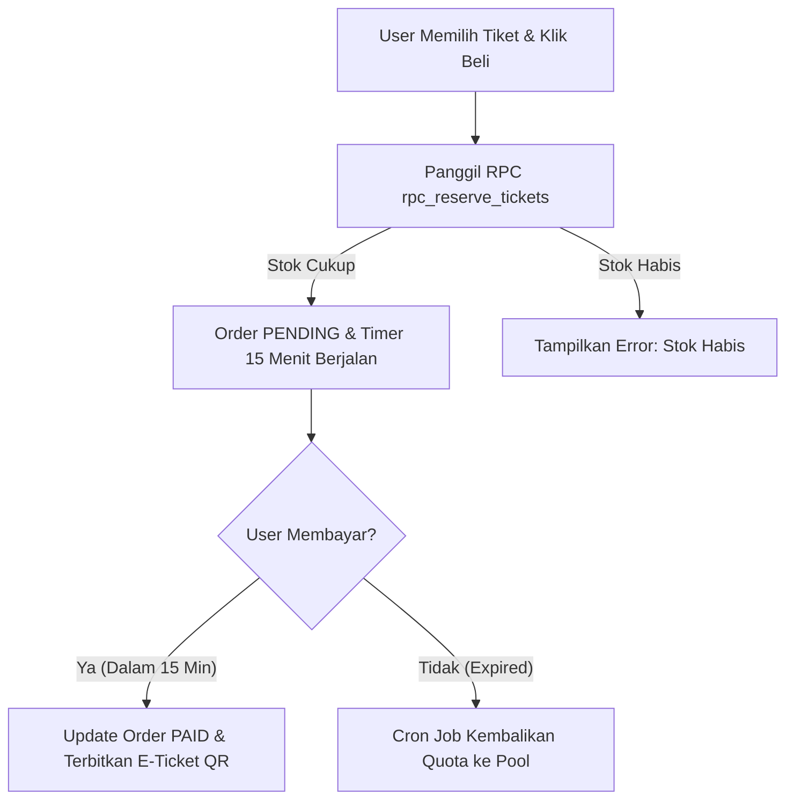
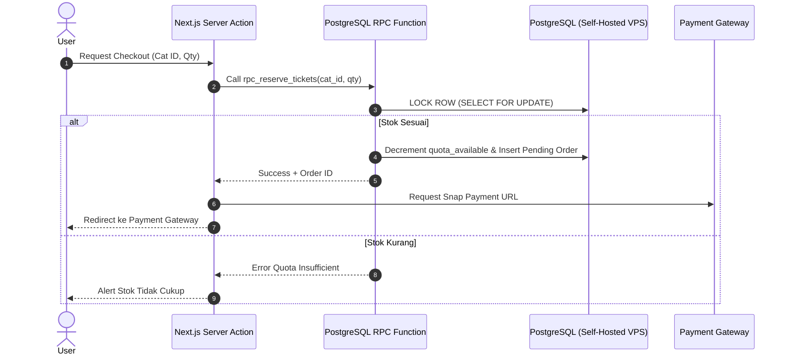

# 12 — Ticketing System (Lock Logic & Race Condition Handling)

> **Single Source of Truth (SSOT) — Spesifikasi Arsitektur & Logika Sistem Ticketing**  
> Dokumen ini menentukan alur operasional, pencegahan *race-condition* kuota tiket, logika *hold timer*, validasi QR Code, serta penanganan kegagalan pembayaran pada ekosistem **Sukabumi Eundeur**.

---

## 📌 Daftar Isi

- [Overview](#-overview)
- [Objective](#-objective)
- [Scope](#-scope)
- [Business Rules](#-business-rules)
- [Functional Requirements](#-functional-requirements)
- [Non Functional Requirements](#-non-functional-requirements)
- [User Flow](#-user-flow)
- [Architecture](#-architecture)
- [Dependencies](#-dependencies)
- [Risks](#-risks)
- [Edge Cases](#-edge-cases)
- [Validation Rules](#-validation-rules)
- [Technical Notes & Lock Logic](#-technical-notes--lock-logic)
  - [1. Lock Timer Architecture (15-Minutes Hold)](#1-lock-timer-architecture-15-minutes-hold)
  - [2. Atomic Reservation SQL Function (Anti Race Condition)](#2-atomic-reservation-sql-function-anti-race-condition)
  - [3. Auto-Release Expired Reservation Cron Job](#3-auto-release-expired-reservation-cron-job)
  - [4. QR Code Security & Verification Protocol](#4-qr-code-security--verification-protocol)
- [Future Improvements](#-future-improvements)
- [Checklist](#-checklist)

---

## 🎯 Overview

Sistem Ticketing Sukabumi Eundeur memproses penjualan tiket festival secara digital dengan performa tinggi. Sistem ini dirancang untuk mengatasi lonjakan trafik saat *war ticket*, mengunci reservasi kuota sementara selama 15 menit, serta memverifikasi kehadiran pengunjung di venue menggunakan pemindaian QR Code aman secara *real-time*.

---

## 🎯 Objective

1. Mencegah *overselling* (stok minus) saat ribuan pengguna membeli tiket secara simultan.
2. Mengimplementasikan mekanisme *Lock Timer* reservasi sementara selama 15 menit.
3. Menjamin waktu proses verifikasi pemindaian QR Code kurang dari 1 detik di pintu masuk acara (*gate*).
4. Menyediakan alur *transfer ticket* resmi antar pengguna untuk meminimalisir praktik calo tak resmi.

---

## 📐 Scope

### In-Scope
- Alur *holding* stok tiket sementara (*pessimistic locking* di tingkat basis data).
- Skrip fungsi atomik PostgreSQL RPC untuk reservasi kuota aman.
- Algoritma pembuatan & enkripsi QR Code tiket.
- Alur kerja pemindaian QR di pintu masuk (*Gate Scanner Web App*).

### Out-of-Scope
- Sistem *Interactive Seat Mapping* (difokuskan untuk tiket standing festival).

---

## 💼 Business Rules

1. **Batas Maksimal Pembelian**: 1 akun / NIK hanya dapat membeli maksimal 4 tiket per event.
2. **Durasi Hold Pembayaran**: Kuota tiket yang sudah diklik checkout dikunci selama **15 menit**. Jika pembayaran tidak selesai dalam rentang waktu tersebut, kuota otomatis dikembalikan ke *public pool*.
3. **Imutabilitas Tiket Terpakai**: Tiket yang sudah di-scan (`is_checked_in = true`) tidak dapat di-scan ulang untuk mengizinkan masuk kembali.
4. **Kebijakan Refund**: Pembatalan sepihak oleh pengguna **tidak dapat** di-refund. Refund massal hanya berlaku jika event dibatalkan resmi oleh penyelenggara.

---

## ⚙️ Functional Requirements

| ID | Deskripsi Fungsional | Komponen / API |
|---|---|---|
| **FR-TKT-01** | Pengguna dapat memilih kategori tiket dan memasukkan identitas pengunjung. | Frontend UI & Form |
| **FR-TKT-02** | Sistem mengunci kuota tiket secara atomik di PostgreSQL. | `rpc_reserve_tickets` |
| **FR-TKT-03** | Sistem melepaskan reservasi tiket yang hangus (>15 menit). | Cron / Worker Task |
| **FR-TKT-04** | Sistem menerbitkan QR Code unik saat transaksi berstatus PAID. | Event Listener / Webhook |
| **FR-TKT-05** | Petugas dapat memverifikasi QR Code via kamera perangkat di CMS. | `validateTicketQR` |

---

## 🚀 Non Functional Requirements

- **Concurrency Handling**: Mampu menangani hingga 1,000 transaksi bersamaan per detik tanpa mengalami stok minus (*race condition*).
- **Scanner Latency**: Respon verifikasi QR Code di pintu masuk < 500ms.
- **Reliability**: Tiket yang telah dilunasi dijamin tersimpan di basis data tanpa kehilangan transaksi.

---

## 🔄 User Flow



---

## 🏗️ Architecture



---

## 🔗 Dependencies

- **PostgreSQL (Self-Hosted VPS) Realtime / RPC**: Menjalankan fungsi atomik PostgreSQL.
- **qrcode**: Node.js library untuk pembuatan gambar QR Code.
- **node-cron / PostgreSQL (Self-Hosted VPS)pg_cron**: Menjalankan otomatisasi pelepasan reservasi expired.

---

## ⚠️ Risks

- **Gate Blank Spot**: Sinyal internet buruk di lokasi festival dapat menghambat pemindaian QR jika hanya mengandalkan koneksi online.
- **Scan Fraud**: Pengunjung membagikan tangkapan layar (screenshot) QR ke beberapa orang.

---

## 🧪 Edge Cases

1. **Dua Pengguna Membeli Tiket Terakhir Bersamaan**: Database mengunci baris kategori tiket (*pessimistic lock*) sehingga hanya satu pembeli yang berhasil, sedangkan pembeli kedua mendapatkan pesan stok habis.
2. **Koneksi Mati Saat Scan QR**: Aplikasi scanner menyimpan antrean hasil scan di `localStorage` dan menyinkronkan data otomatis begitu koneksi pulih.

---

## 📋 Validation Rules

- `quantity`: `1 <= quantity <= 4`.
- `hold_duration`: Tepat 15 menit (900 detik).
- `qr_code`: Karakter alfanumerik 12 karakter (Contoh: `EUND2026X9A2`).

---

## 🛠️ Technical Notes & Lock Logic

### 1. Lock Timer Architecture (15-Minutes Hold)

Saat transaksi dibuat, `expires_at` pada tabel `orders` diisi dengan `NOW() + INTERVAL '15 minutes'`. Selama status `payment_status = 'pending'`, kuota dianggap terkunci.

### 2. Atomic Reservation SQL Function (Anti Race Condition)

Fungsi PostgreSQL ini menggunakan `SELECT ... FOR UPDATE` untuk mengunci baris data kategori tiket dari transaksi paralel lainnya:

```sql
CREATE OR REPLACE FUNCTION public.rpc_reserve_tickets(
    p_category_id UUID,
    p_quantity INT,
    p_user_id UUID,
    p_order_number VARCHAR
)
RETURNS JSONB AS $$
DECLARE
    v_quota_available INT;
    v_price DECIMAL(12,2);
    v_order_id UUID;
    v_expires_at TIMESTAMPTZ;
BEGIN
    -- 1. Lock row kategori tiket secara eksklusif (Pessimistic Locking)
    SELECT quota_available, price 
    INTO v_quota_available, v_price
    FROM public.ticket_categories
    WHERE id = p_category_id
    FOR UPDATE;

    -- 2. Cek kecukupan kuota
    IF v_quota_available < p_quantity THEN
        RAISE EXCEPTION 'Kuota tiket tidak mencukupi' USING ERRCODE = 'P0001';
    END IF;

    -- 3. Kurangi kuota secara atomik
    UPDATE public.ticket_categories
    SET quota_available = quota_available - p_quantity
    WHERE id = p_category_id;

    -- 4. Hitung expired (15 menit)
    v_expires_at := NOW() + INTERVAL '15 minutes';

    -- 5. Buat rekord transaksi PENDING
    INSERT INTO public.orders (
        order_number, user_id, order_type, total_amount, 
        payment_status, expires_at
    ) VALUES (
        p_order_number, p_user_id, 'ticket', (v_price * p_quantity),
        'pending', v_expires_at
    ) RETURNING id INTO v_order_id;

    -- 6. Kembalikan balasan JSON
    RETURN jsonb_build_object(
        'success', true,
        'order_id', v_order_id,
        'expires_at', v_expires_at
    );
EXCEPTION WHEN OTHERS THEN
    RETURN jsonb_build_object(
        'success', false,
        'message', SQLERRM
    );
END;
$$ LANGUAGE plpgsql SECURITY DEFINER;
```

### 3. Auto-Release Expired Reservation Cron Job

Eksekusi periodik (tiap 1 menit) menggunakan `pg_cron` untuk mengembalikan stok pesanan kedaluwarsa:

```sql
SELECT cron.schedule('release_expired_tickets', '* * * * *', $$
BEGIN
    -- 1. Kembalikan kuota tiket dari order yang expired
    WITH expired_orders AS (
        UPDATE public.orders
        SET payment_status = 'expired', updated_at = NOW()
        WHERE payment_status = 'pending' AND expires_at < NOW()
        RETURNING id
    ),
    items_to_restore AS (
        SELECT ticket_category_id, SUM(quantity) as qty
        FROM public.order_items
        WHERE order_id IN (SELECT id FROM expired_orders)
        GROUP BY ticket_category_id
    )
    UPDATE public.ticket_categories tc
    SET quota_available = tc.quota_available + itr.qty
    FROM items_to_restore itr
    WHERE tc.id = itr.ticket_category_id;
END;
$$);
```

### 4. QR Code Security & Verification Protocol

QR Code dihasilkan menggunakan enkripsi HMAC-SHA256 dari kombinasi `ticket_code` dan `secret_key` untuk mencegah pemalsuan tiket:

```typescript
import crypto from 'crypto';

export function generateSecureTicketCode(ticketId: string): string {
  const secret = process.env.TICKET_ENCRYPTION_KEY || 'eundeur-secret';
  const hash = crypto.createHmac('sha256', secret).update(ticketId).digest('hex').substring(0, 8).toUpperCase();
  return `EUND-${hash}`;
}
```

---

## 🚀 Future Improvements

- **Waitlist System**: Jika tiket habis, pendaftar di urutan pertama *waitlist* akan mendapatkan notifikasi WhatsApp otomatis begitu ada reservasi expired.
- **Offline PWA Scanner**: Aplikasi gate scanner yang mendukung sinkronisasi data terenkripsi secara offline via *IndexedDB*.

---

## ✅ Checklist

- [x] Fungsi atomik PostgreSQL `rpc_reserve_tickets` dengan *pessimistic lock*.
- [x] Mekanisme *Cron Job* otomatis untuk pengembalian kuota kedaluwarsa (15 menit).
- [x] Protokol keamanan enkripsi QR Code.
- [x] Memenuhi 15 komponen standar dokumentasi arsitektur.

---

<div align="center">

⬅️ [Kembali ke 11. CMS Planning](./11-cms-planning.md) · ➡️ [Lanjut ke 13. Merchandise Store](./13-merchandise-store.md)

</div>
