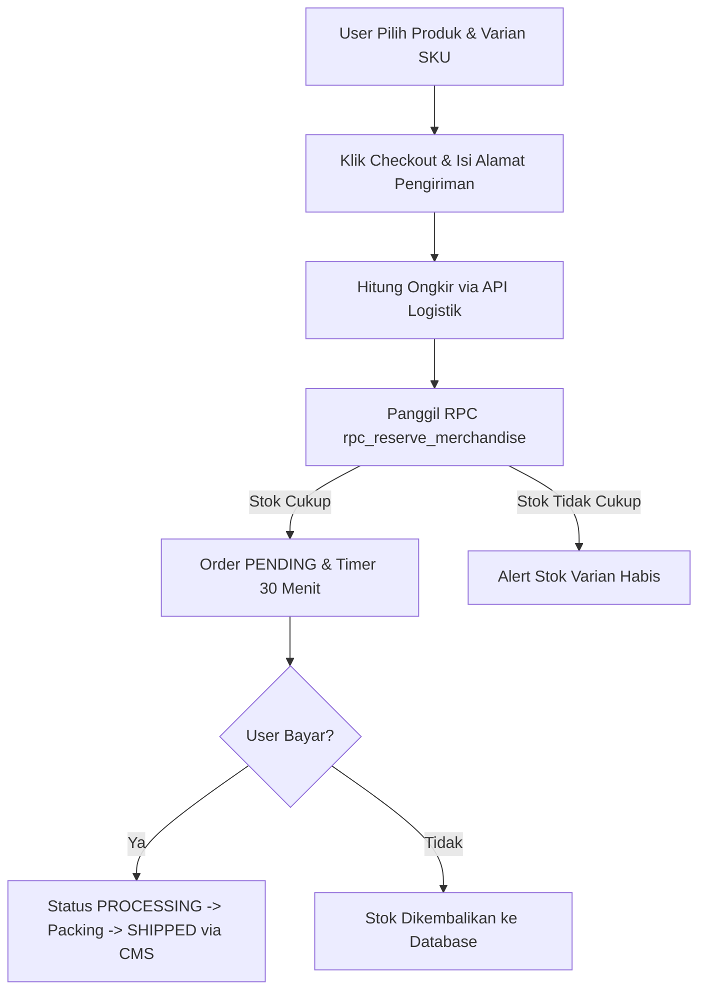
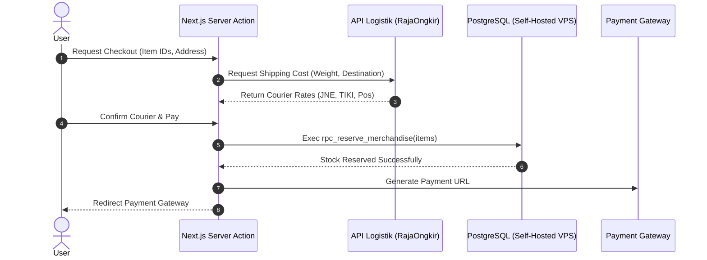

# 13 — Merchandise Store (Inventory Locking & E-Commerce Flow)

> **Single Source of Truth (SSOT) — Spesifikasi Arsitektur E-Commerce & Logika Inventaris**  
> Dokumen ini menentukan alur operasional e-commerce toko merchandise resmi, penanganan *inventory locking*, integrasi kalkulasi logistik, serta aturan retur produk pada ekosistem **Sukabumi Eundeur**.

---

## 📌 Daftar Isi

- [Overview](#-overview)
- [Objective](#-objective)
- [Scope](#-scope)
- [Business Rules](#-business-rules)
- [Functional Requirements](#-functional-requirements)
- [Non Functional Requirements](#-non-functional-requirements)
- [User Flow](#-user-flow)
- [Architecture](#-architecture)
- [Dependencies](#-dependencies)
- [Risks](#-risks)
- [Edge Cases](#-edge-cases)
- [Validation Rules](#-validation-rules)
- [Technical Notes & Inventory Logic](#-technical-notes--inventory-logic)
  - [1. Inventory Locking SQL Function](#1-inventory-locking-sql-function)
  - [2. Shipping Cost Calculation Contract (RajaOngkir/Biteship)](#2-shipping-cost-calculation-contract-rajaongkirbiteship)
  - [3. Verified Purchase Review Protocol](#3-verified-purchase-review-protocol)
- [Future Improvements](#-future-improvements)
- [Checklist](#-checklist)

---

## 🎯 Overview

Modul Merchandise Store memungkinkan penggemar membeli produk resmi festival (apparel, aksesori, rilis fisik) secara terintegrasi dengan akun Sukabumi Eundeur. Modul ini menangani pengelolaan varian stok (SKU), penguncian stok saat checkout, kalkulasi tarif ekspedisi, serta pelacakan resi pengiriman.

---

## 🎯 Objective

1. Mencegah stok barang fisik *overselling* saat banyak transaksi terjadi simultan.
2. Menyediakan integrasi kalkulasi ongkos kirim otomatis berdasarkan bobot & lokasi tujuan.
3. Menjamin keabsahan ulasan produk melalui batasan *Verified Purchase Only*.
4. Menyediakan antarmuka pengelolaan status pengiriman yang efisien bagi tim operasional toko.

---

## 📐 Scope

### In-Scope
- Penguncian stok sementara (*inventory locking*) selama proses transaksi.
- Kontrak kalkulasi tarif ongkos kirim (integrasi RajaOngkir / Biteship).
- Alur pengelolaan resi pengiriman & pembaruan status order.
- Sistem ulasan terverifikasi & fitur wishlist pengguna.

### Out-of-Scope
- Manajemen POS (*Point of Sale*) kasir fisik lapangan (akan dikembangkan pada fase berikutnya).

---

## 💼 Business Rules

1. **Penguncian Stok Checkout**: Stok barang yang di-checkout dikunci selama **30 menit**. Jika pembayaran tidak lunas, stok otomatis dibuka kembali.
2. **Kesesuaian Alamat Pengiriman**: Alamat pengiriman wajib mencakup Kode Pos valid 5 digit dan Nomor Telepon aktif.
3. **Ulasan Terverifikasi**: Hanya akun yang memiliki pesanan berstatus `delivered` yang diizinkan menulis ulasan produk.
4. **Kebijakan Cacat Produk**: Klaim garansi barang cacat wajib menyertakan video *unboxing* tanpa terputus maksimal 2x24 jam sejak paket diterima.

---

## ⚙️ Functional Requirements

| ID | Deskripsi Fungsional | Komponen / API |
|---|---|---|
| **FR-MER-01** | Pengguna dapat memilih produk, ukuran/varian, dan menambahkan ke keranjang. | Cart Component |
| **FR-MER-02** | Sistem mengunci stok produk secara atomik saat form checkout disubmit. | `rpc_reserve_merchandise` |
| **FR-MER-03** | Sistem mengkalkulasi tarif ekspedisi berdasarkan berat barang dan kota tujuan. | `calculateShippingCost` |
| **FR-MER-04** | Admin dapat memperbarui nomor resi dan merubah status ke `shipped`. | CMS Order Module |

---

## 🚀 Non Functional Requirements

- **Accuracy**: Kalkulasi harga total (Barang + Ongkir + Biaya Penanganan) harus 100% presisi tanpa pembulatan tidak sah.
- **Performance**: Pemanggilan kalkulasi tarif ekspedisi < 800ms.
- **Consistency**: Transaksi stok dijamin ACID Compliant di PostgreSQL.

---

## 🔄 User Flow



---

## 🏗️ Architecture



---

## 🔗 Dependencies

- **RajaOngkir / Biteship API**: Layanan kalkulasi ongkir ekspedisi Indonesia.
- **PostgreSQL (Self-Hosted VPS) PostgreSQL**: Penyimpanan stok & transaksi order.

---

## ⚠️ Risks

- **Perubahan Stok oleh Admin**: Risiko admin CMS mengubah stok fisik manual saat transaksi checkout *pending* sedang berlangsung.
- **Kegagalan API Ongkir**: Risiko API kalkulasi tarif ekspedisi pihak ketiga mengalami *downtime*.

---

## 🧪 Edge Cases

1. **Stok Varian Tertentu (Ukuran XL) Habis Saat Checkout**: Sistem menolak transaksi khusus varian tersebut tanpa membatalkan barang varian lain yang masih tersedia di keranjang.
2. **Paket Dikembalikan oleh Kurir (Alamat Tidak Ditemukan)**: Admin CMS mengubah status ke `returned` dan sistem otomatis mengirimkan email konfirmasi ke pembeli untuk klarifikasi alamat.

---

## 📋 Validation Rules

- `quantity`: `1 <= quantity <= stock_quantity`.
- `postal_code`: Tepat 5 digit angka.
- `weight`: Minimal 100 gram (0.1 kg).

---

## 🛠️ Technical Notes & Inventory Logic

### 1. Inventory Locking SQL Function

```sql
CREATE OR REPLACE FUNCTION public.rpc_reserve_merchandise(
    p_items JSONB, -- Array of {product_id, quantity}
    p_user_id UUID,
    p_order_number VARCHAR,
    p_shipping_fee DECIMAL
)
RETURNS JSONB AS $$
DECLARE
    v_item JSONB;
    v_product_id UUID;
    v_qty INT;
    v_stock INT;
    v_price DECIMAL(12,2);
    v_total_goods DECIMAL(12,2) := 0;
    v_order_id UUID;
BEGIN
    -- 1. Iterasi & kunci setiap item
    FOR v_item IN SELECT * FROM jsonb_array_elements(p_items)
    LOOP
        v_product_id := (v_item->>'product_id')::UUID;
        v_qty := (v_item->>'quantity')::INT;

        -- Pessimistic Lock
        SELECT stock_quantity, price INTO v_stock, v_price
        FROM public.products
        WHERE id = v_product_id AND is_active = TRUE
        FOR UPDATE;

        IF v_stock IS NULL OR v_stock < v_qty THEN
            RAISE EXCEPTION 'Stok produk % tidak mencukupi', v_product_id;
        END IF;

        -- Accumulate Price
        v_total_goods := v_total_goods + (v_price * v_qty);
    END LOOP;

    -- 2. Kurangi stok produk
    FOR v_item IN SELECT * FROM jsonb_array_elements(p_items)
    LOOP
        UPDATE public.products
        SET stock_quantity = stock_quantity - (v_item->>'quantity')::INT
        WHERE id = (v_item->>'product_id')::UUID;
    END LOOP;

    -- 3. Buat rekord Order
    INSERT INTO public.orders (
        order_number, user_id, order_type, total_amount,
        payment_status, expires_at
    ) VALUES (
        p_order_number, p_user_id, 'merchandise', (v_total_goods + p_shipping_fee),
        'pending', NOW() + INTERVAL '30 minutes'
    ) RETURNING id INTO v_order_id;

    RETURN jsonb_build_object('success', true, 'order_id', v_order_id);
EXCEPTION WHEN OTHERS THEN
    RETURN jsonb_build_object('success', false, 'message', SQLERRM);
END;
$$ LANGUAGE plpgsql SECURITY DEFINER;
```

### 2. Shipping Cost Calculation Contract (RajaOngkir/Biteship)

```typescript
export interface ShippingRateRequest {
  originCityId: string; // E.g., "431" (Sukabumi)
  destinationCityId: string;
  weightInGrams: number;
  courier: 'jne' | 'tiki' | 'pos';
}

export interface ShippingRateResponse {
  courierName: string;
  service: string;
  cost: number;
  estimatedDays: string;
}
```

---

## 🚀 Future Improvements

- **Automated AWB Printing**: Integrasi cetak resi pengiriman otomatis langsung dari dashboard CMS via thermal printer.
- **Inventory Threshold Alert**: Notifikasi otomatis ke Telegram Admin ketika stok merchandise tinggal < 5 pcs.

---

## ✅ Checklist

- [x] Fungsi atomik PostgreSQL `rpc_reserve_merchandise` dengan *pessimistic lock*.
- [x] Kontrak API kalkulasi tarif pengiriman terdefinisi.
- [x] Aturan ulasan produk terverifikasi (*Verified Purchase*).
- [x] Memenuhi 15 komponen standar dokumentasi arsitektur.

---

<div align="center">

⬅️ [Kembali ke 12. Ticketing System](./12-ticketing-system.md) · ➡️ [Lanjut ke 14. News System](./14-news-system.md)

</div>
