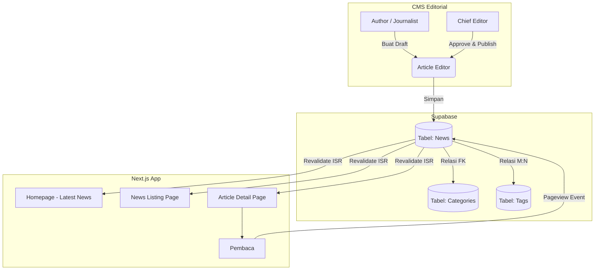

# 14 — News & Content System

> Dokumen ini memaparkan arsitektur logika dan operasional dari **Sistem Berita (News Portal)** di platform Sukabumi Eundeur, mencakup manajemen artikel, pengelompokan (kategori & tag), peran penulis (*author*), serta mekanisme penentuan artikel terpopuler (*trending*).

---

## 📌 Daftar Isi

- [Penjelasan](#-penjelasan)
- [Tujuan](#-tujuan)
- [Scope](#-scope)
- [Flow — Siklus Editorial Berita](#-flow--siklus-editorial-berita)
- [Diagram Arsitektur News System](#-diagram-arsitektur-news-system)
- [Struktur Konten Artikel](#-struktur-konten-artikel)
- [Taksonomi (Kategori & Tag)](#-taksonomi-kategori--tag)
- [Pencarian & Kalkulasi Trending](#-pencarian--kalkulasi-trending)
- [Checklist](#-checklist)
- [Catatan](#-catatan)
- [Best Practice](#-best-practice)
- [Enterprise Recommendation](#-enterprise-recommendation)
- [Future Improvement](#-future-improvement)

---

## 🎯 Penjelasan

Di luar masa penjualan tiket, platform festival musik membutuhkan mesin penggerak agar pengguna terus kembali berkunjung (*user retention*). **News Portal** adalah solusi utamanya. Portal berita ini akan menyajikan liputan tentang musisi lokal, pengumuman *line-up*, hingga liputan kegiatan komunitas di Sukabumi.

Sistem ini didesain agar mudah digunakan oleh tim redaksi (Jurnalis/Editor) melalui CMS, sekaligus sangat cepat diakses oleh pengguna (*SEO-optimized*) menggunakan metode *Static Site Generation* (SSG).

---

## 🎯 Tujuan

1. Menyediakan ruang sentral untuk publikasi rilis pers, artikel, dan berita komunitas.
2. Membangun struktur SEO (*Search Engine Optimization*) yang kuat agar Sukabumi Eundeur mendominasi pencarian terkait "Musik Sukabumi" di Google.
3. Menciptakan sistem relasional di mana sebuah artikel dapat ditautkan (*linked*) langsung ke profil Artis atau jadwal Event tertentu.
4. Mendefinisikan mekanisme alur kerja editorial (Draft -> Review -> Published).

---

## 📐 Scope

Dokumen ini mencakup:
- Struktur data artikel (Judul, Thumbnail, Rich Text).
- Pengelolaan Taksonomi (Kategori dan Tagar).
- Algoritma sederhana penentuan artikel *Trending*.
- Sistem Pencarian (Search) teks pada berita.

Dokumen ini **tidak mencakup**:
- Koding spesifik pengaturan *Rich Text Editor* di React (diurus di implementasi).
- Strategi SEO teknis (meta tag, canonical) yang dibahas khusus di `18-seo-strategy.md`.

---

## 🔄 Flow — Siklus Editorial Berita

Untuk menjaga kualitas publikasi, pembuatan berita mengikuti alur keredaksian standar:

1. **Drafting:** *Author* (Penulis) membuat draf artikel, mengunggah gambar, dan menulis isi berita. (Status: `Draft`).
2. **Reviewing:** *Author* mengajukan artikel. *Editor* atau *Super Admin* meninjau tata bahasa dan kesesuaian gambar. (Status: `In Review`).
3. **Publishing:** *Editor* menekan tombol *Publish*. Server (Next.js) memicu Revalidasi (ISR) agar halaman statis baru terbentuk. (Status: `Published`).
4. **Archiving (Opsional):** Berita yang sudah sangat kedaluwarsa atau tidak relevan dapat ditarik (*unpublish*). (Status: `Archived`).

---

## 🖼️ Diagram Arsitektur News System

---

## 📝 Struktur Konten Artikel

Setiap artikel (*News*) di dalam *database* harus menyimpan informasi berikut:

- **Judul (Title):** Maksimal 100 karakter.
- **Slug (URL):** URL ramah-SEO (*SEO-friendly URL*). (contoh: `pengumuman-lineup-fase-satu-2026`).
- **Thumbnail (Cover Image):** URL gambar utama resolusi tinggi (dari *Media Library*).
- **Konten (Body):** Disimpan dalam format **HTML** atau **JSON (Tiptap/Editor.js)**, bukan teks biasa (*plaintext*), agar mendukung format huruf tebal, miring, dan *embed* video.
- **Author (Penulis):** Relasi ke tabel `Users` dengan atribut nama dan foto profil.
- **Published At:** Waktu dan tanggal rilis (mendukung *Scheduled Publishing*).

---

## 🗂️ Taksonomi (Kategori & Tag)

Untuk mempermudah navigasi, sistem berita menggunakan sistem taksonomi dua lapis:

### 1. Kategori (Ketat / Strict)
Kategori bersifat hierarkis dan eksklusif (1 Artikel = 1 Kategori Utama).
*Contoh:*
- `Festival News` (Pembaruan seputar Eundeur Fest)
- `Local Scene` (Kabar band lokal)
- `Interviews` (Wawancara eksklusif)

### 2. Tags (Bebas / Fleksibel)
Tagar bersifat non-hierarkis dan plural (1 Artikel = Banyak Tags). Berguna untuk menghubungkan topik spesifik.
*Contoh:* `#Metal`, `#IndieRock`, `#RoadToEundeur`, `#InfoTiket`.

---

## 📈 Pencarian & Kalkulasi Trending

### Sistem Pencarian (Search)
- Kolom pencarian di halaman *News* akan melakukan *Full-Text Search* ke kolom `title` dan `content` pada Supabase PostgreSQL.
- Pencarian didukung oleh filter berdasarkan *Kategori* dan *Rentang Tanggal*.

### Kalkulasi Trending
Alih-alih menggunakan sistem algoritma rekomendasi *machine learning* yang berat, "Artikel Trending" pada fase 1 dihitung dengan formula sederhana:
- **Parameter:** Jumlah Kunjungan Halaman (*Pageviews*).
- **Timeframe:** Dihitung berdasarkan *views* terbanyak dalam **7 hari terakhir** (bukan terbanyak sepanjang masa, agar berita lama tidak terus mendominasi).
- **Implementasi:** Next.js memanggil *Server Action* yang mengeksekusi RPC (*Remote Procedure Call*) di Supabase untuk menghitung statistik *views* per artikel per pekan.

---

## ✅ Checklist

- [x] Alur kerja keredaksian (Draft -> Review -> Publish) terdefinisi.
- [x] Atribut data artikel (Judul, Slug, Body, Thumbnail) lengkap.
- [x] Strategi pembagian Kategori vs Tag dijelaskan.
- [x] Logika pencarian (*Full-Text Search*) dan penentuan *Trending* dirancang.
- [ ] Memilih *Library Rich Text Editor* (misal: TipTap, Lexical) yang akan digunakan di CMS (Tugas Frontend).

---

## 📝 Catatan

- **Scheduled Publishing:** Sistem harus mendukung fitur *publish* di masa depan. Admin menyimpan status `Published` namun dengan tanggal `published_at` besok pagi jam 08:00. *Query* publik (di *Frontend*) wajib memiliki filter `WHERE published_at <= NOW()`.

---

## 💡 Best Practice

- **Relasi Entitas Terkait (Related Entities):** Jangan menulis nama artis secara manual jika artis tersebut akan tampil di Eundeur. Sediakan relasi (kolom *Foreign Key* atau relasi JSON) pada artikel yang mengarah ke tabel `Artists`. Sehingga, di bagian bawah berita, sistem otomatis memunculkan blok *"Lihat Profil Artis: [Nama Artis]"*.
- **Oversized Images:** Pastikan gambar di dalam konten (Body) menggunakan sistem komponen `next/image` agar otomatis di-*resize* dan dikonversi ke WebP, menjaga skor *LCP (Largest Contentful Paint)* tetap hijau.

---

## 🏢 Enterprise Recommendation

> **Headless CMS Approach**
> Arsitektur News System ini menggunakan pola *Headless CMS*. Artinya, *Frontend* web publik benar-benar terpisah dari panel keredaksian. Di masa mendatang, konten berita ini bisa ditarik secara bebas oleh aplikasi *Mobile App* native iOS/Android, atau bahkan ditampilkan di layar *digital signage* di *venue* acara hanya dengan memanggil API GraphQL/REST yang sama tanpa mengubah struktur *database*.

---

## 🚀 Future Improvement

- **Comment Section:** Mengaktifkan kolom komentar di bawah artikel berita khusus bagi *Member* terverifikasi, terhubung langsung dengan sistem moderasi *Community*.
- **Newsletter Automation:** Integrasi dengan sistem email pihak ketiga (misal: Resend atau Mailchimp). Setiap kali berita dengan kategori `Major Announcement` diterbitkan, sistem otomatis menyebarkan ringkasannya (HTML *email*) ke ribuan *subscriber*.
- **Content Personalization:** Memberikan tag pada profil pembaca berdasarkan berita yang sering mereka klik (misal: sering baca berita "Metal"), lalu mengubah urutan berita di beranda berdasarkan preferensi tersebut.

---

⬅️ [Kembali ke 13. Merchandise Store](./13-merchandise-store.md) · ➡️ [Lanjut ke 15. Community System](./15-community-system.md)

