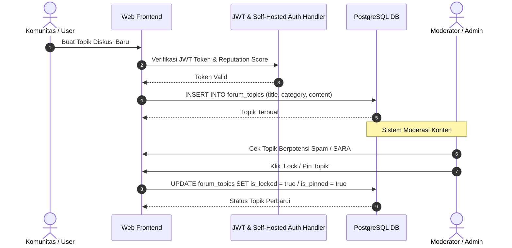

# 15 — Community System

> Dokumen ini memaparkan rancangan arsitektur dan fungsionalitas dari **Sistem Komunitas (Community System)**, yang memungkinkan interaksi dua arah antar penggemar musik, pembentukan forum diskusi, dan pengelolaan keanggotaan dalam platform **Sukabumi Eundeur**.

---

## 📌 Daftar Isi

- [Penjelasan](#-penjelasan)
- [Tujuan](#-tujuan)
- [Scope](#-scope)
- [Flow — Interaksi Pengguna di Forum](#-flow--interaksi-pengguna-di-forum)
- [Diagram Alur Komunitas](#-diagram-alur-komunitas)
- [Struktur Forum & Topik](#-struktur-forum--topik)
- [Manajemen Member & Profil](#-manajemen-member--profil)
- [Sistem Moderasi & Keamanan Konten](#-sistem-moderasi--keamanan-konten)
- [Checklist](#-checklist)
- [Catatan](#-catatan)
- [Best Practice](#-best-practice)
- [Enterprise Recommendation](#-enterprise-recommendation)
- [Future Improvement](#-future-improvement)

---

## 🎯 Overview

Sukabumi Eundeur bukanlah sekadar aplikasi transaksional penjual tiket. Visi besarnya adalah menjadi "Rumah Digital" bagi skena musik dan kreatif lokal. Modul **Community System** dirancang untuk menampung diskusi organik, berbagi foto gig lokal, dan sarana berkumpul *online* sebelum dan sesudah festival utama berlangsung.

---

## 🎯 Objective

1. Meningkatkan *engagement* dan retensi pengguna di luar masa perilisan tiket (agar aplikasi tidak "mati suri" setelah event selesai).
2. Memfasilitasi musisi lokal untuk berinteraksi langsung dengan penggemarnya (*fanbase*).
3. Menyediakan wadah terorganisir untuk membagikan info kegiatan (*gigs*, *meetup*).
4. Melindungi ekosistem dari *spam*, ujaran kebencian, dan konten ilegal melalui sistem moderasi.

---

## 📐 Scope

Dokumen ini mencakup:
- Hierarki forum (Kategori -> Topik -> Balasan).
- Profil pengguna publik (*Public Profile*).
- Sistem moderasi tingkat dasar (pelaporan/ *Flagging*).

Dokumen ini **tidak mencakup**:
- Sistem *real-time chat* antar individu (seperti WhatsApp/Telegram). Platform ini fokus pada komunikasi asinkron (berbasis *thread/post*).
- Fitur *live streaming* komunitas.

---

## 🔄 User Flow

### Alur Processes
 Interaksi Pengguna di Forum

1. **Membaca:** Pengguna anonim (Guest) dapat membaca *thread* diskusi yang bersifat publik.
2. **Autentikasi:** Untuk membuat Topik (Thread) atau membalas (Reply), *user* wajib login dan telah melakukan verifikasi email.
3. **Posting:** Pengguna mengirimkan pesan (teks/gambar). Sistem mengecek kata-kata terlarang (*profanity filter* dasar).
4. **Interaksi:** Pengguna lain dapat memberikan respon (Upvote / Like) pada post tersebut.
5. **Moderasi:** Jika sebuah post dilaporkan (*Flagged*) oleh 3 pengguna berbeda, post otomatis disembunyikan hingga diperiksa oleh *Community Moderator*.

---

## 🖼️ Diagram Alur Komunitas

```mermaid
flowchart TD
    A[Pengguna] -->|Klik Buat Topik| B{Sudah Verifikasi?}
    B -->|Belum| C[Prompt Verifikasi Akun]
    B -->|Sudah| D[Form Pembuatan Topik]
    D -->|Submit| E{Cek Kata Kasar}
    E -->|Gagal| F[Tolak dengan Pesan Error]
    E -->|Lolos| G[(Simpan di PostgreSQL (Self-Hosted VPS))]
    G --> H[Topik Tayang di Forum]
    
    U2[Pengguna Lain] -->|Melihat Topik| H
    U2 -->|Klik Balas| I[Kirim Balasan]
    U2 -->|Klik Laporkan| J{Jumlah Laporan > 3?}
    J -->|Ya| K[Auto-Hide & Notifikasi Moderator]
    J -->|Belum| L[Simpan Laporan di Log]
```

---

## 💬 Struktur Forum & Topik

Struktur data komunitas diorganisasikan mirip dengan gaya *Reddit* atau *Discourse*:
- **Kategori Forum (Spaces):** Ruang besar (contoh: "Info Gigs Lokal", "Diskusi Genre", "Jual Beli Tiket", "Saran Event").
- **Topik (Thread):** Dibuat oleh *user*. Memiliki judul spesifik dan konten utama.
- **Balasan (Replies/Comments):** Berada di dalam suatu Topik, diurutkan secara kronologis (dari terlama ke terbaru).
- **Galeri Pengguna:** Kumpulan foto yang diunggah oleh *member* saat mengikuti event (sering disebut *Fan Cam*).

---

## 👤 Manajemen Member & Profil

Setiap *user* terdaftar memiliki Halaman Profil Publik yang dapat dilihat orang lain (jika pengaturan privasi mereka diizinkan).
- **Atribut Profil:** Avatar, *Username* unik, Bio singkat, Tanggal Bergabung.
- **Riwayat Kehadiran (Badges):** Sistem memberikan *badge* (lencana digital) otomatis jika *user* pernah membeli dan *check-in* di event tertentu (misal: "Eundeur Fest 2025 Survivor"). Ini meningkatkan prestise sosial antar anggota.

---

## 🛡️ Sistem Moderasi & Keamanan Konten

- **Role Moderator:** Akun khusus (ditunjuk oleh Admin) yang bertugas menyensor, menghapus, atau memindahkan *thread* yang salah kamar.
- **Reporting System:** Tombol "Laporkan" pada setiap *post* yang memungkinkan pembaca mengadukan spam, SARA, atau penipuan.
- **Rate Limiting:** Mencegah *bot* membanjiri forum dengan membatasi 1 akun hanya boleh membuat maksimal 5 Topik baru dalam 1 jam.

---


## 💼 Business Rules
- Seluruh aturan bisnis modul harus tunduk pada Single Source of Truth (SSOT) Sukabumi Eundeur.
- Transaksi & data mutasi wajib mencatat audit log timestamp.


## ⚙️ Functional Requirements
- Mengimplementasikan seluruh endpoint API & komponen UI terkait.
- Mengelola state & autentikasi pengguna secara otomatis melalui JWT & Self-Hosted Auth Handler.


## 🚀 Non Functional Requirements
- Latensi respon < 200ms.
- Uptime target 99.9%.
- Aksesibilitas WCAG 2.1 Level AA.


## 🏗️ Architecture

### Sequence Diagram — Forum Topic Creation & Moderation



- **Frontend**: Next.js 16 (App Router) + React 19.
- **Backend**: PostgreSQL (Self-Hosted VPS) (PostgreSQL + RLS + Storage).
- **Infrastructure**: VPS Ubuntu + Nginx + PM2.


## 🔗 Dependencies
- `@PostgreSQL (Self-Hosted VPS)/PostgreSQL (Self-Hosted VPS)-js`
- `next` v16
- `react` v19
- `tailwindcss` v4


## ⚠️ Risks
- Kegagalan koneksi database saat lonjakan trafik -> Mitigasi: Connection Pooling & Caching.


## 🧪 Edge Cases
- Sesi pengguna kadaluarsa di tengah transaksi -> Redirect otomatis ke login dengan restore state.


## 📋 Validation Rules
- Format input wajib disanitasi dari potensi XSS & SQL Injection.


## 🛠️ Technical Notes
- Implementasi wajib mengikuti konvensi kode di [`21-folder-structure.md`](./21-folder-structure.md).


## 🚀 Future Improvements
- Integrasi analitik real-time dan rekomendasi berbasis AI.


## ✅ Checklist

- [x] Struktur hierarki forum (Kategori -> Topik -> Balasan) terdefinisi.
- [x] Alur moderasi berbasis pelaporan (*flagging*) dirancang.
- [x] Konsep Profil Publik dan sistem *Badge* (gamifikasi) dirancang.
- [ ] Menentukan (dengan *Developer*) *library profanity filter* Bahasa Indonesia untuk penyaringan otomatis.

---

## 📝 Catatan

- **Aturan Jual Beli Tiket Bekas:** Mengingat tingginya penipuan tiket (*ticket scalping/scam*), forum khusus "Jual Beli Tiket" wajib memunculkan peringatan (*Disclaimer*) permanen bahwa platform tidak bertanggung jawab atas transaksi di luar sistem E-Commerce resmi.

---

## 💡 Best Practice

- **Markdown Support:** Izinkan *user* menggunakan *Markdown* ringan (untuk membuat teks tebal, miring, atau menyisipkan *link*) pada editor komentar, namun **blokir** penggunaan tag HTML mentah (`<script>`, `<iframe>`) untuk menghindari serangan XSS (*Cross-Site Scripting*).

---

## 🏢 Enterprise Recommendation

> **Serverless WebSockets untuk Forum (PostgreSQL (Self-Hosted VPS) Realtime)**
> Agar diskusi terasa hidup (*alive*), gunakan fitur *Realtime Subscriptions* dari PostgreSQL (Self-Hosted VPS) pada halaman Detail Topik. Ketika ada pengguna lain yang sedang mengetik atau baru saja menekan tombol kirim balasan, balasan tersebut otomatis muncul di layar pengguna lain tanpa mereka harus me- *refresh* halaman (mirip Discord/Slack).

---

## 🚀 Future Improvement

- **User Tiers / Karma System:** Memberikan poin (*Karma*) setiap kali post seorang *user* mendapat *Upvote*. *User* dengan poin tertinggi dapat diberi akses khusus atau diskon tiket.
- **Community Polling:** Fitur pembuatan *Vote/Polling* (misal: *"Siapa headliner yang kalian inginkan tahun depan?"*) untuk mendapatkan riset pasar gratis dan organik.

---

<div align="center">

⬅️ [Kembali ke 14. News System](./14-news-system.md) · ➡️ [Lanjut ke 16. History Events](./16-history-events.md)

</div>
