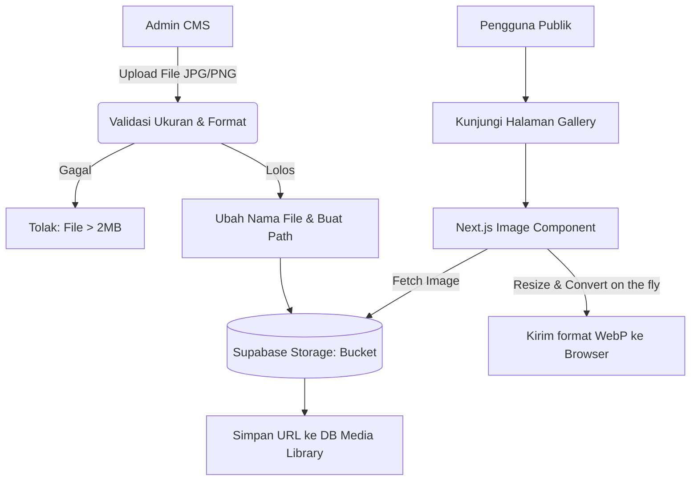
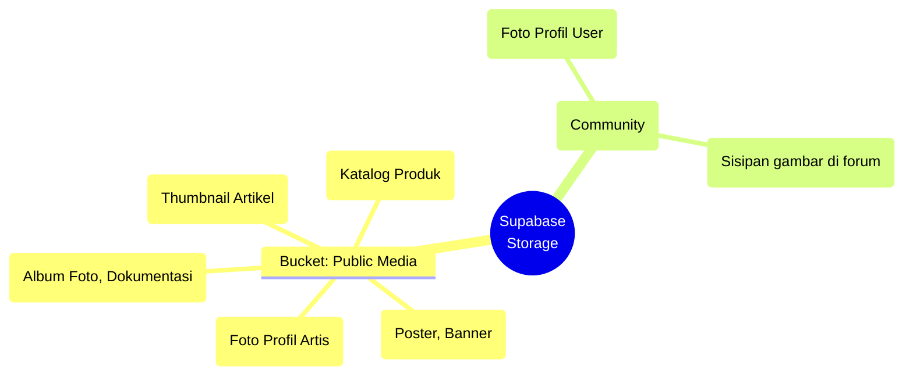

# 17 — Media Gallery System

> Dokumen ini menguraikan arsitektur dan manajemen dari **Sistem Galeri Media**, yang menangani penyimpanan, pengorganisasian, dan penyajian aset visual (foto dan video) dalam ekosistem platform **Sukabumi Eundeur**.

---

## 📌 Daftar Isi

- [Penjelasan](#-penjelasan)
- [Tujuan](#-tujuan)
- [Scope](#-scope)
- [Flow — Pengelolaan Aset Visual](#-flow--pengelolaan-aset-visual)
- [Diagram Arsitektur Galeri](#-diagram-arsitektur-galeri)
- [Kategorisasi & Album](#-kategorisasi--album)
- [Manajemen File (Supabase Storage)](#-manajemen-file-supabase-storage)
- [Optimasi Gambar & Video (Performance)](#-optimasi-gambar--video-performance)
- [Checklist](#-checklist)
- [Catatan](#-catatan)
- [Best Practice](#-best-practice)
- [Enterprise Recommendation](#-enterprise-recommendation)
- [Future Improvement](#-future-improvement)

---

## 🎯 Penjelasan

**Media Gallery** di Sukabumi Eundeur melayani dua fungsi:
1. **Fungsi Internal (CMS):** Sebagai pustaka (*Media Library*) sentral bagi Admin untuk menyimpan aset poster, foto artis, dan banner web.
2. **Fungsi Eksternal (Publik):** Sebagai halaman *Gallery* publik tempat pengguna bisa menikmati kompilasi dokumentasi foto (album) dari berbagai event dan pergerakan komunitas.

Karena gambar (dan video) merupakan kontributor terbesar penyebab *website* menjadi lambat, modul ini sangat berkaitan erat dengan strategi optimisasi performa (LCP) dan efisiensi *bandwidth*.

---

## 🎯 Tujuan

1. Menyediakan repositori terpusat untuk semua aset visual agar tidak terjadi duplikasi (*upload* gambar yang sama berkali-kali).
2. Merancang struktur album yang rapi untuk memisahkan dokumentasi antar-event.
3. Memastikan semua aset visual disajikan (*delivered*) kepada *end-user* dalam format teringan (WebP/AVIF) tanpa mengorbankan kualitas.
4. Menjaga batas kuota pengeluaran biaya (*Cost Control*) pada BaaS Storage (Supabase).

---

## 📐 Scope

Dokumen ini mencakup:
- Struktur Album dan Taksonomi Galeri (Frontend).
- Manajemen integrasi dengan Supabase Storage (Backend).
- Strategi format *file* dan optimisasi aset.

Dokumen ini **tidak mencakup**:
- Komponen CDN (*Content Delivery Network*) eksternal khusus video raksasa.
- *Source code* konversi format gambar di sisi Next.js (berada di implementasi teknis).

---

## 🔄 Flow — Pengelolaan Aset Visual

---

## 🖼️ Diagram Arsitektur Galeri

Penyimpanan (*Buckets*) akan dipisah secara logis untuk mencegah tercampurnya aset publik dan aset sistem:

---

## 🗂️ Kategorisasi & Album

Di halaman publik (`/gallery`), foto-foto tidak ditampilkan secara acak dan bertumpuk, melainkan diorganisasikan ke dalam **Album**.

- **Album Event:** (contoh: *"Eundeur Fest 2026 - Day 1"*, *"Eundeur Fest 2026 - Crowd Highlights"*).
- **Album Komunitas:** (contoh: *"Kopdar Musik Sukabumi April 2026"*).
- **Struktur UI:** Halaman depan Galeri akan menampilkan pola *Grid* bata (*Masonry Grid*) yang modern, dan jika diklik akan memperbesar foto menggunakan *Lightbox* (Modal layar penuh) tanpa *loading* halaman baru.

---

## 💽 Manajemen File (Supabase Storage)

1. **Naming Convention:** Admin harus diatur oleh sistem agar tidak mengunggah file dengan nama asli seperti `IMG_1234.JPG`. Sistem CMS secara otomatis mengubah nama file saat *upload* menjadi *slug* yang ramah SEO (contoh: `eundeur-fest-2026-crowd-01.jpg`).
2. **Upload Limit:** Untuk menjaga batas kuota *storage*, batasi ukuran unggahan melalui CMS maksimal **2 MB per foto**. Jika foto asli berukuran 15 MB dari fotografer, Admin wajib mengompresinya terlebih dahulu menggunakan *tools* eksternal sebelum *upload*.

---

## ⚡ Optimasi Gambar & Video (Performance)

- **Gambar:** 
  Wajib menggunakan komponen `<Image />` bawaan Next.js (`next/image`). Komponen ini secara otomatis akan mengubah JPG/PNG dari Supabase menjadi **WebP** atau **AVIF**, serta menyesuaikan resolusi gambar dengan ukuran layar pengguna (HP vs Desktop).
- **Video:** 
  Platform **dilarang keras** (*anti-pattern*) men- *hosting* file video (MP4) langsung di Supabase Storage untuk ditonton secara publik, karena akan menghabiskan kuota *bandwidth* secara eksponensial. Seluruh video (termasuk *Aftermovie* atau *Teaser*) wajib diunggah ke platform video (seperti **YouTube** atau **Vimeo**), dan website Sukabumi Eundeur hanya melakukan penyisipan (*Embed Component*).

---

## ✅ Checklist

- [x] Struktur *Buckets* (Pemisahan aset publik dan *user upload*) terencana.
- [x] Konsep *Album* (Kategorisasi visual) untuk halaman publik terdefinisi.
- [x] Batasan *upload* CMS (Maks. 2MB, *Auto-rename*) dirancang.
- [x] Aturan ketat penggunaan *embed* YouTube untuk konten video ditetapkan.
- [ ] Menyiapkan *component Lightbox* di sisi *Frontend* (UI) untuk memberikan pengalaman melihat foto yang mulus.

---

## 📝 Catatan

- **Copyright & Watermark:** Karena foto-foto di festival memiliki nilai hak cipta yang tinggi, fotografer resmi sebaiknya sudah membubuhkan *watermark* kecil pada gambar sebelum diserahkan ke Admin CMS. Platform *web* tidak perlu membebani server untuk melakukan penambahan *watermark* secara *on-the-fly* (otomatis oleh sistem).

---

## 💡 Best Practice

- **Lazy Loading (Pemuatan Tertunda):** Halaman Galeri dengan 100 foto tidak boleh memuat 100 foto tersebut sekaligus. Gunakan parameter `loading="lazy"` (bawaan *Next.js Image*) agar browser hanya mengunduh foto yang sedang terlihat di layar *scroll* pengguna (menghemat *bandwidth* secara drastis).
- **Blur-up Placeholder:** Sediakan gambar buram berukuran sangat kecil (hanya beberapa *bytes*) yang muncul instan selagi menunggu gambar utama selesai diunduh, untuk memberikan *feedback* visual yang modern.

---

## 🏢 Enterprise Recommendation

> **Image CDN (Content Delivery Network)**
> Walaupun Next.js *Image Optimization* sangat bagus, ia membebani komputasi memori pada server VPS Anda setiap kali harus meresize gambar. Untuk sistem *enterprise*, sangat disarankan menggunakan **Image CDN eksternal** pihak ketiga (seperti Cloudinary, Imgix, atau BunnyCDN). Dengan CDN, proses *resize* (`?width=300&format=webp`) diserahkan ke server CDN yang tersebar secara global, membuat VPS aplikasi Anda tetap ringan dan cepat.

---

## 🚀 Future Improvement

- **Face Recognition / Photo Finder:** Menggunakan API AI eksternal (seperti AWS Rekognition) agar pengguna yang hadir di festival dapat menemukan foto diri mereka di tengah kerumunan (*crowd*) hanya dengan mengunggah *selfie* mereka.
- **User Generated Content (UGC) Gallery:** Memberikan *hashtag* resmi di Instagram, lalu secara otomatis menarik (*pull/embed*) foto-foto publik dari Instagram *users* ke dalam Galeri Sukabumi Eundeur.

---

⬅️ [Kembali ke 16. History Events](./16-history-events.md) · ➡️ [Lanjut ke 18. SEO Strategy](./18-seo-strategy.md)

