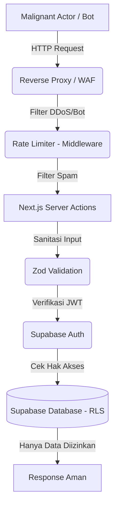

# 19 — Security Strategy

> Dokumen ini memaparkan strategi **Keamanan Sistem (Security)** untuk ekosistem Sukabumi Eundeur. Mencakup pengamanan data pengguna, arsitektur basis data, mitigasi eksploitasi, hingga perlindungan terhadap kerentanan aplikasi web umum (OWASP Top 10).

---

## 📌 Daftar Isi

- [Penjelasan](#-penjelasan)
- [Tujuan](#-tujuan)
- [Scope](#-scope)
- [Flow — Peta Lapis Keamanan](#-flow--peta-lapis-keamanan)
- [Keamanan Database (Supabase RLS)](#-keamanan-database-supabase-rls)
- [Otorisasi & Autentikasi](#-otorisasi--autentikasi)
- [Mitigasi Serangan Web (OWASP)](#-mitigasi-serangan-web-owasp)
- [Keamanan Transaksi & Webhook](#-keamanan-transaksi--webhook)
- [Infrastruktur & Pembatasan Akses (Rate Limiting)](#-infrastruktur--pembatasan-akses-rate-limiting)
- [Checklist](#-checklist)
- [Catatan](#-catatan)
- [Best Practice](#-best-practice)
- [Enterprise Recommendation](#-enterprise-recommendation)
- [Future Improvement](#-future-improvement)

---

## 🎯 Penjelasan

Sebuah platform festival musik tidak hanya menampung pengunjung, tetapi juga **uang (transaksi)** dan **data pribadi** (Nomor KTP/Identitas, Nama Lengkap, Nomor HP). Kebocoran data (*Data Breach*) atau kelemahan sistem transaksi (*Payment Bypass*) akan berakibat fatal pada reputasi, hukum, dan kelangsungan bisnis Sukabumi Eundeur. 

Strategi keamanan platform ini mengandalkan pendekatan *Defense in Depth* (Keamanan Berlapis), dari level antarmuka klien, perantara (*Next.js server*), hingga level terbawah (*Database*).

---

## 🎯 Tujuan

1. Melindungi data sensitif dan privasi pengguna sesuai dengan kaidah regulasi.
2. Mencegah eskalasi hak akses (contoh: *User* biasa menyusup ke panel CMS Admin).
3. Mengamankan API dan formulir aplikasi dari injeksi (XSS, SQL Injection, CSRF).
4. Melindungi *server* dari serangan *bot* (calo tiket) atau serangan penolakan layanan (*DDoS* tingkat aplikasi).

---

## 📐 Scope

Dokumen ini mencakup:
- Strategi implementasi Supabase *Row Level Security* (RLS).
- Panduan *Rate Limiting* (pembatasan frekuensi permintaan).
- Pencegahan vektor serangan web yang umum.
- Konsep keamanan integrasi *Payment Gateway*.

Dokumen ini **tidak mencakup**:
- Manajemen konfigurasi *Firewall* OS/Router pada penyedia VPS (lebih spesifik pada tugas *DevOps*).
- Kebijakan Kepatuhan (*Compliance*) ISO / Sertifikasi Penetrasi (pentest) formal (belum masuk *scope* fase 1).

---

## 🔄 Flow — Peta Lapis Keamanan

---

## 🛡️ Keamanan Database (Supabase RLS)

Sistem menggunakan **Supabase**, yang artinya *Database* (PostgreSQL) terekspos ke internet. **Row Level Security (RLS)** adalah garis pertahanan absolut (Wajib Aktif).

1. **Default Deny:** Seluruh tabel baru di Supabase harus secara *default* diset `RLS ENABLED` tanpa ada kebijakan (sehingga tidak ada yang bisa membaca/menulis).
2. **Read Public Data:** Kebijakan (Policy) eksplisit diberikan agar siapa saja (anonim) bisa `SELECT` tabel `Events`, `Products`, dan `News` yang berstatus *Published*.
3. **Data Isolasi Pengguna:** Pengguna biasa (`authenticated`) hanya diizinkan membaca (`SELECT`) dan mengubah (`UPDATE`) baris di tabel `Orders` dan `Tickets` **jika** `user_id` pada baris tersebut sama dengan `auth.uid()`.
4. **Bypass RLS (Server Side):** Untuk operasi tingkat tinggi (pembuatan tiket, rekonsiliasi data), *Next.js Server Actions* akan menggunakan `Service Role Key` (kunci super rahasia) yang menembus RLS. *Service Role Key* **tidak boleh** pernah lolos ke kode publik (Client Components).

---

## 🔐 Otorisasi & Autentikasi

- **Otorisasi Berbasis Peran (RBAC):** Hak istimewa Admin/Editor tidak boleh disimpan pada *cookies* atau profil *client-side*. *Role* harus diinjeksikan secara aman (misal: Supabase *Custom Claims* atau diverifikasi ulang di server sebelum mengeksekusi aksi).
- **Proteksi Halaman Admin:** Next.js *Middleware* (`middleware.ts`) wajib memeriksa sesi pengguna (*Session JWT*). Jika *user* mencoba membuka `/admin/*` namun bukan admin, alihkan paksa (*redirect*) kembali ke beranda (Status HTTP 403 Forbidden).

---

## ⚔️ Mitigasi Serangan Web (OWASP)

1. **SQL Injection (SQLi):** Aman, karena sistem menggunakan SDK Prisma/Supabase ORM (lapisan abstraksi) dan tidak mengeksekusi kueri mentah (*raw string concatenation*).
2. **Cross-Site Scripting (XSS):** React/Next.js secara bawaan mengamankan variabel dari injeksi XSS. Namun, untuk konten artikel CMS yang dirender via `dangerouslySetInnerHTML`, konten harus disanitasi menggunakan pustaka pembersih HTML (seperti `DOMPurify` di *client* atau `sanitize-html` di server).
3. **Cross-Site Request Forgery (CSRF):** Menggunakan *Server Actions* Next.js (di atas versi 14) secara bawaan telah mengaktifkan pelindung CSRF melalui pengenalan *Host Headers* dan *Origin matching*.

---

## 💳 Keamanan Transaksi & Webhook

Titik masuk paling rentan untuk pencurian (fraud) adalah manipulasi pembayaran.

1. **Harga Tidak Berasal dari Klien:** Harga tiket/keranjang **tidak pernah** dikirim dari browser (contoh: `POST { ticket_price: 5000 }`). Server (*Server Action*) harus selalu menghitung ulang (kalkulasi silang) harga asli berdasarkan ID produk dari tabel *database*.
2. **Validasi Webhook Gateway:** Rute *Endpoint* `/api/webhooks/payment` harus memverifikasi *HMAC Signature* (Tanda Tangan Enkripsi) dari *Payment Gateway*. Ini untuk memastikan bahwa notifikasi "Pembayaran Sukses" benar-benar datang dari server Bank/Gateway resmi, bukan dari peretas (hacker) yang memanggil *endpoint* secara manual dengan Postman/cURL.

---

## 🚦 Infrastruktur & Pembatasan Akses (Rate Limiting)

Untuk mencegah calo tiket (*Ticket Scalping Bot*) memborong tiket, atau mencegah *Spammer* membanjiri forum dengan topik sampah, sistem pembatasan laju (*Rate Limit*) diterapkan:

- **Auth Brute Force:** Supabase Auth memiliki pembatasan bawaan (menahan tebakan *password* berulang).
- **Checkout Rate Limit:** Fungsi `checkoutTicket` dibatasi per IP/User (misalnya maks 3 percobaan dalam 1 menit). Dapat diimplementasikan menggunakan Redis (Upstash) di tingkat *Middleware* atau *Server Actions*.

---

## ✅ Checklist

- [x] Kebijakan ketat (RLS) pada tabel Supabase telah direncanakan.
- [x] Sanitasi XSS pada rendering *Rich Text* Artikel diidentifikasi.
- [x] Verifikasi Webhook *Payment Gateway* menggunakan kalkulasi *signature* diwajibkan.
- [x] Konsep *Rate Limiting* pada transaksi esensial dan form *submit* dirancang.
- [ ] Memastikan file `.env` yang berisi variabel `SUPABASE_SERVICE_ROLE_KEY` disembunyikan dan di- *ignore* dari repositori GitHub.

---

## 📝 Catatan

- **Sensitivitas Data:** Segala informasi sensitif terkait identitas (seperti NIK KTP jika kelak disyaratkan oleh pemerintah/event besar) tidak boleh ditampilkan kembali (*read*) dalam bentuk telanjang di log sistem, idealnya dienkripsi parsial (masking).

---

## 💡 Best Practice

- **Zod Input Validation:** Segala bentuk *request* yang masuk (dari form UI atau API) wajib divalidasi kebenaran strukturnya (tipe data, panjang minimal/maksimal, email valid) dengan pustaka validasi ketat (seperti Zod) sebelum data tersebut menyentuh logika *database*.

---

## 🏢 Enterprise Recommendation

> **Audit Trail In-Database (Trigger/Function)**
> Sistem enterprise besar (Fintech/E-commerce) tidak mengandalkan *Audit Log* di tingkat aplikasi (Next.js) karena rentan terlewat. Gunakan fitur *Database Triggers* murni di Supabase (PostgreSQL). Buat *trigger* khusus: *"Setiap ada perubahan UPDATE pada tabel Orders, otomatis INSERT rekaman perubahan lama dan baru ke tabel Audit_Log"*. Ini memastikan **tidak ada satupun perubahan data** (meskipun diedit manual oleh admin via *SQL Client*) yang luput dari catatan log.

---

## 🚀 Future Improvement

- **Bug Bounty / VDP:** Jika festival semakin besar, buat halaman "Vulnerability Disclosure Program" (VDP) yang mengizinkan *white-hat hacker* (peretas baik) melaporkan celah keamanan secara resmi alih-alih meretas aplikasi untuk eksploitasi.
- **Two-Factor Authentication (2FA):** Menerapkan 2FA (menggunakan Authenticator App) bagi *Super Admin* dan *Event Manager* yang memiliki akses ke data penting dan uang (Sangat disarankan, karena kebocoran *password* admin akibat serangan rekayasa sosial/ *phishing* adalah ancaman nyata).

---

⬅️ [Kembali ke 18. SEO Strategy](./18-seo-strategy.md) · ➡️ [Lanjut ke 20. Performance](./20-performance.md)

