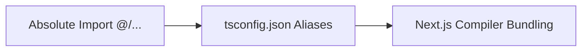
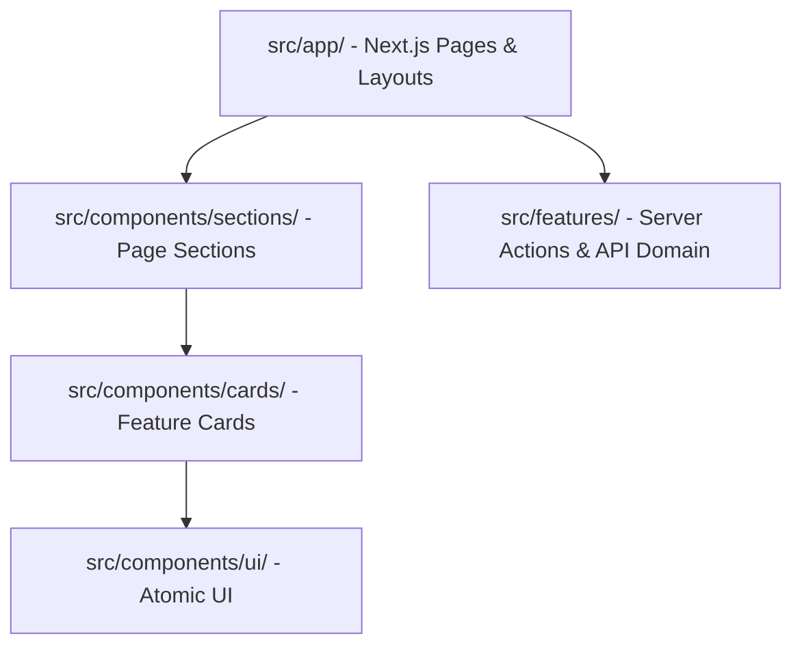

# 21 — Folder Structure & Code Conventions (Design System & App Architecture)

> **Single Source of Truth (SSOT) — Struktur Folder Repository & Standar Konvensi Kode**  
> Dokumen ini menentukan tata letak direktori, arsitektur *Design Tokens* (Tailwind CSS v4), pengelompokan komponen UI, serta aturan penulisan kode untuk repository **Sukabumi Eundeur**.

---

## 📌 Daftar Isi

- [Overview](#-overview)
- [Objective](#-objective)
- [Scope](#-scope)
- [Business Rules](#-business-rules)
- [Functional Requirements](#-functional-requirements)
- [Non Functional Requirements](#-non-functional-requirements)
- [User Flow](#-user-flow)
- [Architecture](#-architecture)
- [Dependencies](#-dependencies)
- [Risks](#-risks)
- [Edge Cases](#-edge-cases)
- [Validation Rules](#-validation-rules)
- [Technical Notes & Folder Tree](#-technical-notes--folder-tree)
  - [1. Complete Folder Tree Structure](#1-complete-folder-tree-structure)
  - [2. Component Layering Architecture](#2-component-layering-architecture)
  - [3. Tailwind CSS v4 & Tokens Configuration](#3-tailwind-css-v4--tokens-configuration)
  - [4. Naming Conventions Standard](#4-naming-conventions-standard)
- [Future Improvements](#-future-improvements)
- [Checklist](#-checklist)

---

## 🎯 Overview

Platform Sukabumi Eundeur menerapkan arsitektur hibrida *Feature-Sliced Design* yang memisahkan komponen antarmuka generik (`src/components/ui/`), komponen kartu spesifik (`src/components/cards/`), seksi halaman (`src/components/sections/`), serta logika domain bisnis (`src/features/`).

---

## 🎯 Objective

1. Menyediakan direktori berstruktur rapi yang memisahkan *Presentation Logic* dan *Business Logic*.
2. Membakukan lokasi penyimpanan token desain, CSS global, dan aset visual antarmuka.
3. Menjamin *Developer* dapat mengimpor komponen secara efisien menggunakan Absolute Path Imports (`@/...`).
4. Mencegah *dead code* dan redundansi melalui pemisahan modul yang jelas.

---

## 📐 Scope

### In-Scope
- Pohon folder lengkap dari akar repository hingga file komponen Next.js.
- Tata letak file CSS Design Tokens (`src/app/globals.css`).
- Pemetaaan alias direktori TypeScript (`tsconfig.json`).
- Konvensi penamaan file, folder, dan variabel.

### Out-of-Scope
- Konfigurasi cluster server produksi (dijelaskan pada `24-deployment-plan.md`).

---

## 💼 Business Rules

1. **Aturan Pemisahan Komponen Atomic**: Komponen generik di `/components/ui/` **tidak boleh** mengimpor pustaka PostgreSQL (Self-Hosted VPS) / API backend secara langsung (harus bersifat *Pure Presentation Components*).
2. **Penggunaan Path Alias**: Impor berkas **wajib** menggunakan alias `@/components/...` atau `@/lib/...`. Dilarang menggunakan relatif path panjang seperti `../../../../components/Button`.
3. **Pemisahan Server vs Client**: Komponen yang menggunakan React Hook (`useState`, `useEffect`) wajib menambahkan directive `'use client'` di baris pertama file.

---

## ⚙️ Functional Requirements

| ID | Direktori | Peran & Fungsi |
|---|---|---|
| **FR-FS-01** | `src/app/` | Menampung rute URL App Router Next.js & berkas global CSS. |
| **FR-FS-02** | `src/components/ui/` | Komponen tombol, input, modal, badge generik. |
| **FR-FS-03** | `src/components/cards/` | Kartu UI spesifik (LineupCard, MerchCard, NewsCard, CountdownCard). |
| **FR-FS-04** | `src/components/sections/` | Block seksi halaman utama (HeroSection, GallerySection). |
| **FR-FS-05** | `src/features/` | Logika transaksional per domain (events, merch, news, community). |

---

## 🚀 Non Functional Requirements

- **Maintainability**: Waktu pencarian berkas oleh developer baru < 10 detik dengan arsitektur intuitif.
- **Build Performance**: Struktur folder mendukung *Tree-Shaking* penuh untuk meminimalkan ukuran JavaScript bundle.

---

## 🔄 User Flow



---

## 🏗️ Architecture



---

## 🔗 Dependencies

- **TypeScript**: Mendukung alias `paths` di `tsconfig.json`.
- **Tailwind CSS v4**: Dikompilasi via `@import "tailwindcss";`.

---

## ⚠️ Risks

- **Import Cycles (Circular Dependency)**: Risiko ketergantungan melingkar jika `src/features` mengimpor `src/components` yang mengimpor kembali `src/features`.

---

## 🧪 Edge Cases

1. **Komponen yang Hanya Dipakai Satu Halaman**: Disimpan di subfolder lokal rute terkait (misal `src/app/(public)/events/[slug]/_components/`).

---

## 📋 Validation Rules

- Penamaan file komponen React: **PascalCase** (contoh: `ArtistCard.tsx`).
- Penamaan file utility / helper: **camelCase** atau **kebab-case** (contoh: `formatCurrency.ts`).

---

## 🛠️ Technical Notes & Folder Tree

### 1. Complete Folder Tree Structure

```text
sukabumi-eundeur/
├── .github/                     # Workflow CI/CD GitHub Actions
│   └── workflows/
│       └── deploy.yml
├── docs/                        # 26 Berkas Dokumentasi SSOT
├── public/                      # Aset Statis Publik (Favicon, Logo, Fonts)
│   ├── images/
│   ├── fonts/
│   └── poster-2026.jpg
├── Reference/                   # Acuan Desain Visual
│   └── Sukabumi_Eundeur_heavy_metal_fes...202607220029.jpeg
│
├── src/                         # Source Code Aplikasi
│   ├── app/                     # Next.js App Router (URL Routes)
│   │   ├── (public)/            # Group Route Publik
│   │   │   ├── page.tsx         # Home Page
│   │   │   ├── layout.tsx       # Public Layout (Sticky Header & Footer)
│   │   │   ├── events/
│   │   │   ├── merch/
│   │   │   └── news/
│   │   ├── (auth)/              # Group Route Login/Register
│   │   ├── (admin)/             # Group Route CMS Admin Dashboard
│   │   ├── api/                 # Route Handlers (Webhooks)
│   │   │   └── webhooks/
│   │   │       └── payment/
│   │   ├── globals.css          # Design Tokens & Tailwind CSS v4
│   │   └── layout.tsx           # Root Layout Global
│   │
│   ├── components/              # Komponen UI Reusable
│   │   ├── ui/                  # Atomic Components (Button, Input, Badge, Modal)
│   │   │   ├── Button.tsx
│   │   │   ├── Input.tsx
│   │   │   └── Badge.tsx
│   │   ├── cards/               # UI Cards (Design System Aligned)
│   │   │   ├── ArtistCard.tsx
│   │   │   ├── MerchCard.tsx
│   │   │   ├── NewsCard.tsx
│   │   │   └── CountdownCard.tsx
│   │   ├── sections/            # Page Sections (Block Layouts)
│   │   │   ├── HeroSection.tsx
│   │   │   ├── LineupSection.tsx
│   │   │   ├── GallerySection.tsx
│   │   │   └── MerchSection.tsx
│   │   └── layout/              # Navigasi & Footer
│   │       ├── Navbar.tsx
│   │       └── Footer.tsx
│   │
│   ├── features/                # Domain Logika Bisnis & Mutasi Data
│   │   ├── events/
│   │   │   ├── actions.ts       # Server Actions (rpc_reserve_tickets)
│   │   │   └── types.ts
│   │   ├── merch/
│   │   └── news/
│   │
│   ├── lib/                     # Helpers & Configurations
│   │   ├── PostgreSQL (Self-Hosted VPS)/            # PostgreSQL & Database Client Credentials
│   │   │   ├── server.ts
│   │   │   └── client.ts
│   │   └── utils/               # Formatters (formatCurrency, formatDate)
│   │       └── index.ts
│   │
│   └── types/                   # Interfaces TypeScript Global
│       └── database.ts
│
├── .env.example
├── next.config.mjs
├── tsconfig.json
├── package.json
└── README.md
```

### 2. Component Layering Architecture

1. **`src/components/ui/`**: Pure UI Component tanpa logika PostgreSQL (Self-Hosted VPS) (Dumb Component).
2. **`src/components/cards/`**: Komponen kartu visual yang mengonsumsi props data.
3. **`src/components/sections/`**: Blok pembangun utama halaman utama.
4. **`src/features/`**: Mengolah pemanggilan Server Actions & PostgreSQL & Database Client.

### 3. Tailwind CSS v4 & Tokens Configuration

#### `tsconfig.json`
```json
{
  "compilerOptions": {
    "target": "ES2022",
    "lib": ["dom", "dom.iterable", "esnext"],
    "allowJs": true,
    "skipLibCheck": true,
    "strict": true,
    "noEmit": true,
    "esModuleInterop": true,
    "module": "esnext",
    "moduleResolution": "bundler",
    "resolveJsonModule": true,
    "isolatedModules": true,
    "jsx": "preserve",
    "incremental": true,
    "plugins": [{ "name": "next" }],
    "paths": {
      "@/*": ["./src/*"]
    }
  },
  "include": ["next-env.d.ts", "**/*.ts", "**/*.tsx", ".next/types/**/*.ts"],
  "exclude": ["node_modules"]
}
```

### 4. Naming Conventions Standard

- **React Components**: `PascalCase.tsx` (Contoh: `CountdownCard.tsx`).
- **Utilities & Actions**: `camelCase.ts` (Contoh: `formatCurrency.ts`).
- **Route Folders**: `kebab-case` (Contoh: `app/(public)/contact-us/page.tsx`).
- **Types & Interfaces**: `PascalCase` (Contoh: `interface ITicket { ... }`).

---

## 🚀 Future Improvements

- **Storybook Integration**: Mengintegrasikan Storybook untuk katalogisasi komponen `src/components/ui/` dan `src/components/cards/` secara terisolasi.

---

## ✅ Checklist

- [x] Pohon struktur folder `/src` terdefinisi lengkap.
- [x] Pemisahan komponen Atomic (`ui`, `cards`, `sections`, `features`) terstruktur.
- [x] Konfigurasi Alias TypeScript `@/*` terpasang.
- [x] Memenuhi 15 komponen standar dokumentasi arsitektur.

---

<div align="center">

⬅️ [Kembali ke 20. Performance](./20-performance.md) · ➡️ [Lanjut ke 22. Development Roadmap](./22-development-roadmap.md)

</div>
