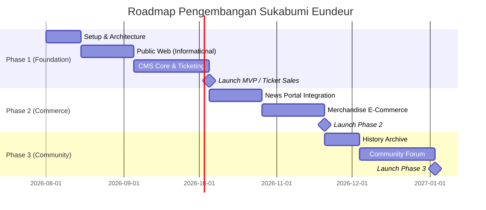

# 22 — Development Roadmap

> Dokumen ini menjabarkan peta jalan pengembangan (*Roadmap*) proyek platform **Sukabumi Eundeur**, membaginya ke dalam fase-fase (Fase 1 hingga Fase 4) agar peluncuran dapat dilakukan secara bertahap dan iteratif, alih-alih menunggu bertahun-tahun untuk perilisan penuh.

---

## 📌 Daftar Isi

- [Penjelasan](#-penjelasan)
- [Tujuan](#-tujuan)
- [Scope](#-scope)
- [Flow — Peta Perjalanan Peluncuran (Milestones)](#-flow--peta-perjalanan-peluncuran-milestones)
- [Fase 1: Foundation (Minimum Viable Product)](#-fase-1-foundation-minimum-viable-product)
- [Fase 2: Expansion (Commerce & Content)](#-fase-2-expansion-commerce--content)
- [Fase 3: Social & Archive (Community)](#-fase-3-social--archive-community)
- [Fase 4: Ecosystem & Scale (Masa Depan)](#-fase-4-ecosystem--scale-masa-depan)
- [Checklist](#-checklist)
- [Catatan](#-catatan)
- [Best Practice](#-best-practice)

---

## 🎯 Overview

Platform ekosistem ini terlalu besar (Ticketing + E-Commerce + Portal Berita + Komunitas + History) untuk dirilis bersamaan sekaligus (*Big Bang Release*). Pembangunan sistem harus mengikuti prinsip **Agile Development**, di mana fitur-fitur esensial (Inti Bisnis) dirilis terlebih dahulu untuk mendapatkan traksi dan pendapatan, sementara fitur tersier menyusul pada fase pembaruan (*updates*) berikutnya.

---

## 🎯 Objective

1. Memberikan pedoman bagi *Product Manager* dan *Developer* tentang fitur apa yang harus diprioritaskan.
2. Mempercepat *Time to Market* (T2M) dengan mengunci batasan (*Scope Limit*) pada produk kelayakan minimum (MVP).
3. Menyinkronkan jadwal rilis platform (*Go-Live*) dengan jadwal kebutuhan festival dunia nyata (misal: perilisan Modul Tiket tepat sebelum musim penjualan *Pre-Sale*).

---

## 📐 Scope

Dokumen ini mencakup:
- Pembagian proyeksi menjadi 4 Fase (*Milestones*).
- Prioritas modul dan pengerjaan (*Backlog Grouping*).

---

## 🔄 User Flow

### Alur Processes
 Peta Perjalanan Peluncuran (Milestones)

---

## 🏁 Fase 1: Foundation (Minimum Viable Product)
**Fokus Utama:** Peluncuran wujud resmi (*Brand Launch*) dan Pemasukan (Penjualan Tiket).

**Cakupan (Deliverables):**
- **Public Profile:** Halaman *Home*, *About Us*, *Contact*, *Partners*.
- **Database & Auth:** PostgreSQL (Self-Hosted VPS) *setup*, Register/Login User.
- **CMS (Core):** Dashboard Admin, Modul Daftar *Event*, Setting Web.
- **Ticketing Engine:** Modul *Checkout* tiket, Pembuatan Invoice, *QR Code Generator*, Integrasi Payment Gateway.
- **Gate Scanner:** Fitur khusus admin untuk validasi scan QR Code saat hari-H.

*(Target: Begitu Fase 1 selesai, penyelenggara sudah bisa berjualan tiket secara digital. Ini adalah urat nadi proyek).*

---

## 🏗️ Fase 2: Expansion (Commerce & Content)
**Fokus Utama:** Retensi trafik pasca-promosi event dan pembukaan aliran pendapatan kedua.

**Cakupan (Deliverables):**
- **News Portal:** Sistem berita, Taksonomi (Kategori/Tag), CMS Editor Artikel (*Rich Text*).
- **Merchandise Store:** Katalog Kaos/Aksesoris, Manajemen Stok, Modul *Checkout* Barang Fisik (Alamat & Kurir).
- **Media Gallery:** Pustaka aset publik (Galeri Foto) tanpa fitur forum komunitas.

---

## 🤝 Fase 3: Social & Archive (Community)
**Fokus Utama:** Membangun "Rumah Skena Musik" dan pengarsipan jejak.

**Cakupan (Deliverables):**
- **History System:** Mesin "Pembekuan Data" (Data Freezing) untuk menyimpan event yang telah selesai secara permanen. Profil Artis dan riwayat performa mereka.
- **Community Forum:** Sistem Topik, Komen, Moderasi (Flagging), Verifikasi Member.
- **Review System:** Kolom ulasan bintang pada pembelian Merchandise.

---

## 🚀 Fase 4: Ecosystem & Scale (Masa Depan)
**Fokus Utama:** Mengamankan platform dari trafik raksasa, memperluas fitur gaya hidup (Lifestyle).

**Cakupan (Future Roadmap - Opsional):**
- **Mobile Native App:** Pembuatan Aplikasi Android/iOS Eundeur (*WebView/React Native*) dengan notifikasi dorong (*Push Notifications*).
- **Cashless Wristband:** Integrasi dompet digital internal Eundeur Pay ke gelang NFC saat festival berlangsung.
- **Membership Subscription:** Berlangganan eksklusif (loyalty program) untuk akses diskon tiket tahunan.

---

## 💼 Business Rules
- Seluruh aturan bisnis modul harus tunduk pada Single Source of Truth (SSOT) Sukabumi Eundeur.
- Transaksi & data mutasi wajib mencatat audit log timestamp.

## ⚙️ Functional Requirements
- Mengimplementasikan seluruh endpoint API & komponen UI terkait.
- Mengelola state & autentikasi pengguna secara otomatis melalui JWT & Self-Hosted Auth Handler.

## 🚀 Non Functional Requirements
- Latensi respon < 200ms.
- Uptime target 99.9%.
- Aksesibilitas WCAG 2.1 Level AA.

## 🏗️ Architecture
- **Frontend**: Next.js 16 (App Router) + React 19.
- **Backend**: PostgreSQL (Self-Hosted VPS) (PostgreSQL + RLS + Storage).
- **Infrastructure**: VPS Ubuntu + Nginx + PM2.

## 🔗 Dependencies
- `@PostgreSQL (Self-Hosted VPS)/PostgreSQL (Self-Hosted VPS)-js`
- `next` v16
- `react` v19
- `tailwindcss` v4

## ⚠️ Risks
- Kegagalan koneksi database saat lonjakan trafik -> Mitigasi: Connection Pooling & Caching.

## 🧪 Edge Cases
- Sesi pengguna kadaluarsa di tengah transaksi -> Redirect otomatis ke login dengan restore state.

## 📋 Validation Rules
- Format input wajib disanitasi dari potensi XSS & SQL Injection.

## 🛠️ Technical Notes
- Implementasi wajib mengikuti konvensi kode di [`21-folder-structure.md`](./21-folder-structure.md).

## 🚀 Future Improvements
- Integrasi analitik real-time dan rekomendasi berbasis AI.

## ✅ Checklist

- [x] Target *Milestone* setiap fase telah diurutkan berdasar nilai urgensi bisnis.
- [ ] Memecah modul Fase 1 menjadi *Sprint* atau *Tickets (Trello/Jira)* untuk tim Developer.
- [ ] Berdiskusi dengan *Marketing Team* agar kampanye rilis sesuai dengan rilis Fase 1.

---

## 💡 Best Practice

- **Ship Early, Ship Often (Kirim Lebih Awal):** Jangan tunggu sistem Berita (News) selesai jika sistem Tiket (Ticketing) sudah *Production Ready*. Segera luncurkan Tiket lebih dulu dan beri label *“News Portal: Coming Soon”*. Traksi dari pengunjung akan memvalidasi *bug* dasar infrastruktur (*load server*) sejak dini.

---

⬅️ [Kembali ke 21. Folder Structure](./21-folder-structure.md) · ➡️ [Lanjut ke 23. Testing Plan](./23-testing-plan.md)

