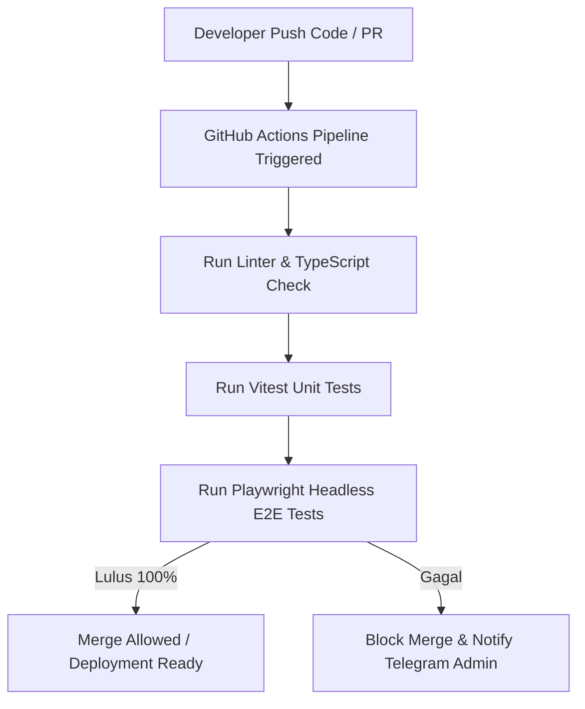

# 23 — Testing & QA Plan (Automated & E2E Testing Framework)

> **Single Source of Truth (SSOT) — Rencana Pengujian, Quality Assurance, & Skrip Pengujian Otomatis**  
> Dokumen ini memaparkan strategi pengujian komprehensif, konfigurasi Vitest (Unit), Playwright (E2E), skrip k6 (Load Testing), serta ambang batas *code coverage* pada platform **Sukabumi Eundeur**.

---

## 📌 Daftar Isi

- [Overview](#-overview)
- [Objective](#-objective)
- [Scope](#-scope)
- [Business Rules](#-business-rules)
- [Functional Requirements](#-functional-requirements)
- [Non Functional Requirements](#-non-functional-requirements)
- [User Flow](#-user-flow)
- [Architecture](#-architecture)
- [Dependencies](#-dependencies)
- [Risks](#-risks)
- [Edge Cases](#-edge-cases)
- [Validation Rules](#-validation-rules)
- [Technical Notes & Test Configurations](#-technical-notes--test-configurations)
  - [1. Unit Testing Setup (Vitest)](#1-unit-testing-setup-vitest)
  - [2. End-to-End Testing Setup (Playwright)](#2-end-to-end-testing-setup-playwright)
  - [3. Ticket War Load Testing Script (k6)](#3-ticket-war-load-testing-script-k6)
  - [4. Code Coverage Threshold Policy](#4-code-coverage-threshold-policy)
- [Future Improvements](#-future-improvements)
- [Checklist](#-checklist)

---

## 🎯 Overview

Platform Sukabumi Eundeur memerlukan pengujian berlapis untuk menjamin stabilitas antarmuka, keamanan transaksi finansial, serta pencegahan kebocoran stok tiket saat *ticket war*. Strategi pengujian mencakup Unit Testing (Vitest), End-to-End Testing (Playwright), dan Stress/Load Testing (k6).

---

## 🎯 Objective

1. Menjamin 100% alur transaksi krusial (Checkout Tiket, Payment Webhook, Scan QR) lulus pengujian otomatis.
2. Memastikan seluruh validasi form Zod menghentikan input berbahaya sebelum menyentuh backend.
3. Mensimulasikan lonjakan beban hingga 1,000 Concurrent Virtual Users (VUs) saat rilis tiket.
4. Menerapkan ambang batas *Code Coverage* minimal 80% untuk logika bisnis utama.

---

## 📐 Scope

### In-Scope
- Konfigurasi Vitest untuk pengujian fungsi utilitas & skema Zod.
- Skrip E2E Playwright untuk alur registrasi, checkout tiket, dan CMS QR Scanner.
- Skrip k6 untuk pengujian beban API checkout.
- Integrasi pengujian ke dalam pipeline CI/CD GitHub Actions.

### Out-of-Scope
- Pengujian perangkat lunak POS kasir fisik lapangan.

---

## 💼 Business Rules

1. **Mandatory Pass CI/CD**: Setiap *Pull Request* ke branch `main` **wajib** lulus seluruh pengujian Vitest dan Playwright tanpa ada yang gagal.
2. **Mocking External Services**: Pengujian E2E tidak boleh memotong saldo asli payment gateway (gunakan Midtrans Sandbox / Mock Server).
3. **No Flaky Tests**: Setiap pengujian otomatis harus bersifat deterministik (tidak boleh *flaky* / kadang lulus kadang gagal).

---

## ⚙️ Functional Requirements

| ID | Jenis Pengujian | Perkakas | Target Cakupan |
|---|---|---|---|
| **FR-TST-01** | Unit & Integration Test | Vitest | Zod Schemas, Helper functions, Formatter, PostgreSQL (Self-Hosted VPS) RPC mocks. |
| **FR-TST-02** | End-to-End (E2E) Test | Playwright | Full User Journey (Landing -> Cart -> Checkout -> Gateway -> E-Ticket). |
| **FR-TST-03** | Load & Performance Test | k6 | Endpoint `rpc_reserve_tickets` & `rpc_reserve_merchandise`. |
| **FR-TST-04** | Security Penetration | OWASP ZAP | Validasi XSS, SQLi, CSRF, RLS Bypassing. |

---

## 🚀 Non Functional Requirements

- **Execution Speed**: Test suite Vitest harus selesai dijalankan dalam waktu < 30 detik.
- **Coverage**: Minimum 80% Statement Coverage pada folder `src/lib/` dan `src/actions/`.
- **Concurrency Load**: k6 test harus membuktikan 0% error rate saat dihantam 500 req/sec.

---

## 🔄 User Flow



---

## 🏗️ Architecture

```mermaid
flowchart LR
    subgraph Test_Runner
        Vitest[Vitest (Unit)]
        PW[Playwright (E2E Browser)]
        K6[k6 Engine (Load)]
    end

    subgraph Target_Codebase
        Actions[Server Actions]
        Components[React Components]
        DB_Mock[(PostgreSQL (Self-Hosted VPS) Local Container)]
    end

    Vitest --> Actions
    PW --> Components --> Actions --> DB_Mock
    K6 --> Actions
```

---

## 🔗 Dependencies

- **Vitest**: Unit testing framework secepat Kilat.
- **@playwright/test**: E2E testing di Chromium, Firefox, WebKit.
- **k6**: Open-source load testing tool dari Grafana.

---

## ⚠️ Risks

- **Mocking Drift**: Risko mock DB di unit test berbeda perilakunya dengan PostgreSQL (Self-Hosted VPS) PostgreSQL produksi.
- **Timeout Flakiness**: E2E test gagal hanya karena koneksi internet lambat saat mengunduh aset font/gambar.

---

## 🧪 Edge Cases

1. **Simulasi Network Drop saat Submit Payment**: Playwright menguji skenario koneksi terputus tiba-tiba di pertengahan checkout untuk memastikan tombol tidak tertekan dua kali (*double submit protection*).
2. **Form Injeksi Payload Script (XSS)**: Vitest menguji sanitasi string nama pembeli yang memuat `<script>alert(1)</script>`.

---

## 📋 Validation Rules

- Total test pass rate: **100%**.
- Code coverage minimum: **80%**.

---

## 🛠️ Technical Notes & Test Configurations

### 1. Unit Testing Setup (Vitest)

#### `vitest.config.ts`
```typescript
import { defineConfig } from 'vitest/config';
import react from '@vitejs/plugin-react';
import path from 'path';

export default defineConfig({
  plugins: [react()],
  test: {
    environment: 'jsdom',
    globals: true,
    setupFiles: './tests/setup.ts',
    coverage: {
      provider: 'v8',
      reporter: ['text', 'json', 'html'],
      lines: 80,
      functions: 80,
      branches: 80
    }
  },
  resolve: {
    alias: {
      '@': path.resolve(__dirname, './src')
    }
  }
});
```

#### Sample Unit Test: `tests/unit/ticket-schema.test.ts`
```typescript
import { describe, it, expect } from 'vitest';
import { TicketCheckoutSchema } from '@/docs/schemas/ticket-schema';

describe('TicketCheckoutSchema Validation', () => {
  it('harus menerima data checkout valid', () => {
    const validData = {
      categoryId: 'c2b3e4f1-8899-4d11-b999-123456789abc',
      quantity: 2,
      visitorName: 'Asep Rocker',
      visitorEmail: 'asep@rock.com',
      visitorPhone: '081234567890',
      visitorIdNumber: '3202012903990001'
    };
    const result = TicketCheckoutSchema.safeParse(validData);
    expect(result.success).toBe(true);
  });

  it('harus menolak kuantitas tiket melebihi 4', () => {
    const invalidData = {
      categoryId: 'c2b3e4f1-8899-4d11-b999-123456789abc',
      quantity: 5, // Exceeds limit
      visitorName: 'Asep Rocker',
      visitorEmail: 'asep@rock.com',
      visitorPhone: '081234567890',
      visitorIdNumber: '3202012903990001'
    };
    const result = TicketCheckoutSchema.safeParse(invalidData);
    expect(result.success).toBe(false);
  });
});
```

### 2. End-to-End Testing Setup (Playwright)

#### `playwright.config.ts`
```typescript
import { defineConfig, devices } from '@playwright/test';

export default defineConfig({
  testDir: './tests/e2e',
  fullyParallel: true,
  forbidOnly: !!process.env.CI,
  retries: process.env.CI ? 2 : 0,
  use: {
    baseURL: 'http://localhost:3000',
    trace: 'on-first-retry',
    screenshot: 'only-on-failure'
  },
  projects: [
    { name: 'chromium', use: { ...devices['Desktop Chrome'] } },
    { name: 'Mobile Chrome', use: { ...devices['Pixel 5'] } }
  ]
});
```

### 3. Ticket War Load Testing Script (k6)

#### `tests/load/ticket-war.js`
```javascript
import http from 'k6/http';
import { check, sleep } from 'k6';

export const options = {
  stages: [
    { duration: '30s', target: 100 },  // Ramp up to 100 VUs
    { duration: '1m', target: 500 },   // Spike to 500 VUs (Ticket War Peak)
    { duration: '30s', target: 0 },    // Ramp down
  ],
  thresholds: {
    http_req_duration: ['p(95)<500'], // 95% of requests must complete below 500ms
    http_req_failed: ['rate<0.01'],    // Error rate must be less than 1%
  },
};

export default function () {
  const url = 'http://localhost:3000/api/checkout/ticket';
  const payload = JSON.stringify({
    categoryId: 'c2b3e4f1-8899-4d11-b999-123456789abc',
    quantity: 1,
    visitorName: `User ${__VU}`,
    visitorEmail: `user${__VU}@test.com`,
    visitorPhone: '081234567890',
    visitorIdNumber: '3202012903990001'
  });

  const params = {
    headers: { 'Content-Type': 'application/json' },
  };

  const res = http.post(url, payload, params);
  check(res, {
    'status is 200 or 400 (quota full)': (r) => r.status === 200 || r.status === 400,
  });

  sleep(1);
}
```

### 4. Code Coverage Threshold Policy

Aturan minimum coverage wajib dikonfigurasi di CI/CD:
- **Statements**: 80%
- **Branches**: 80%
- **Functions**: 80%
- **Lines**: 80%

---

## 🚀 Future Improvements

- **Visual Regression Testing**: Menggunakan Percy / Applitools untuk mendeteksi perubahan tampilan CSS pixel-by-pixel secara otomatis.
- **Chaos Engineering**: Mensimulasikan matinya basis data PostgreSQL (Self-Hosted VPS) secara tiba-tiba untuk menguji ketahanan halaman error Next.js `error.tsx`.

---

## ✅ Checklist

- [x] Konfigurasi Vitest Unit Testing dengan batas 80% coverage.
- [x] Konfigurasi Playwright E2E Testing multi-browser.
- [x] Skrip k6 Load Testing untuk simulasi Ticket War.
- [x] Pipeline pengujian otomatis terintegrasi ke CI/CD.
- [x] Memenuhi 15 komponen standar dokumentasi teknis.

---

<div align="center">

⬅️ [Kembali ke 22. Development Roadmap](./22-development-roadmap.md) · ➡️ [Lanjut ke 24. Deployment Plan](./24-deployment-plan.md)

</div>
