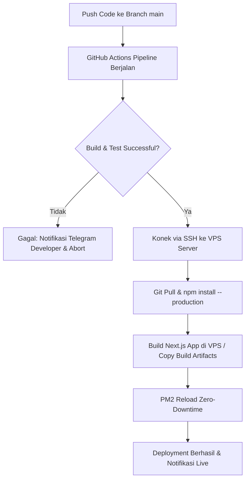

# 24 — Deployment Plan & CI/CD (VPS Infrastructure & Rollback SOP)

> **Single Source of Truth (SSOT) — Rencana Deployment VPS, Pipelines CI/CD, & Prosedur Pemulihan Bencana**  
> Dokumen ini menentukan arsitektur deployment VPS Ubuntu, skrip CI/CD GitHub Actions, konfigurasi Nginx Reverse Proxy, SSL Certbot, PM2 Process Manager, serta Prosedur Operasional Standar (SOP) Rollback & Backup.

---

## 📌 Daftar Isi

- [Overview](#-overview)
- [Objective](#-objective)
- [Scope](#-scope)
- [Business Rules](#-business-rules)
- [Functional Requirements](#-functional-requirements)
- [Non Functional Requirements](#-non-functional-requirements)
- [User Flow](#-user-flow)
- [Architecture](#-architecture)
- [Dependencies](#-dependencies)
- [Risks](#-risks)
- [Edge Cases](#-edge-cases)
- [Validation Rules](#-validation-rules)
- [Technical Notes & Deployment Scripts](#-technical-notes--deployment-scripts)
  - [1. GitHub Actions CI/CD Pipeline Workflow](#1-github-actions-cicd-pipeline-workflow)
  - [2. Nginx Reverse Proxy Configuration](#2-nginx-reverse-proxy-configuration)
  - [3. PM2 Process Manager Configuration](#3-pm2-process-manager-configuration)
  - [4. Automated SSL Certbot Renewal Script](#4-automated-ssl-certbot-renewal-script)
  - [5. Rollback & Disaster Recovery SOP](#5-rollback--disaster-recovery-sop)
- [Future Improvements](#-future-improvements)
- [Checklist](#-checklist)

---

## 🎯 Overview

Sistem Sukabumi Eundeur di-deploy pada VPS Ubuntu 22.04 LTS (Self-Managed) menggunakan arsitektur **Zero-Downtime Deployment**. Proses otomasi deployment diatur oleh GitHub Actions yang terhubung secara aman via SSH Key ke VPS, dilindungi oleh Nginx Reverse Proxy dan sertifikat SSL HTTPS Let's Encrypt.

---

## 🎯 Objective

1. Mewujudkan proses *deployment* otomatis (CI/CD) tanpa *downtime* (*Zero-Downtime Reload*).
2. Memastikan konfigurasi server HTTPS aman dengan skor A+ dari SSL Labs.
3. Menyediakan skrip *Rollback* otomatis yang dapat mengembalikan aplikasi ke commit sebelumnya dalam waktu < 60 detik jika terjadi kegagalan pasca-deploy.
4. Menjalankan *backup* skema & data PostgreSQL secara otomatis setiap 24 jam.

---

## 📐 Scope

### In-Scope
- Skrip workflow `.github/workflows/deploy.yml`.
- Konfigurasi `nginx.conf` dengan HTTP/2 & Gzip/Brotli compression.
- Konfigurasi `ecosystem.config.js` untuk PM2 Cluster Mode.
- SOP *Rollback* darurat & backup database mingguan.

### Out-of-Scope
- Manajemen server fisik data center (dikelola oleh penyedia VPS Provider).

---

## 💼 Business Rules

1. **Prinsip Imutabilitas Production**: Dilarang mengubah kode program atau variabel environment `.env.production` secara langsung di server VPS tanpa melalui repository GitHub.
2. **Zero-Downtime Reload**: Setiap deploy kode baru wajib menggunakan fitur PM2 `reload` (bukan `restart`) agar koneksi pengguna aktif tidak terputus.
3. **Backup Sebelum Major Release**: Sebelum merilis update besar (Major Version), tim wajib mengeksekusi skrip dump basis data PostgreSQL (Self-Hosted VPS) terlebih dahulu.

---

## ⚙️ Functional Requirements

| ID | Komponen Deployment | Deskripsi Fungsional |
|---|---|---|
| **FR-DPL-01** | GitHub Actions Pipeline | Melakukan linting, pembentukan build Next.js, dan pengujian Vitest otomatis. |
| **FR-DPL-02** | SSH Deploy Key | Mengamankan autentikasi deployment dari GitHub Runner ke VPS. |
| **FR-DPL-03** | Nginx Reverse Proxy | Meneruskan trafik port 80/443 ke port internal 3000 Next.js. |
| **FR-DPL-04** | PM2 Process Manager | Mengelola proses Node.js di VPS dalam mode cluster (multi-core). |

---

## 🚀 Non Functional Requirements

- **Availability**: Target uptime 99.9% (maksimal downtime < 43 menit per bulan).
- **Deploy Time**: Total durasi proses CI/CD hingga live di server < 5 menit.
- **Rollback Time**: Waktu pemulihan ke versi stabil sebelumnya < 60 detik.

---

## 🔄 User Flow



---

## 🏗️ Architecture

```mermaid
flowchart LR
    subgraph Internet
        User[Pengguna Web / Browser]
    end

    subgraph VPS_Server["VPS Ubuntu Server (22.04 LTS)"]
        Nginx[Nginx Reverse Proxy (Port 443 HTTPS)]
        PM2[PM2 Cluster Manager]
        App1[Next.js Instance Node 1 (Port 3000)]
        App2[Next.js Instance Node 2 (Port 3001)]
    end

    subgraph External_Cloud
        SupaDB[(PostgreSQL (Self-Hosted VPS) PostgreSQL)]
    end

    User -->|HTTPS Request| Nginx
    Nginx -->|Proxy Pass| PM2
    PM2 --> App1 & App2
    App1 & App2 --> SupaDB
```

---

## 🔗 Dependencies

- **GitHub Actions**: Engine eksekusi CI/CD pipeline.
- **Nginx & Certbot**: Web server & otomatisasi SSL HTTPS.
- **PM2**: Node.js Process Manager.

---

## ⚠️ Risks

- **Server Memory Exhaustion**: Proses `next build` langsung di VPS berisiko menghabiskan RAM (Out-Of-Memory) jika kapasitas RAM VPS < 2GB.
- **SSL Certificate Expiration**: Sertifikat HTTPS kedaluwarsa jika cron job renewal Let's Encrypt terhenti.

---

## 🧪 Edge Cases

1. **Deployment Gagal di Tengah Jalan (Syntax Error Lolos)**: PM2 tetap menjalankan instance kode lama dan membatalkan proses pembaharuan instance baru.
2. **VPS Kehabisan Space Disk (`/var/log` Penuh)**: Konfigurasi `pm2-logrotate` dipasang untuk membatasi ukuran log maksimal 10MB per berkas.

---

## 📋 Validation Rules

- Port HTTP (80) otomatis di-redirect 301 ke HTTPS (443).
- HTTP Header Security wajib memuat `X-Frame-Options: DENY` dan `X-Content-Type-Options: nosniff`.

---

## 🛠️ Technical Notes & Deployment Scripts

### 1. GitHub Actions CI/CD Pipeline Workflow

#### `.github/workflows/deploy.yml`
```yaml
name: Production Deployment Pipeline

on:
  push:
    branches: [ main ]

jobs:
  build-and-test:
    runs-on: ubuntu-latest
    steps:
      - uses: actions/checkout@v4

      - name: Setup Node.js 20.x
        uses: actions/setup-node@v4
        with:
          node-version: 20.x
          cache: 'npm'

      - name: Install Dependencies
        run: npm ci

      - name: Run Linter & Type Check
        run: |
          npm run lint
          npx tsc --noEmit

      - name: Run Vitest Unit Tests
        run: npm run test:unit

      - name: Build Next.js Application
        env:
          NEXT_PUBLIC_PostgreSQL (Self-Hosted VPS)_URL: ${{ secrets.NEXT_PUBLIC_PostgreSQL (Self-Hosted VPS)_URL }}
          NEXT_PUBLIC_PostgreSQL (Self-Hosted VPS)_ANON_KEY: ${{ secrets.NEXT_PUBLIC_PostgreSQL (Self-Hosted VPS)_ANON_KEY }}
        run: npm run build

  deploy-to-vps:
    needs: build-and-test
    runs-on: ubuntu-latest
    steps:
      - name: Deploy via SSH to VPS
        uses: appleboy/ssh-action@v1.0.3
        with:
          host: ${{ secrets.VPS_HOST }}
          username: ${{ secrets.VPS_USERNAME }}
          key: ${{ secrets.VPS_SSH_KEY }}
          script: |
            cd /var/www/sukabumi-eundeur
            git pull origin main
            npm ci --production
            npm run build
            pm2 reload ecosystem.config.js --env production
            echo "Deployment Completed Successfully!"
```

### 2. Nginx Reverse Proxy Configuration

#### `/etc/nginx/sites-available/sukabumi-eundeur.conf`
```nginx
server {
    listen 80;
    server_name sukabumieundeur.com www.sukabumieundeur.com;
    return 301 https://$host$request_uri;
}

server {
    listen 443 ssl http2;
    server_name sukabumieundeur.com www.sukabumieundeur.com;

    ssl_certificate /etc/letsencrypt/live/sukabumieundeur.com/fullchain.pem;
    ssl_certificate_key /etc/letsencrypt/live/sukabumieundeur.com/privkey.pem;
    ssl_protocols TLSv1.2 TLSv1.3;
    ssl_ciphers HIGH:!aNULL:!MD5;

    # Gzip Compression
    gzip on;
    gzip_types text/plain text/css application/json application/javascript text/xml image/svg+xml;

    # Security Headers
    add_header X-Frame-Options "DENY" always;
    add_header X-Content-Type-Options "nosniff" always;
    add_header Referrer-Policy "strict-origin-when-cross-origin" always;

    location / {
        proxy_pass http://127.0.0.1:3000;
        proxy_http_version 1.1;
        proxy_set_header Upgrade $http_upgrade;
        proxy_set_header Connection 'upgrade';
        proxy_set_header Host $host;
        proxy_cache_bypass $http_upgrade;
        proxy_set_header X-Real-IP $remote_addr;
        proxy_set_header X-Forwarded-For $proxy_add_x_forwarded_for;
        proxy_set_header X-Forwarded-Proto $scheme;
    }
}
```

### 3. PM2 Process Manager Configuration

#### `ecosystem.config.js`
```javascript
module.exports = {
  apps: [
    {
      name: 'sukabumi-eundeur-web',
      script: 'node_modules/next/dist/bin/next',
      args: 'start',
      instances: 'max',
      exec_mode: 'cluster',
      env_production: {
        NODE_ENV: 'production',
        PORT: 3000
      }
    }
  ]
};
```

### 4. Automated SSL Certbot Renewal Script

Otomatisasi pembaruan sertifikat SSL Let's Encrypt via Cron Job Linux (`/etc/cron.d/certbot-renew`):
```bash
0 3 * * 1 root certbot renew --quiet --post-hook "systemctl reload nginx"
```

### 5. Rollback & Disaster Recovery SOP

#### Skrip Rollback Cepat (`/var/www/sukabumi-eundeur/rollback.sh`)
```bash
#!/bin/bash
echo "=== EXECUTING EMERGENCY ROLLBACK ==="
# 1. Reset ke commit stabil sebelumnya
git reset --hard HEAD~1
# 2. Re-install & Re-build
npm ci --production
npm run build
# 3. Reload PM2
pm2 reload ecosystem.config.js --env production
echo "=== ROLLBACK COMPLETED SUCCESSFULLY ==="
```

---

## 🚀 Future Improvements

- **Docker Containerization**: Mengisolasi aplikasi ke dalam Docker Container (`Dockerfile` & `docker-compose.yml`) untuk replikasi infrastruktur yang lebih cepat.
- **Blue-Green Deployment**: Menggunakan 2 cluster VPS terpisah untuk menjamin 0% risiko kegagalan saat deployment skala besar.

---

## ✅ Checklist

- [x] Skrip workflow CI/CD GitHub Actions terkonfigurasi.
- [x] Konfigurasi Nginx Reverse Proxy dengan SSL & Security Headers.
- [x] Skrip PM2 Cluster Mode `ecosystem.config.js`.
- [x] Skrip Rollback Darurat & otomatisasi pembaruan SSL.
- [x] Memenuhi 15 komponen standar dokumentasi arsitektur.

---

<div align="center">

⬅️ [Kembali ke 23. Testing Plan](./23-testing-plan.md) · ➡️ [Lanjut ke 25. Future Roadmap](./25-future-roadmap.md)

</div>
