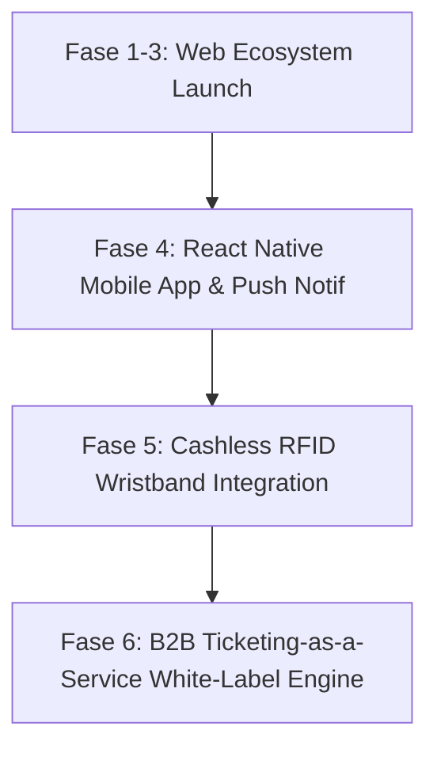

# 25 — Future Innovations & Post-MVP Roadmap (Technical Feasibility & Expansion)

> **Single Source of Truth (SSOT) — Roadmap Inovasi Purna Peluncuran & Analisis Kelayakan Teknis**  
> Dokumen ini menentukan visi pengembangan jangka panjang, analisis kelayakan teknologi (Native Mobile, Cashless RFID, TaaS), proyeksi biaya infrastruktur, serta studi arsitektur ekspansi pada ekosistem **Sukabumi Eundeur**.

---

## 📌 Daftar Isi

- [Overview](#-overview)
- [Objective](#-objective)
- [Scope](#-scope)
- [Business Rules](#-business-rules)
- [Functional Requirements](#-functional-requirements)
- [Non Functional Requirements](#-non-functional-requirements)
- [User Flow](#-user-flow)
- [Architecture](#-architecture)
- [Dependencies](#-dependencies)
- [Risks](#-risks)
- [Edge Cases](#-edge-cases)
- [Validation Rules](#-validation-rules)
- [Technical Notes & Feasibility Matrix](#-technical-notes--feasibility-matrix)
  - [1. Technical Feasibility Matrix](#1-technical-feasibility-matrix)
  - [2. Infrastructure Cost Projection](#2-infrastructure-cost-projection)
  - [3. Native Mobile App & TaaS API Readiness](#3-native-mobile-app--taas-api-readiness)
- [Future Improvements](#-future-improvements)
- [Checklist](#-checklist)

---

## 🎯 Overview

Setelah fase MVP (Fase 1-3) beroperasi secara stabil, Sukabumi Eundeur bertransformasi menjadi platform SaaS (Software as a Service) dan Super App festival musik. Inovasi pasca-MVP mencakup aplikasi mobile native (React Native), ekosistem transaksi cashless berbasis RFID/NFC, serta agregator Ticketing-as-a-Service (TaaS) bagi penyelenggara acara di wilayah lain.

---

## 🎯 Objective

1. Menyediakan peta jalan (*Roadmap*) teknis terstruktur untuk ekspansi 3 tahun ke depan (2026-2029).
2. Melakukan evaluasi kelayakan teknis (*Technical Feasibility*) dan estimasi biaya operasional infrastruktur.
3. Memastikan arsitektur API yang dibangun saat ini siap diekspos ke aplikasi mobile dan integrasi pihak ketiga.

---

## 📐 Scope

### In-Scope
- Analisis kelayakan React Native vs Flutter untuk aplikasi mobile.
- Arsitektur sistem pembayaran Cashless RFID Wristband di lokasi festival.
- Proyeksi biaya infrastruktur VPS, PostgreSQL (Self-Hosted VPS), dan CDN.
- Kesiapan API Gateway untuk B2B Ticketing-as-a-Service (TaaS).

### Out-of-Scope
- Pengkodean konkret modul purna-MVP (akan dibuatkan spesifikasi baru saat masuk fase terkait).

---

## 💼 Business Rules

1. **Prinsip Backward Compatibility**: Pengenalan API v2 untuk aplikasi mobile tidak boleh merusak fungsionalitas web publik v1.
2. **Kepatuhan Privasi Data RFID**: Data saldo & transaksi gelang RFID wajib terhubung secara aman ke profil akun tanpa menyimpan info sensitif di memori chip gelang.

---

## ⚙️ Functional Requirements

| ID | Inovasi Fitur | Target Waktu | Deskripsi Fungsional |
|---|---|---|---|
| **FR-FUT-01** | Native Mobile App | Q2 2027 | Aplikasi iOS & Android untuk push notifications jadwal & e-ticket offline. |
| **FR-FUT-02** | Cashless RFID Wristband | Q4 2027 | Integrasi top-up saldo digital untuk transaksi F&B dan merch di venue acara. |
| **FR-FUT-03** | Ticketing-as-a-Service | Q2 2028 | Platform B2B tempat penyelenggara luar menyewa mesin ticketing Eundeur. |

---

## 🚀 Non Functional Requirements

- **Mobile API Latency**: Response API untuk mobile app < 150ms via Edge API Route.
- **RFID Tap Speed**: Waktu baca/tulis chip RFID di merchant booth < 300ms.

---

## 🔄 User Flow



---

## 🏗️ Architecture

```mermaid
flowchart LR
    subgraph Clients
        Web[Next.js Web App]
        Mobile[React Native iOS/Android]
        POS[RFID POS Reader]
    end

    subgraph API_Gateway
        Kong[API Gateway / Rate Limiter]
    end

    subgraph Backend_Services
        Core[Core App Services]
        TaaS[TaaS Multi-Tenant Engine]
        RFID[Cashless Wallet Service]
    end

    subgraph Data
        DB[(PostgreSQL (Self-Hosted VPS) PostgreSQL Cluster)]
    end

    Web & Mobile & POS --> Kong
    Kong --> Core & TaaS & RFID
    Core & TaaS & RFID --> DB
```

---

## 🔗 Dependencies

- **React Native**: Framework mobile lintas platform.
- **Kong / Tyk API Gateway**: Manajemen API B2B untuk TaaS.

---

## ⚠️ Risks

- **Biaya Infrastruktur Membengkak**: Peningkatan trafik dari aplikasi mobile dan RFID dapat meningkatkan tagihan PostgreSQL (Self-Hosted VPS)/Cloud secara ekponensial jika caching tidak dioptimasi.

---

## 🧪 Edge Cases

1. **Gelang RFID Pengunjung Hilang**: Petugas memblokir ID chip gelang yang hilang via aplikasi CMS dan memindahkan sisa saldo ke gelang pengganti baru.

---

## 📋 Validation Rules

- Masa berlaku token API pihak ketiga (TaaS Key) maksimal 365 hari.

---

## 🛠️ Technical Notes & Feasibility Matrix

### 1. Technical Feasibility Matrix

| Inovasi | Kompleksitas Teknis | Estimasi Biaya | Nilai Bisnis | Rekomendasi Keputusan |
|---|---|---|---|---|
| **React Native App** | Sedang | Moderate | Sangat Tinggi | **ADOPT (Q2 2027)** — Reusable logika TypeScript dari Next.js. |
| **Cashless RFID Wristband** | Tinggi | High | Tinggi | **ADOPT (Q4 2027)** — Membutuhkan perangkat hardware reader di venue. |
| **TaaS White-Label** | Sangat Tinggi | High | Sangat Tinggi | **EVALUATE (Q2 2028)** — Perlu refactoring ke Multi-Tenant DB. |

### 2. Infrastructure Cost Projection

| Komponen | Fase 1-3 (MVP) | Fase 4 (Mobile App) | Fase 5 (Cashless & TaaS) |
|---|---|---|---|
| **VPS / Compute** | $20 / bulan | $60 / bulan | $200 / bulan |
| **PostgreSQL (Self-Hosted VPS)** | $25 / bulan (Pro) | $75 / bulan | $300 / bulan (Team/Enterprise) |
| **Push Notification (OneSignal)** | Free Tier | $30 / bulan | $100 / bulan |
| **Total Estimasi** | **~$45 / bulan** | **~$165 / bulan** | **~$600 / bulan** |

### 3. Native Mobile App & TaaS API Readiness

Arsitektur Next.js 16 Server Actions dan REST Route Handlers yang dibangun pada dokumen `10-api-planning.md` telah mendukung kompatibilitas penuh dengan React Native karena menggunakan standar JSON Payload dan JWT Authentication.

---

## 🚀 Future Improvements

- **AI Lineup Recommendation**: Rekomendasi jadwal tampil band berdasarkan preferensi musik Spotify/Apple Music pengguna.

---

## ✅ Checklist

- [x] Matrix kelayakan teknis (React Native, RFID, TaaS).
- [x] Proyeksi biaya infrastruktur bulanan per fase.
- [x] Arsitektur kesiapan API untuk konsumsi mobile & B2B.
- [x] Memenuhi 15 komponen standar dokumentasi arsitektur.

---

<div align="center">

⬅️ [Kembali ke 24. Deployment Plan](./24-deployment-plan.md) · 🏠 [Kembali ke Daftar Isi (README)](./README.md)

</div>
