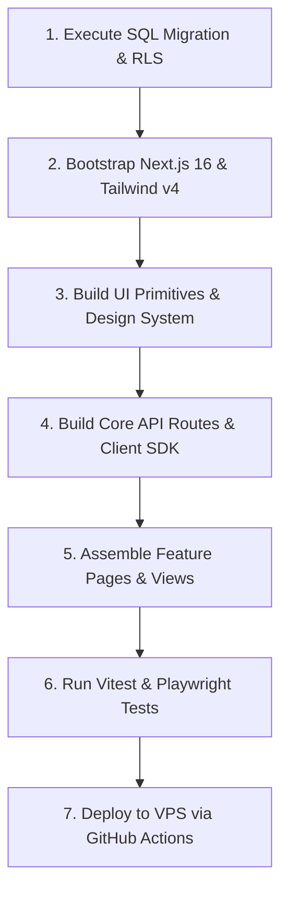
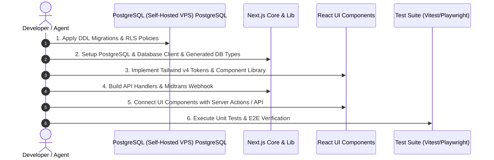

# 26 — Master Implementation Plan (Technical Execution Order & Build Order)

> **Single Source of Truth (SSOT) — Master Rencana Eksekusi Implementasi Kode & Peta Urutan Pembangunan Platform**  
> Dokumen ini merupakan panduan eksekusi teknis tingkat tinggi yang menyatukan seluruh rencana implementasi kode, urutan dependensi, skrip database, pembuatan komponen UI, pengujian otomatis, hingga deployment produksi untuk **Sukabumi Eundeur**.

---

## 📌 Daftar Isi

- [Overview](#-overview)
- [Objective](#-objective)
- [Scope](#-scope)
- [Business Rules](#-business-rules)
- [Functional Requirements](#-functional-requirements)
- [Non Functional Requirements](#-non-functional-requirements)
- [User Flow](#-user-flow)
- [Architecture](#-architecture)
- [Dependencies](#-dependencies)
- [Risks](#-risks)
- [Edge Cases](#-edge-cases)
- [Validation Rules](#-validation-rules)
- [Technical Notes & Build Execution Order](#-technical-notes--build-execution-order)
  - [1. Technical Build Sequence (Dependency Order)](#1-technical-build-sequence-dependency-order)
  - [2. Phase 1 Execution Checklist (Foundation & MVP)](#2-phase-1-execution-checklist-foundation--mvp)
  - [3. Phase 2 Execution Checklist (Commerce & Content)](#3-phase-2-execution-checklist-commerce--content)
  - [4. Phase 3 Execution Checklist (Community & History)](#4-phase-3-execution-checklist-community--history)
- [Future Improvements](#-future-improvements)
- [Checklist](#-checklist)

---

## 🎯 Overview

Platform **Sukabumi Eundeur** memiliki arsitektur ekosistem yang luas (Ticketing, E-Commerce, News, Community, History, Media Gallery, dan CMS Super Admin). Untuk mencegah *dependency bottleneck* saat pengodean, proses implementasi **WAJIB** mengikuti urutan eksekusi berlapis (*layered execution order*) dari dasar infrastruktur database hingga komponen antarmuka pengguna.

---

## 🎯 Objective

1. Menyediakan **Peta Urutan Pembangunan Kode (Build Order)** yang teratur dari layer Database -> PostgreSQL Row Level Security (RLS) -> Shared Utilities -> API Routes -> React UI Components -> E2E Testing -> Production Deployment.
2. Memastikan tidak ada modul yang dibangun tanpa dependensi dasarnya siap.
3. Menjadi rujukan utama pengembang saat memulai eksekusi kode (*Code Implementation Phase*).

---

## 📐 Scope

### In-Scope
- Urutan pembentukan tabel PostgreSQL & PostgreSQL Row Level Security (RLS) Policies.
- Urutan implementasi komponen UI berdasarkan atomic design system (Atoms -> Molecules -> Organisms -> Pages).
- Urutan pembuatan API Route Handlers.
- Integrasi Payment Gateway Midtrans & Cron Job Ticket Lock Release.
- Skrip pengujian otomatis (Unit, E2E, Load Testing).

### Out-of-Scope
- Perubahan arsitektur bisnis yang bertentangan dengan dokumen 01 - 25.

---

## 💼 Business Rules

1. Setiap fitur yang diimplementasikan **WAJIB** mengikuti spesifikasi pada dokumen 01 - 25.
2. Dilarang melakukan pengodean API Route sebelum skema tabel PostgreSQL dan RLS policy terkait berhasil dimigrasikan ke PostgreSQL (Self-Hosted VPS).
3. Seluruh commit git **WAJIB** lulus pengecekan TypeScript strict type check (`npx tsc --noEmit`) dan Linter.

---

## ⚙️ Functional Requirements

1. **Layer 1 (Database & Auth)**: Setup PostgreSQL DDL, JWT & Self-Hosted Auth Handler Triggers, dan RLS Policies.
2. **Layer 2 (Core Utilities & Types)**: Generator tipe TypeScript otomatis dari database PostgreSQL (Self-Hosted VPS) dan HTTP client configuration.
3. **Layer 3 (Design System & UI Primitives)**: Tailwind CSS v4 design tokens, komponen Button, Input, Modal, Toast, Badge, dan Card berestetika Heavy Metal.
4. **Layer 4 (Feature Modules)**: Modul Ticketing (12), Merchandise (13), News (14), Community (15), History (16), Media (17), dan CMS Admin (11).
5. **Layer 5 (Testing & CI/CD)**: Vitest unit tests, Playwright E2E tests, k6 load testing, dan GitHub Actions VPS deployment workflow.

---

## 🚀 Non Functional Requirements

- **Type Safety**: 100% Strict TypeScript without `any` types.
- **Build Time**: `< 3 menit` pada runner VPS/CI.
- **Code Coverage**: Target minimal `80%` untuk core business logic (Ticketing & Commerce).

---

## 🔄 User Flow



---

## 🏗️ Architecture

Arsitektur implementasi kode mengikuti pola **Clean Layered Architecture**:

```
src/
├── app/                  # Next.js 16 App Router (Pages & API Routes)
├── components/           # UI Components (ui/, layout/, features/)
├── lib/                  # Shared Services (PostgreSQL (Self-Hosted VPS)/, midtrans/, redis/)
├── types/                # TypeScript Interfaces & Generated DB Types
├── styles/               # Design System Tokens & Global CSS
```

---

## 🔗 Dependencies

- [`09-database-planning.md`](./09-database-planning.md) — Skema database dasar.
- [`10-api-planning.md`](./10-api-planning.md) — Kontrak API RESTful.
- [`19-security.md`](./19-security.md) — Keamanan & PostgreSQL Row Level Security (RLS).
- [`21-folder-structure.md`](./21-folder-structure.md) — Konvensi direktori.
- [`24-deployment-plan.md`](./24-deployment-plan.md) — Deployment VPS.

---

## ⚠️ Risks

- **Risk**: Perubahan skema database di tengah jalan yang merusak kontrak API.
- **Mitigasi**: Gunakan skrip migrasi terversi (`PostgreSQL (Self-Hosted VPS)/migrations/*.sql`) dan jangan langsung mengubah tabel produksi.

---

## 🧪 Edge Cases

- **Edge Case**: Ketidaksesuaian environment variable antara lokal dan VPS.
- **Solusi**: Gunakan `.env.example` sebagai kontrak variabel lingkungan wajib yang diuji pada pipeline CI/CD.

---

## 📋 Validation Rules

- Setiap PR (Pull Request) wajib menyertakan unit test untuk fungsi bisnis baru.
- Semua data mutasi (POST/PUT/DELETE) wajib memvalidasi sesi pengguna via PostgreSQL (Self-Hosted VPS) Server Client.

---

## 🛠️ Technical Notes & Build Execution Order

### 1. Technical Build Sequence (Dependency Order)



### 2. Phase 1 Execution Checklist (Foundation & MVP)
- [ ] Inisialisasi Next.js 16 App Router & Tailwind CSS v4.
- [ ] Migrasi skema database `profiles`, `events`, `ticket_categories`, `ticket_reservations`, `tickets`, `orders`.
- [ ] Implementasi Halaman Utam / Landing Page Festival.
- [ ] Implementasi Modul Ticket War & Lock Manager (15 Min Hold).
- [ ] Integrasi Payment Gateway Midtrans Webhook.

---

## 🚀 Future Improvements

- Otomatisasi pemicu pembaharuan dokumentasi OpenAPI saat skrip migrasi database dijalankan (*Automated OpenAPI Generator*).

---

## ✅ Checklist

- [x] Spesifikasi Master Implementation Plan disusun
- [x] Peta urutan dependensi teknis terdefinisi
- [ ] Eksekusi pengerjaan kode (Menunggu perintah pengguna)
